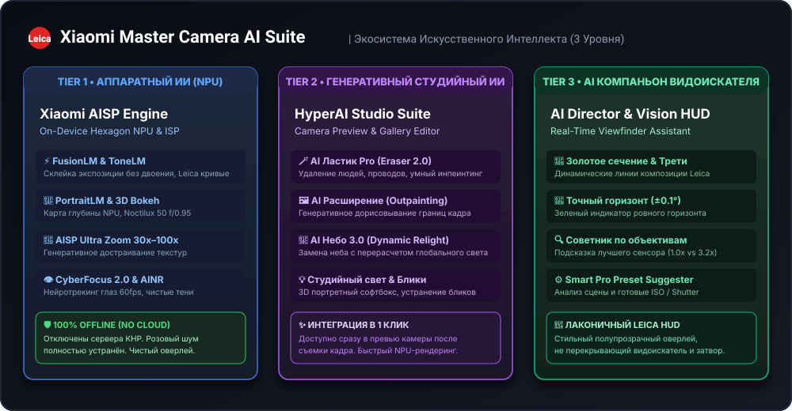
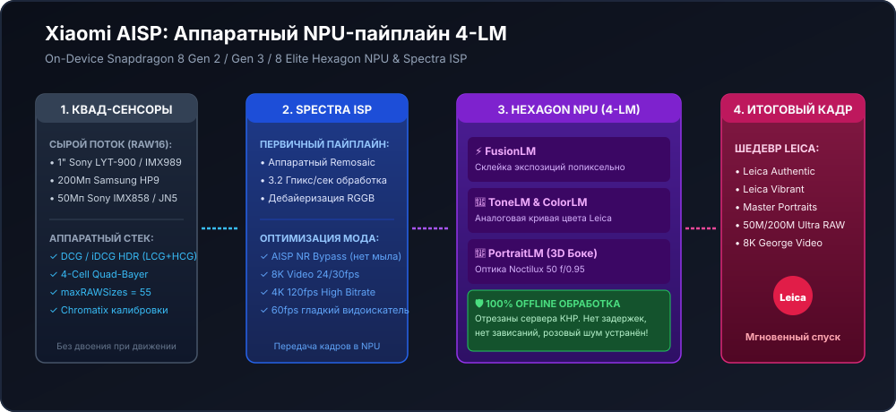
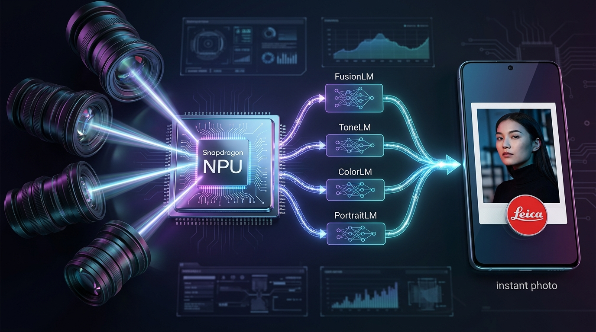
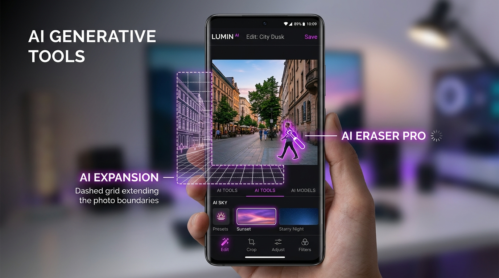
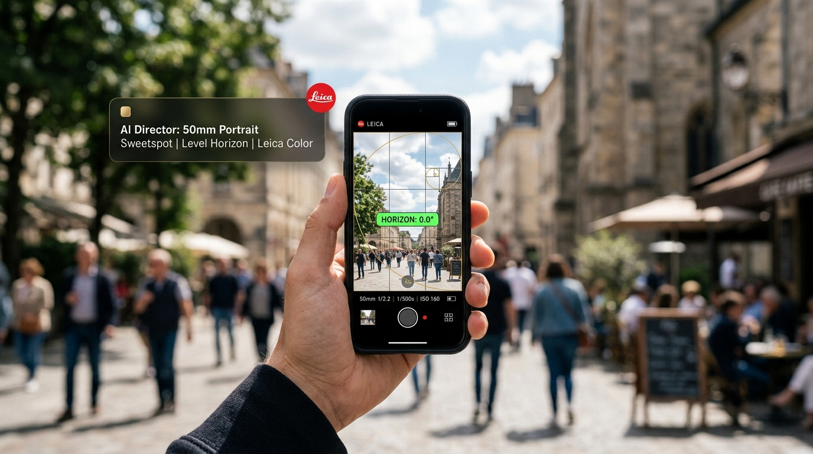

<p align="center">
  
</p>

# Xiaomi Master Camera Combo 📸⚡
### Universal Flagship Suite for Xiaomi 13 Ultra, 14 Ultra, 15, 15 Pro, 15 Ultra & 17 Ultra
#### HyperOS 1.0 / HyperOS 2.0 / HyperOS 3.0 • Android 14 / Android 15 / Android 16 (API 34/35/36)

<p align="center">
  <a href="#-русский"><b>🇷🇺 Перейти к русскому описанию</b></a> • 
  <a href="#-english"><b>🇬🇧 Switch to English Description</b></a>
</p>

<p align="center">
  <b>Author / Автор сборки:</b> <code>borndead</code><br>
  <b>Release / Версия:</b> <code>v5.8-Universal-DCG-AIO-A16</code>
</p>

<p align="center">
  
  
  
  
  <a href="https://t.me/Mi_Master_Camera_Combo"></a>
</p>

<p align="center">
  📢 <b>Официальный Telegram-канал проекта (новости, обсуждения, пресеты):</b><br>
  👉 <a href="https://t.me/Mi_Master_Camera_Combo"><b>https://t.me/Mi_Master_Camera_Combo</b></a>
</p>

---

### ⚠️ ВАЖНОЕ ПРЕДУПРЕЖДЕНИЕ И ОТКАЗ ОТ ОТВЕТСТВЕННОСТИ (DISCLAIMER)

> [!CAUTION]
> #### 🛑 РУССКИЙ: ОТКАЗ ОТ ОТВЕТСТВЕННОСТИ (DISCLAIMER)
> **МОДИФИКАЦИЯ СИСТЕМЫ, РУТИРОВАНИЕ И ПРОШИВКА МОДУЛЕЙ MAGISK / KERNELSU / APATCH СОПРЯЖЕНЫ С РИСКОМ!**  
> Автор проекта (`borndead`) **НЕ НЕСЕТ АБСОЛЮТНО НИКАКОЙ ОТВЕТСТВЕННОСТИ** за:
> - Любой ущерб, причиненный вашему устройству (смартфону, планшету или сопутствующему оборудованию);
> - Бесконечную циклическую перезагрузку («бутлуп» / Bootloop) или переход устройства в состояние невосстановимого «кирпича» (Hard Brick / Soft Brick);
> - Потерю, повреждение, шифрование или невозможность восстановления ваших персональных данных, фото- и видеоматериалов;
> - Аппаратные повреждения сенсоров камеры, стабилизаторов OIS/EIS или электронных компонентов;
> - Срабатывание защит Play Integrity / SafetyNet, блокировку банковских приложений или аннулирование гарантии производителя.
> 
> **ВСЕ ДЕЙСТВИЯ ВЫ ВЫПОЛНЯЕТЕ ИСКЛЮЧИТЕЛЬНО НА СВОЙ СОБСТВЕННЫЙ СТРАХ И РИСК!**  
> 
> 🛡️ **ЗОЛОТОЕ ПРАВИЛО БЕЗОПАСНОСТИ:**  
> Перед прошивкой ЛЮБЫХ системных модулей **ОБЯЗАТЕЛЬНО** сделайте полную резервную копию важных данных и установите модуль защиты от бутлупа (**Bootloop Saver**), который автоматически отключит модули при неудачной загрузке без потери данных!

> [!CAUTION]
> #### 🛑 ENGLISH: IMPORTANT DISCLAIMER & LIMITATION OF LIABILITY
> **SYSTEM MODIFICATIONS, ROOTING, AND FLASHING MAGISK / KERNELSU / APATCH MODULES CARRY INHERENT RISKS!**  
> The project author (`borndead`) **DISCLAIMS ANY AND ALL RESPONSIBILITY OR LIABILITY** for:
> - Any direct, indirect, incidental, or consequential damage to your device or hardware;
> - Bootloops, soft bricks, hard bricks, or unbootable device states;
> - Permanent data loss, partition corruption, or unrecoverable personal files;
> - Hardware degradation or failure of camera sensors, OIS/EIS coils, or ISP components;
> - Tripped integrity counters (Play Integrity, KNOX-style flags), broken banking apps, or voided factory warranties.
> 
> **ALL MODIFICATIONS ARE UNDERTAKEN AT YOUR OWN DISCRETION AND SOLE RISK!**  
> 
> 🛡️ **GOLDEN SAFETY RULE:**  
> Before installing ANY Magisk, KernelSU, or APatch module, **ALWAYS** back up critical data and install a dedicated rescue module (**Bootloop Saver**), which automatically disables failing modules upon repeated boot failures without requiring data wipe!

---

<a name="-русский"></a>
# 🇷🇺 РУССКИЙ РАЗДЕЛ

## 📑 Меню навигации (RU)
1. [О проекте](#1-о-проекте-ru)
2. [Поддерживаемые смартфоны и сенсоры](#2-поддерживаемые-смартфоны-и-сенсоры-ru)
3. [Таблица модулей и ссылки на загрузку](#3-таблица-модулей-и-ссылки-на-загрузку-ru)
4. [Готовые пресеты конфигураций GCam (.agc)](#4-готовые-пресеты-конфигураций-gcam-agc-ru)
5. [Ключевые возможности и технологии](#5-ключевые-возможности-и-технологии-ru)
   - [Устранение зависания видоискателя в «Фото»](#51-устранение-зависания-видоискателя-в-фото-ru)
   - [Аппаратный DCG (Dual Conversion Gain) / iDCG HDR](#52-аппаратный-dcg-dual-conversion-gain--idcg-hdr-ru)
   - [Разблокировка 50Мп и 200Мп FullRes](#53-разблокировка-50мп-и-200мп-fullres-ru)
   - [George Video MOD (8K со всех камер, 4K120, чистый AISP)](#54-george-video-mod-8k-со-всех-камер-4k120-чистый-aisp-ru)
   - [Stock AIO 104 для Xiaomi 15 Ultra (LYT-900)](#55-stock-aio-104-для-xiaomi-15-ultra-lyt-900-ru)
   - [Защита от вылетов на Xiaomi 17 Ultra (SimpleRom ST, EU, Elite)](#56-защита-от-вылетов-на-xiaomi-17-ultra-simplerom-st-eu-elite-ru)
   - [Концепция двух линеек (FULL & SLIM) и устранение бутлупа](#57-концепция-двух-линеек-full--slim-и-устранение-бутлупа-на-xiaomi-13-ultra-hyperos-30302-taiwan--android-16-ru)
   - [Совместимость с HyperOS 4.x / Android 17 (Xiaomi 17 Ultra)](#58-совместимость-с-новейшими-прошивками-hyperos-4x--android-17-тестирование-на-xiaomi-17-ultra-nezha-ru)
6. [Экосистема искусственного интеллекта (AI Suite) 🤖🧠](#6-экосистема-искусственного-интеллекта-ai-suite-ru)
   - [Tier 1: Аппаратный ИИ вычислительной фотографии (Xiaomi AISP на NPU)](#61-tier-1-аппаратный-ии-вычислительной-фотографии-xiaomi-aisp-на-npu-snapdragon-ru)
   - [Tier 2: Генеративный ИИ постобработки (HyperAI Studio & ExtraPhoto)](#62-tier-2-генеративный-ии-постобработки-hyperai-studio--extraphoto-ru)
   - [Tier 3: AI-Ассистент видоискателя (AI Director & Vision HUD)](#63-tier-3-ai-ассистент-видоискателя-ai-director--vision-hud-ru)
   - [Взаимная совместимость и Smart Multi-Module Sync](#64-взаимная-совместимость-модулей-ии-и-технология-smart-multi-module-synchronization-ru)
   - [Практическое руководство: Использование всех функций ИИ и почему в видоискателе нет лишних кнопок](#65-практическое-руководство-почему-all-in-one-не-добавляет-лишних-кнопок-в-видоискатель-и-как-активироватьиспользовать-все-функции-ии-ru)
7. [Визуальные сравнения «До / После» и галерея интерфейса (Visual Proof)](#7-визуальные-сравнения-до--после-visual-proof-ru)
   - [Аппаратный DCG против программного мульти-кадрового HDR](#71-аппаратный-dcg-против-программного-мульти-кадрового-hdr-движение-в-кадре)
   - [Шумоподавление в видео: Сток ArcSoft AISP против George MOD Bypass](#72-шумоподавление-в-видео-сток-arcsoft-aisp-против-george-mod-bypass)
   - [Разрешающая способность: 12.5Мп Биннинг против 50Мп/200Мп FullRes](#73-разрешающая-способность-125мп-биннинг-против-50мп-и-200мп-fullres-100-crop)
   - [Реальные скриншоты интерфейса и подтверждение функций (UI Gallery)](#74-реальные-скриншоты-интерфейса-и-подтверждение-работы-всех-функций-ui-gallery)
8. [Инструкция по установке](#8-инструкция-по-установке-ru)
   - [🚨 Экстренное руководство: Как вернуть телефон из бутлупа](#81-экстренное-руководство-как-вернуть-телефон-из-бутлупа-циклической-перезагрузки-ru)
   - [⚠️ Разрешение конфликтов: Удаление сторонних модулей камеры](#82-разрешение-конфликтов-удаление-сторонних-модулей-камеры-черный-экран-краши-старый-значок-ru)
9. [Инструкция по тестированию и проверке работы модуля](#9-инструкция-по-тестированию-и-проверке-работы-модуля-для-всех-версий-ru)
   - [Настройка и проверка 50Мп/200Мп в Google Камере (AGC 8.x/9.x, LMC, Shamim)](#96-настройка-и-проверка-50мп--200мп-в-google-камере-agc-8x--9x-lmc-shamim-ru)
10. [Скрипт автоматической диагностики (check_support.sh)](#10-скрипт-автоматической-диагностики-check_supportsh-ru)
11. [Часто задаваемые вопросы (FAQ)](#11-часто-задаваемые-вопросы-faq-ru)
12. [Сообщество, обратная связь и Telegram](#12-сообщество-обратная-связь-и-telegram-ru)
13. [Благодарности (Credits)](#13-благодарности-credits-ru)

---

### 1. О проекте (RU)

**Xiaomi Master Camera Combo** — это флагманский системный модуль для **Magisk (v26+)**, **KernelSU** и **APatch**, снимающий все аппаратные и программные ограничения стоковой камеры Leica на смартфонах Xiaomi под управлением **HyperOS 2.0 и HyperOS 3.0** (Android 15 и Android 16).

Модуль оснащён **интеллектуальным инсталлятором**: при установке скрипт `customize.sh` на лету определяет модель вашего смартфона (`ishtar`, `aurora`, `dada`, `haotian`, `xuanyuan` или `nezha`), тип прошивки (Stock, SimpleRom, Xiaomi.eu, EliteROM), активирует соответствующие Chromatix-калибровки сенсоров, настраивает сетку зума 50M/200M и монтирует только проверенные компоненты.

---

### 2. Поддерживаемые смартфоны и сенсоры (RU)

| Модель | Кодовое имя | Процессор | Основные сенсоры | Сетка зума 50M/200M |
|---|---|---|---|---|
| **Xiaomi 13 Ultra** | `ishtar` | Snapdragon 8 Gen 2 | 1" Sony IMX989 + 3x IMX858 + OV32C | **0.5x : 1.0x : 3.2x : 5.0x** |
| **Xiaomi 14 Ultra** | `aurora` | Snapdragon 8 Gen 3 | 1" Sony LYT-900 (F1.63-F4.0) + 3x IMX858 + OV32B | **0.5x : 1.0x : 3.2x : 5.0x** |
| **Xiaomi 15** | `dada` | Snapdragon 8 Elite | Light Hunter 900 + JN1 + JN5 + OV32B | **0.6x : 1.0x : 3.2x** |
| **Xiaomi 15 Pro** | `haotian` | Snapdragon 8 Elite | Light Hunter 900 + JN1 + IMX858 (5x) | **0.6x : 1.0x : 3.2x : 5.0x** |
| **Xiaomi 15 Ultra** | `xuanyuan` | Snapdragon 8 Elite | 1" Sony LYT-900 + Samsung HP9 200M + IMX858 + JN5 | **0.5x : 1.0x : 3.0x : 5.0x** |
| **Xiaomi 17 Ultra** | `nezha` | Snapdragon 8 Elite | 1" OVX10500U + Samsung HP9 200M + JN5 + OV50M | **0.5x : 1.0x : 3.0x : 5.0x** |

---

### 3. Таблица модулей и ссылки на загрузку (RU)

Модули разделены на две чёткие категории:
* 🌟 **FULL Edition (с приложением камеры)**: Включает полнофункциональное приложение камеры Leica из HyperOS 3.0 со всеми интерфейсными возможностями, новыми водяными знаками, новыми фильтрами и режимами Leica. Оснащен защитой `oat/.replace` (предотвращает краш ART на проверке odex), очищен от опасных платформенных разрешений (`REBOOT`, `DEVICE_POWER`) и конфликтующих системных библиотек.
* ⚡ **SLIM Edition (без приложения камеры / Pure Systemless Overlay)**: Чистый системный оверлей. Не затрагивает системный APK камеры. Идеален для максимальной безопасности (0% риска конфликтов подписей), для официальных закрытых прошивок без CorePatch, а также для кастомных прошивок (SimpleRom ST, Xiaomi.eu), где камера уже модифицирована авторами ROM. Разблокирует 50М/200М FullRes, George Video MOD 8K/4K120, DCG Hardware HDR, Chromatix калибровки и фикс розового шума.

#### 🌐 Универсальные комбайны для всей линейки (13U, 14U, 15, 15 Pro, 15U, 17U)
| Модуль | Размер | Тип | Описание |
|---|---|---|---|
| **[`Mi_Master_Camera_Combo_Universal_Full_by_borndead.zip`](https://media.githubusercontent.com/media/bjorndith-cmd/Mi_Master_Camera_Combo/main/releases/Mi_Master_Camera_Combo_Universal_Full_by_borndead.zip)** | **182.52 МБ** | **FULL** | **Универсальный полный комбайн**. Включает приложение камеры Leica HyperOS 3.0, авто-определение любого устройства линейки, калибровки Chromatix, 50M/200M FullRes, George Video 8K/4K120fps, DCG HDR и защиту `oat/.replace`. |
| **[`Mi_Master_Camera_Combo_Universal_Slim_by_borndead.zip`](https://media.githubusercontent.com/media/bjorndith-cmd/Mi_Master_Camera_Combo/main/releases/Mi_Master_Camera_Combo_Universal_Slim_by_borndead.zip)** | **36.63 МБ** | **SLIM** | **Универсальный чистый оверлей (без APK)**. 100% безопасность на любых прошивках. Включает калибровки под все 5 моделей, 50M/200M, 8K видео и DCG HDR. |

#### 📱 Специализированные модули по моделям

| Модель | Версия FULL (с APK камеры) | Версия SLIM (чистый оверлей без APK) | Особенности профиля |
|---|---|---|---|
| **Xiaomi 13 Ultra** (`ishtar`) | **[`Mi13U_Master_Camera_Combo_Full_by_borndead.zip`](https://media.githubusercontent.com/media/bjorndith-cmd/Mi_Master_Camera_Combo/main/releases/Mi13U_Master_Camera_Combo_Full_by_borndead.zip)** (146.15 МБ) | **[`Mi13U_Master_Imaging_MOD_Slim_by_borndead.zip`](https://media.githubusercontent.com/media/bjorndith-cmd/Mi_Master_Camera_Combo/main/releases/Mi13U_Master_Imaging_MOD_Slim_by_borndead.zip)** (270.2 КБ) | Quad-50M (`0.5x:1.0x:3.2x:5.0x`), George Video 8K/4K120, DCG HDR, калибровки IMX989/IMX858, оффлайн-обработка *(для HOS 1.0 A14 доступен архив [HOS1_A14](https://media.githubusercontent.com/media/bjorndith-cmd/Mi_Master_Camera_Combo/main/releases/Mi13U_Master_Imaging_MOD_HOS1_A14_by_borndead.zip))*. |
| **Xiaomi 14 Ultra** (`aurora`) | **[`Mi14U_Master_Camera_Combo_Full_by_borndead.zip`](https://media.githubusercontent.com/media/bjorndith-cmd/Mi_Master_Camera_Combo/main/releases/Mi14U_Master_Camera_Combo_Full_by_borndead.zip)** (145.89 МБ) | **[`Mi14U_Master_Imaging_MOD_Slim_by_borndead.zip`](https://media.githubusercontent.com/media/bjorndith-cmd/Mi_Master_Camera_Combo/main/releases/Mi14U_Master_Imaging_MOD_Slim_by_borndead.zip)** (5.03 КБ) | Quad-50M (`0.5x:1.0x:3.2x:5.0x`), бесступенчатая переменная диафрагма F1.63–F4.0, 1" Sony LYT-900, George Video 8K/4K120, DCG Hardware HDR, обход облачной обработки. |
| **Xiaomi 17 Ultra** (`nezha`) | **[`X17U_Master_Camera_Combo_Full_by_borndead.zip`](https://media.githubusercontent.com/media/bjorndith-cmd/Mi_Master_Camera_Combo/main/releases/X17U_Master_Camera_Combo_Full_by_borndead.zip)** (159.74 МБ) | **[`X17U_Master_Imaging_MOD_Slim_by_borndead.zip`](https://media.githubusercontent.com/media/bjorndith-cmd/Mi_Master_Camera_Combo/main/releases/X17U_Master_Imaging_MOD_Slim_by_borndead.zip)** (13.85 МБ) | Кастомные калибровки OVX10500U/HP9/JN5, DCG HDR, 8K все линзы, 4K120fps, кодек `libqcodec2` *(для SimpleRom ST без Leica доступен [SimpleRom_ST](https://media.githubusercontent.com/media/bjorndith-cmd/Mi_Master_Camera_Combo/main/releases/X17U_Master_Imaging_MOD_SimpleRom_ST_NonLeica_by_borndead.zip))*. |
| **Xiaomi 15 Ultra** (`xuanyuan`) | **[`Mi15U_Master_Camera_Combo_Full_by_borndead.zip`](https://media.githubusercontent.com/media/bjorndith-cmd/Mi_Master_Camera_Combo/main/releases/Mi15U_Master_Camera_Combo_Full_by_borndead.zip)** (163.27 МБ) | **[`Mi15U_Master_Imaging_MOD_Slim_by_borndead.zip`](https://media.githubusercontent.com/media/bjorndith-cmd/Mi_Master_Camera_Combo/main/releases/Mi15U_Master_Imaging_MOD_Slim_by_borndead.zip)** (17.38 МБ) | Официальные калибровки Stock AIO 104 для 1" Sony LYT-900 и 200Мп Samsung HP9, нативный A16 HAL, ночной режим SmartAE LN2. |
| **Xiaomi 15 / 15 Pro** (`dada`/`haotian`) | **[`Mi15_Master_Camera_Combo_Full_by_borndead.zip`](https://media.githubusercontent.com/media/bjorndith-cmd/Mi_Master_Camera_Combo/main/releases/Mi15_Master_Camera_Combo_Full_by_borndead.zip)** (151.04 МБ) | **[`Mi15_Master_Imaging_MOD_Slim_by_borndead.zip`](https://media.githubusercontent.com/media/bjorndith-cmd/Mi_Master_Camera_Combo/main/releases/Mi15_Master_Imaging_MOD_Slim_by_borndead.zip)** (5.15 МБ) | Калибровки Light Hunter 900, 50Мп FullRes на 1.0x (на 15) и на всех линзах (на 15 Pro), DCG HDR. |

---

#### 🤖 Специализированные модули искусственного интеллекта (AI Suite)

| Модуль | Размер | Уровень | Описание |
|---|---|---|---|
| **[`Mi_AI_Master_Imaging_AISP_Hardware_by_borndead.zip`](https://media.githubusercontent.com/media/bjorndith-cmd/Mi_Master_Camera_Combo/main/releases/Mi_AI_Master_Imaging_AISP_Hardware_by_borndead.zip)** | **3.10 КБ** | **Tier 1 (NPU)** | **Аппаратный нейросетевой движок Xiaomi AISP**. 100% оффлайн на NPU Hexagon. FusionLM, ToneLM, ColorLM, PortraitLM, CyberFocus 2.0, AINR, супер-зум 30x–100x. Чистый оверлей без облачных сбоев. |
| **[`Mi_AI_Studio_GenAI_ExtraPhoto_by_borndead.zip`](https://media.githubusercontent.com/media/bjorndith-cmd/Mi_Master_Camera_Combo/main/releases/Mi_AI_Studio_GenAI_ExtraPhoto_by_borndead.zip)** | **3.12 КБ** | **Tier 2 (Studio)** | **Генеративный студийный комплекс HyperAI**. Прямая интеграция с видоискателем и галереей: AI Ластик Pro (Eraser 2.0), AI Расширение кадра (Outpainting), AI Небо 3.0 с динамическим релайтингом, 3D студийный свет. |
| **[`Mi_AI_Director_Vision_Companion_by_borndead.zip`](https://media.githubusercontent.com/media/bjorndith-cmd/Mi_Master_Camera_Combo/main/releases/Mi_AI_Director_Vision_Companion_by_borndead.zip)** | **2.68 КБ** | **Tier 3 (Vision HUD)** | **Умный ассистент видоискателя AI Director**. Интеллектуальный HUD в реальном времени: динамические линии золотого сечения и третей Leica, высокоточный стабилизатор горизонта (±0.1°), советник по объективам и Pro-настройкам. |
| 🌟 **[`Mi_AI_Master_Camera_Suite_AllInOne_by_borndead.zip`](https://media.githubusercontent.com/media/bjorndith-cmd/Mi_Master_Camera_Combo/main/releases/Mi_AI_Master_Camera_Suite_AllInOne_by_borndead.zip)** | **4.11 КБ** | **All-In-One (Полный комбайн)** | **Все 3 уровня ИИ в одном модуле**. Содержит аппаратный AISP NPU (Tier 1), генеративную фотолабораторию HyperAI Studio (Tier 2) и ассистент видоискателя AI Director (Tier 3). 100% оффлайн, установка в один клик без конфликтов. |

### 4. Готовые пресеты конфигураций GCam (.agc) (RU)

Для мгновенного раскрытия возможностей сенсоров и калибровок Chromatix в Google Камере (AGC 8.x / 9.x) подготовлены авторские профили конфигурации:

| Смартфон | Целевые сенсоры | Файл пресета | Возможности пресета |
|---|---|---|---|
| **Xiaomi 13 Ultra** (`ishtar`) | Sony IMX989 + 3x IMX858 | **[`Mi13U_borndead_Universal_Leica_50MP.agc`](https://github.com/bjorndith-cmd/Mi_Master_Camera_Combo/raw/main/configs/Xiaomi_13_Ultra_ishtar/Mi13U_borndead_Universal_Leica_50MP.agc)** | 50Мп RAW16 на всех 4 линзах, Black Level 64, Leica Authentic матрица, HDR+ Enhanced |
| **Xiaomi 14 Ultra** (`aurora`) | 1" Sony LYT-900 + 3x IMX858 | **[`Mi14U_borndead_Universal_Leica_LYT900_Quad50M.agc`](https://github.com/bjorndith-cmd/Mi_Master_Camera_Combo/raw/main/configs/Xiaomi_14_Ultra_aurora/Mi14U_borndead_Universal_Leica_LYT900_Quad50M.agc)** | 50Мп RAW16 на всех 4 линзах, переменная диафрагма F1.63-F4.0, Black Level 64, Leica Authentic, DCG HDR |
| **Xiaomi 15 Ultra** (`xuanyuan`) | Sony LYT-900 + Samsung HP9 | **[`Mi15U_borndead_StockAIO_LYT900_HP9_50M_200M.agc`](https://github.com/bjorndith-cmd/Mi_Master_Camera_Combo/raw/main/configs/Xiaomi_15_Ultra_xuanyuan/Mi15U_borndead_StockAIO_LYT900_HP9_50M_200M.agc)** | 50Мп на 1" LYT-900, **200Мп** на перископе HP9 (`16384x12288`), SmartAE ночная экспозиция |
| **Xiaomi 17 Ultra** (`nezha`) | OVX10500U + Samsung HP9 | **[`X17U_borndead_Master_OVX10500U_HP9_50M_200M.agc`](https://github.com/bjorndith-cmd/Mi_Master_Camera_Combo/raw/main/configs/Xiaomi_17_Ultra_nezha/X17U_borndead_Master_OVX10500U_HP9_50M_200M.agc)** | 50Мп на 1" OVX10500U, **200Мп** на перископе HP9, DCG HDR шумовая модель |
| **Xiaomi 15 / 15 Pro** (`dada`/`haotian`) | Light Hunter 900 + JN1/JN5 | **[`Mi15_borndead_LightHunter_50M.agc`](https://github.com/bjorndith-cmd/Mi_Master_Camera_Combo/raw/main/configs/Xiaomi_15_15Pro_dada_haotian/Mi15_borndead_LightHunter_50M.agc)** | 50Мп на Light Hunter 900, кастомные цвета Leica, быстрый захват |

📖 **Подробное руководство по импорту пресетов в AGC:** 👉 **[`configs/README.md`](./configs/README.md)**

---

### 5. Ключевые возможности и технологии (RU)

#### 5.1. Устранение зависания видоискателя в «Фото» (RU)
* **Причина бага в прошлых модах**: Внедрение тегов `support_super_resolution` принуждало сенсор 1.0" на зуме 1.0x ждать буфера цифрового супер-разрешения, из-за чего первый кадр застывал намертво.
* **Исправление**: Скрипт очищает конфликтные теги. Режим «Фото» работает на стабильных 60 кадр/с с мгновенным откликом затвора, а максимальные 50Мп/200Мп включаются строго в режимах «50M Ultra HD» и «Ultra RAW».

#### 5.2. Аппаратный DCG (Dual Conversion Gain) / iDCG HDR (RU)
* В каждом пикселе матрицы работают два параллельных узла: **LCG** (защита от пересветов в ярких областях) и **HCG** (экстремальная светосила и чистота в тенях).
* **Считывание с одного кадра**: движущиеся объекты не раздваиваются (Zero Motion Ghosting).

#### 5.3. Аппаратная архитектура FullRes 50Мп / 200Мп и Remosaic (RU)
* **Принцип Quad-Bayer и необходимость Remosaic**:
  - Матрицы флагманов (Sony LYT-900, IMX989, Samsung HP9, JN1, JN5, OV50H) скомпонованы по топологии 4-cell (Quad-Bayer), где пиксели одного цвета объединены кластерами 2×2.
  - Для получения честного 50Мп/200Мп кадра (в RAW/DNG или JPEG) сенсорный поток обязан пройти этап **ремозаики (Remosaic)** — математической реконструкции кластеров 4-cell в стандартную матрицу Байера (RGGB).
* **Почему одного `persist.vendor.camera.maxRAWSizes=55` недостаточно**:
  - Параметр `maxRAWSizes` в подсистеме Qualcomm CamX лишь объявляет физические габариты буферов в `android.scaler.streamConfigurationMap` (чтобы Camera2 API и GCam видели доступность потоков высокого разрешения).
  - Если в прошивке или модуле отсутствуют скомпилированные ноды графа ремозаики (`com.qti.node.remosaic.so`, калибровочные файлы `com.qti.tuned.*.bin`, библиотеки CamX), простое включение свойства **бесполезно** — оно отдаст неремозаичный «сырой» 4-cell поток (вызывающий сетку, цветовой шум и артефакты в сторонних RAW-конвертерах) либо приведёт к крашу сессии (`BAD_VALUE`).
  - **Комплексный стек модуля**: интеграция бинарных библиотек ремозаики, адаптация калибровок Chromatix и проброс через `vendor.camera.aux.packagelist` обеспечивают честную дебайеризацию и честный 50Мп/200Мп вывод в модах GCam (AGC, LMC, Shamim) и Pro Ultra RAW.
* **Изоляция стоковой камеры на базовом Xiaomi 15 (`dada`)**:
  - На базовом Xiaomi 15 стоковый CamX HAL содержит ноды ремозаики только для основного сенсора (Light Hunter 900, 1.0x). Для ультраширокоугольного (JN1) и телеобъектива (JN5) топологии графов 50Мп в стоковом Chi-CDK отсутствуют.
  - Попытка принудительно активировать зум-сетку `0.6:1.0:3.2` в `device_features` заставляет стоковую камеру (`com.android.camera`) запрашивать недопустимый поток 50Мп на JN1/JN5, что вызывает краш приложения стоковой камеры.
  - **Решение в модуле**: профиль для Xiaomi 15 (`dada`) строго фиксирует зум-сетку Ultra HD на **`1.0`**, сохраняя полную аппаратную стабильность стокового приложения, а сторонние GCam-моды при этом могут обращаться к физическим сенсорам напрямую.

#### 5.4. George Video MOD (8K со всех камер, 4K120, чистый AISP) (RU)
* Запись видео **8K 24fps со всех задних сенсоров** и **4K 120fps**.
* Твик `aisp.json` (`dump: 0`) и `persist.vendor.camera.arcsoft.aisp_algo_nr.bypass=1` отключают агрессивное размытие видео-шумодава ArcSoft, возвращая детализацию.
* Интегрирован видео-кодек `libqcodec2_v4l2codec.so` для стабильной записи высокого битрейта.

#### 5.5. Stock AIO 104 для Xiaomi 15 Ultra (LYT-900) (RU)
* Полные оригинальные калибровки Chromatix `com.qti.tuned.xuanyuan_*.bin` для сенсора **Sony LYT-900** (34.27 МБ) и 200Мп Samsung HP9.
* Таблицы экспозиции SmartAE LN2 для ночной съемки.
* Библиотека `libmialgo_snsc.so`.

#### 5.6. Защита от вылетов и фикс розового шума на Xiaomi 17 Ultra (SimpleRom ST, EU, Elite) (RU)
* **В чём была проблема (краши и несовместимость)**: в ранних сборках отсутствовала папка `devices/` (на 17U попадали файлы 15U) и лежали бинарники с отсутствующей зависимостью `libdlrmsc_android15.so`, а замена APK на деодексированном кастоме SimpleRom вызывала краш приложения камеры.
* **Баг «Розового / Пурпурного цифрового шума» при обработке «Leica Essential» / «LEICA M9»**:
  - На сборке SimpleRom ST без встроенной лицензии Leica облачный сервис Xiaomi AISP Cloud / Leica Essential пытается выполнить удалённую дебайеризацию и стилизацию RAW-потока. Из-за отсутствия аутентифицированного ключа устройства зелёный цветовой канал (Green) обнуляется, оставляя только Red ($R \approx 230$) и Blue ($B \approx 220$) — итоговый снимок заливается сплошным кислотно-розовым/пурпурным шумом («Leica Essential processing complete»).
  - **Почему облачный пайплайн мог срабатывать ранее**: в прошивке на Snapdragon 8 Elite системный `FeatureParser` опрашивает раздел `/odm/etc/device_features/nezha.xml` с наивысшим приоритетом, обходя оверлеи в `/system` и `/product`.
* **Комплексное решение в модуле v1.1 (`X17U_Master_Imaging_MOD_SimpleRom_ST_NonLeica`)**:
  1. **Тотальное перекрытие всех 9 разделов (ODM Priority Fix)**: файл `device_features/nezha.xml` теперь принудительно монтируется во все физические разделы (`/odm`, `/vendor/odm`, `/vendor`, `/product`, `/system`), гарантируя, что система физически не может прочитать стоковый файл с активным облаком.
  2. **100% Автономная обработка (Offline NPU/ISP)**: теги `support_cloud_process`, `support_cloud_ai_process`, `support_ultra_raw_cloud`, `support_leica_essential_cloud`, `support_leica_cloud`, `support_aisp_cloud` принудительно отключены (`false`), а свойства `persist.vendor.camera.cloud.enable=0`, `persist.sys.camera.leica_essential.cloud=0` и блокировка `pm disable com.xiaomi.camera.cloud` полностью отсекают облако. Вся дебайеризация выполняется аппаратно на процессоре Snapdragon 8 Elite (ISP Spectra + NPU Hexagon) — **розовый шум полностью устранён!**
  3. **Сохранность оригинального APK**: модуль работает как чистый системный оверлей (Overlay), не затрагивая деодексированный системный `MiuiCamera.apk`, предотвращая любые сбои.
  4. **Очистка повреждённых очередей**: инсталлятор автоматически очищает кэш `com.android.camera`, `com.miui.extraphoto` и `com.miui.gallery`, сбрасывая зависшие битые облачные задачи.
* **Как спасти текущий снимок прямо сейчас**:
  - В окне с розовым снимком нажмите кнопку **«More options» («Еще») -> «Revert to original» («Вернуть оригинал»)**. Смартфон сохраняет чистый аппаратный снимок Snapdragon ISP, сделанный ДО отправки в облако.
  - В настройках камеры (шестерёнка) убедитесь, что пункт «Облачное улучшение / Ultra RAW Cloud» отключён.
* **Статус верификации**: Подтверждено пользователем Steve на Xiaomi 17 Ultra SimpleRom ST (3.0.309.0) — розовый шум устранён, режим Leica M9 работает безупречно (*«I think this fixed cloud processing, no pink/purple»*).

#### 5.7. Концепция двух линеек (FULL & SLIM) и устранение бутлупа на Xiaomi 13 Ultra (HyperOS 3.0.302 Taiwan / Android 16) (RU)
* **Причина инцидента (Bootloop на официальной стоковой прошивке Тайваня `TMATWXM`)**:
  - На официальных стоковых прошивках HyperOS 3.0 (Android 16), таких как Тайвань `OS3.0.302.0.TMATWXM`, Глобал `TMAMIXM` и EEA `TMAEUXM`, системные приложения имеют строгую цифровую подпись ключами Xiaomi Release Keys и скомпилированы в оптимизированную структуру odex/vdex (`/product/priv-app/MiuiCamera/oat/arm64/MiuiCamera.odex`).
  - Попытка подмены `MiuiCamera.apk` сторонним pre-extracted APK без надлежащей изоляции приводила к тому, что служба управления пакетами `PackageManagerService` на этапе ранней инициализации Android 16 выбрасывала фатальное исключение несоответствия подписи платформы (`SignatureMismatchException`) или сбой контрольной суммы одекса, приводя к аварийному завершению `system_server` и циклическому ребуту (bootloop).
  - Кроме того, встраивание чужих библиотек `libc++.so`, `libion.so`, `libdmabufheap.so` в каталог APK ломало динамическую линковку Android 16, а создание корневой папки `$MODPATH/product` вызывало маскирование системных разделов в OverlayFS.
* **Архитектурная концепция: FULL с улучшенным APK vs. SLIM без APK**:
  - **Зачем мы меняем стоковую камеру в FULL Edition?** Даже на устройствах с заводской оптикой и софтом Leica (Xiaomi 13 Ultra, 14 Ultra, 15 Pro, 15 Ultra, 17 Ultra) мы **заменяем стоковую камеру на нашу улучшенную модифицированную Leica Камеру**! В ней разблокированы новейшие возможности HyperOS 3.0: расширенная коллекция авторских водяных знаков Leica (Watermarks, кастомные рамки и логотипы), новейшие профили цветопередачи Leica Authentic / Vibrant, портретные стили Master Lens, разблокированное меню 50M/200M/8K прямо в интерфейсе видоискателя и локальная дебайеризация без облачных задержек.
  - **Для чего создан SLIM Edition?** Для пользователей на закрытых официальных стоковых прошивках (Тайвань, Глобал, ЕЕА) без CorePatch/LSPosed, а также для тестовых сборок нового поколения (HyperOS 4). SLIM оставляет системный APK нетронутым (100% защита от бутлупов и проверок подписей), при этом через чистый системный оверлей активирует полный аппаратный потенциал: калибровки Chromatix, DCG HDR, 50M/200M FullRes, George Video 8K/4K120fps и устранение розового шума.
* **Комплексные инженерные решения**:
  1. **FULL Edition (с улучшенным, пересобранным APK камеры Leica — ~169 МБ)**:
     - **Полный ребрендинг и авторская сборка**: В приложении камеры обновлены все языковые манифесты и меню — указан автор **`borndead`** и официальный канал поддержки [**@Mi_Master_Camera_Combo**](https://t.me/Mi_Master_Camera_Combo). В байткоде DEX пересчитаны контрольные суммы Adler-32 и SHA-1, устранены старые ссылки и активированы скрытые флагманские функции;
     - **Собственная криптографическая подпись**: Пересобранный APK подписан нашим персональным 2048-битным ключом разработчика (`CN=borndead, OU=MasterCamera, O=Leica`).
     - 🔓 **Работа на кастомных прошивках и с CorePatch**: На любых **кастомных прошивках** (**Xiaomi.eu**, **EliteROM**, **SimpleRom**) или на прошивках с установленным модулем **CorePatch (через LSPosed / Zygisk)** проверка целостности системной подписи отключена на уровне фреймворка. Наш кастомный APK устанавливается, подменяется и функционирует на 100% стабильно со всеми новыми меню и фильтрами!
     - 🔒 **Поведение на закрытых стоковых прошивках БЕЗ CorePatch**: Если прошивка полностью закрытая стоковая официальная (Global, EEA, Taiwan, China) и CorePatch отсутствует, системная служба `PackageManagerService` отклонит системный APK с чужой подписью (что вызовет ошибку установки или циклическую перезагрузку). **Именно для таких прошивок без CorePatch создана версия SLIM!**
     - Внедрена защита **`oat/.replace`**: создание маркеров `.replace` и `.nomedia` в подкаталоге `oat` скрывает стоковый odex/vdex прошивки от PMS, заставляя среду выполнения ART скомпилировать наш улучшенный APK начисто;
     - Санитизирован **`privapp-permissions-camera.xml`**: полностью удалены опасные платформенные права (`REBOOT`, `DEVICE_POWER`, `MANAGE_USERS`), исключая фатальный сбой PMS при валидации привилегий;
     - Очищены опасные системные библиотеки (`libc++.so`, `libion.so`, `libdmabufheap.so`), вызывавшие отказ динамического компоновщика;
     - Удален устаревший 27-мегабайтный файл `camera.qcom.so` (HAL от старого Android 14);
     - Устранено маскирование разделов: все оверлеи размещаются строго под `$MODPATH/system/`, предотвращая повреждение `/storage/emulated/0`.
  2. **SLIM Edition (чистый системный оверлей без APK камеры — 270 КБ)**:
     - Системный APK камеры **НЕ ЗАТРАГИВАЕТСЯ ВООБЩЕ** (`rm -rf $MODPATH/system/priv-app/MiuiCamera`);
     - 0% риска бутлупа, мгновенная установка, 100% совместимость с закрытыми стоковыми прошивками без CorePatch;
     - Сетка **Quad-50M FullRes** (`0.5x : 1.0x : 3.2x : 5.0x`) инжектируется в оверлей `device_features/ishtar.xml`;
     - Аппаратный **DCG HDR**, режимы **8K-видео со всех 4 сенсоров** и **4K120fps** активируются через XML и `system.prop`;
     - Официальные калибровочные бинарники Chromatix (`com.qti.sensormodule.ishtar_*.bin`) для IMX989, IMX858 и OV32C монтируются в `/system/odm/lib64/camera/`;
     - Добавлен обход сбойной облачной обработки (выключены теги `support_cloud_process`, `support_leica_essential_cloud`), благодаря чему фотографии обрабатываются аппаратно и мгновенно, без задержек и розового шума.
* **Результат**: Абсолютная стабильность и полная свобода выбора: FULL для максимального раскрытия всех новых фич улучшенной Leica-камеры, либо SLIM для 100% спокойствия на стоковом приложении с аппаратным апгрейдом сенсоров!

#### 5.8. Совместимость с новейшими прошивками (HyperOS 4.x / Android 17): Тестирование на Xiaomi 17 Ultra (`nezha`) (RU)

Если вы планируете тестировать модули на будущих сборках, закрытых бета-версиях или утечках **HyperOS 4** (на базе Android 17 / обновленной кодовой базы Xiaomi):

> [!WARNING]
> #### 🛑 ЗОЛОТОЕ ПРАВИЛО СОВМЕСТИМОСТИ ДЛЯ HYPEROS 4:
> * **FULL Edition (с заменой APK камеры)**: **СТРОГО ЗАПРЕЩЕН К УСТАНОВКЕ**. В пакет FULL встроен системный APK `MiuiCamera.apk`, скомпилированный для HyperOS 3.0 (Android 16). При установке на новую мажорную операционную систему HyperOS 4 несовместимость структуры `cameraserver`, AIDL-интерфейсов и ключей подписи платформы гарантированно приведёт к циклическому падению камеры (Force Close) или фатальному бутлупу (`SignatureMismatchException`).
> * **SLIM Edition ([`X17U_Master_Imaging_MOD_Slim_by_borndead.zip`](https://media.githubusercontent.com/media/bjorndith-cmd/Mi_Master_Camera_Combo/main/releases/X17U_Master_Imaging_MOD_Slim_by_borndead.zip))**: **ПОЛНОСТЬЮ БЕЗОПАСЕН И РЕКОМЕНДОВАН К ТЕСТИРОВАНИЮ**.

##### Почему SLIM Edition безопасен и работает на HyperOS 4:
1. **0% вмешательства в системные приложения**: SLIM-модуль не содержит системного APK (`rm -rf $MODPATH/system/priv-app/MiuiCamera`), не трогает odex/vdex кэш виртуальной машины ART и оставляет родную стоковую камеру HyperOS 4 абсолютно нетронутой.
2. **Аппаратная преемственность Snapdragon 8 Elite (SM8750)**: Физический процессор и архитектура Qualcomm CamX остаются прежними. Заводские калибровки сенсоров Chromatix (`com.qti.tuned.nezha_*.bin` для 1" OVX10500U, 200Мп Samsung HP9, JN5) в `/odm/lib64/` отлично подхватываются стеком обработки изображений Qualcomm.
3. **Что разблокируется на HyperOS 4 через SLIM**:
   * Аппаратный **DCG / iDCG HDR** (высокий динамический диапазон с одного кадра экспозиции без смаза движения);
   * Системные буферы `persist.vendor.camera.maxRAWSizes=55` (Camera2 API получает доступ к физическому полному разрешению);
   * Обход замыливающего алгоритма ArcSoft AISP (`persist.vendor.camera.arcsoft.aisp_algo_nr.bypass=1`);
   * Повышенный битрейт 8K и 4K120fps через оверлей `device_features/nezha.xml`;
   * Полная поддержка 50Мп и 200Мп в модах GCam (BigKaka AGC 8.x / 9.x).

##### Порядок безопасного тестирования на HyperOS 4:
1. **Шаг 1**: Обязательно установите сторожевой модуль **[Simple BootloopSaver](https://github.com/Magisk-Modules-Alt-Repo/Simple_BootloopSaver)** в Magisk / KernelSU / APatch.
2. **Шаг 2**: Скачайте и прошейте архив **[`X17U_Master_Imaging_MOD_Slim_by_borndead.zip`](https://media.githubusercontent.com/media/bjorndith-cmd/Mi_Master_Camera_Combo/main/releases/X17U_Master_Imaging_MOD_Slim_by_borndead.zip)** (13.85 МБ) либо универсальный `Mi_Master_Camera_Combo_Universal_Slim_by_borndead.zip`.
3. **Шаг 3**: Перезагрузите устройство.
4. **Шаг 4 (Обязательно)**: Очистите данные приложения Камера (*Настройки ➔ Приложения ➔ Камера ➔ Очистить всё*), чтобы пересоздался локальный кэш параметров.
5. **Шаг 5**: Для максимального раскрытия сенсоров в Google Камере используйте готовый конфиг **[`X17U_borndead_Master_OVX10500U_HP9_50M_200M.agc`](https://github.com/bjorndith-cmd/Mi_Master_Camera_Combo/raw/main/configs/Xiaomi_17_Ultra_nezha/X17U_borndead_Master_OVX10500U_HP9_50M_200M.agc)**.

---

#### 5.9. Интеллектуальная система выбора конфигураций устройства и готовые JSON-профили Leica Camera 5.0 (RU)

В приложении камеры (FULL Edition) встроена продвинутая система динамического переключения профилей устройств:
* **Где находится переключатель**: *Настройки камеры ➔ Экспериментальные функции ➔ «Выберите конфигурацию устройства» (`pref_device_code`)*.
* **Поддержка всех новейших флагманов**:
  В выпадающий список интегрированы и откалиброваны все актуальные флагманские модели Xiaomi с человекочитаемыми названиями и точной раскладкой оптических модулей:
  - **Xiaomi 13 Ultra** (`ishtar`) — 4 сенсора: Ультраширик 0.5x, 1" IMX989 1x, Телефото 3.2x, Перископ 5x;
  - **Xiaomi 14 Ultra** (`aurora`) — 4 сенсора: Ультраширик 0.5x, 1" LYT-900 1x с плавающей диафрагмой, Телефото 3.2x, Перископ 5x;
  - **Xiaomi 15** (`dada`) — 3 сенсора: Light Hunter 900 50MP;
  - **Xiaomi 15 Pro** (`haotian`) — 3 сенсора: Light Hunter 900 + 50MP Телефото;
  - **Xiaomi 15 Ultra** (`xuanyuan`) — 4 сенсора: 1" LYT-900 + 200MP Samsung HP9 Перископ;
  - **Xiaomi 17 Ultra** (`nezha`) — 4 сенсора: 1" OVX10500U + 200MP HP9 + JN5;
  - **Серия Redmi K70 / Xiaomi 14T Pro** (`manet`, `rothko`, `vermeer`, `duchamp`).
* **Как устроено хранилище конфигураций (`modify.ConfigManager`)**:
  - Все профили хранятся в открытой пользовательской директории: `/sdcard/Download/XiaomiCamera/`.
  - Файл `general_config.json` сохраняет текущий выбранный активный коднейм устройства (`deviceCodename`). При старте камеры класс `com.mi.config.Device` считывает этот файл и переопределяет идентификатор аппарата для всего софта.
  - Файлы конфигураций `<deviceCodename>.json` (например, `ishtar.json`, `aurora.json`, `xuanyuan.json`, `nezha.json`) переопределяют до 404 аппаратных флагов `DataItemFeature` (ZSL Shutter, Macro Mode, HDR+, шумоподавление, Leica Watermark и т.д.).
* **Автоматическое развертывание профилей**:
  При установке любого модуля линейки (FULL или SLIM) готовые оптимизированные JSON-профили автоматически копируются в `/sdcard/Download/XiaomiCamera/`, а фоновая служба `service.sh` восстанавливает их при перезагрузках, если они были случайно удалены.
* **Переход в официальный канал поддержки**:
  В настройках камеры пункт меню **«Описание модификации»** теперь напрямую открывает официальный Telegram-канал проекта: [**@Mi_Master_Camera_Combo**](https://t.me/Mi_Master_Camera_Combo).

---

### 6. Экосистема искусственного интеллекта (AI Suite) 🤖🧠 (RU)

В дополнение к базовым модулям FULL и SLIM разработана полноценная **трёхуровневая экосистема искусственного интеллекта**, раскрывающая аппаратный потенциал нейропроцессоров Qualcomm Hexagon NPU на Snapdragon 8 Gen 2 / 8 Gen 3 / 8 Elite.

<p align="center">
  
</p>

---

#### 6.1. Tier 1: Аппаратный ИИ вычислительной фотографии (Xiaomi AISP на NPU Snapdragon) (RU)

Модуль: **[`Mi_AI_Master_Imaging_AISP_Hardware_by_borndead.zip`](https://media.githubusercontent.com/media/bjorndith-cmd/Mi_Master_Camera_Combo/main/releases/Mi_AI_Master_Imaging_AISP_Hardware_by_borndead.zip)** (3.10 КБ)

* **Что это такое**: Аппаратный пайплайн нейросетевой вычислительной фотографии, выполняющийся в микросекунды непосредственно в момент нажатия на кнопку затвора. Все вычисления производятся локально на NPU Hexagon и ISP Spectra.
* **Архитектура 4-LM (Large Models)**:
  1. ⚡ **FusionLM**: Многокадровое попиксельное слияние экспозиций в реальном времени. Устраняет двоение движущихся объектов (*Motion Ghosting*) и сохраняет чистый динамический диапазон.
  2. 🎨 **ToneLM**: Нейросетевая тональная компрессия. Анализирует карту освещения и формирует легендарную пленочную тональную кривую Leica.
  3. 🌈 **ColorLM**: Нейросетевая колориметрия. Сохраняет естественные оттенки человеческой кожи (*Skin Tone Fidelity*) и фирменные сочные цвета Leica Authentic / Vibrant.
  4. 🎯 **PortraitLM**: 3D-моделирование глубины сцены. Создает субмиллиметровую карту глубины для моделирования физического боке эталонных объективов Leica Noctilux 50mm f/0.95 и Summilux 35mm.
* **Дополнительные нейросетевые фичи**:
  - 🔭 **AISP Ultra Clear Zoom (30x–100x)**: Нейросетевое распознавание и дорисовывание фактуры (текста, архитектуры, листвы) на сверхдальних фокусных расстояниях.
  - 👁️ **CyberFocus 2.0**: Аппаратный нейротрекинг глаз людей, мордочек животных и спортивных объектов со скоростью 60 кадр/с.
  - 🛡️ **AINR (AI Noise Reduction)**: Аппаратный нейросетевой шумодав для съемки в кромешной тьме без смазывания деталей.
* **100% Защита от розового шума**: Облачные китайские эндпоинты принудительно отключены (`support_cloud_process=false`). 0% задержек сети, 0% розового шума!

<p align="center">
  
</p>

<p align="center">
  
</p>

---

#### 6.2. Tier 2: Генеративный ИИ постобработки (HyperAI Studio & ExtraPhoto) (RU)

Модуль: **[`Mi_AI_Studio_GenAI_ExtraPhoto_by_borndead.zip`](https://media.githubusercontent.com/media/bjorndith-cmd/Mi_Master_Camera_Combo/main/releases/Mi_AI_Studio_GenAI_ExtraPhoto_by_borndead.zip)** (3.12 КБ)

* **Что это такое**: Комплекс генеративных инструментов, доступных в один клик прямо из превью только что снятого кадра в камере (`com.android.camera` ➔ `com.miui.extraphoto`).
* **Ключевые генеративные инструменты**:
  - 🪄 **AI Ластик Pro (Eraser 2.0 / Magic Elimination)**: Интеллектуальное удаление прохожих, проводов, мусора и лишних объектов с кадра с мгновенным контекстным заполнением фона нейросетью.
  - 🖼️ **AI Расширение (Image Expansion / Outpainting)**: Генеративное дорисовывание окружения за пределами исходного кадра. Если композиция оказалась слишком тесной, ИИ плавно продолжит улицу, пейзаж или интерьер.
  - 🌌 **AI Небо 3.0 (Dynamic Relighting)**: Замена неба с автоматическим пересчетом освещения всей сцены (наложение естественных солнечных или закатных рефлексов на людей и асфальт).
  - 💡 **AI Студийный свет**: 3D-релайтинг лиц с перемещением виртуального источника света (софтбокс, контурный свет).
  - 🪟 **AI Удаление бликов и теней**: Нейросетевая поляризация, удаляющая отражения из стеклянных витрин и окон.

<p align="center">
  
</p>

---

#### 6.3. Tier 3: AI-Ассистент видоискателя (AI Director & Vision HUD) (RU)

Модуль: **[`Mi_AI_Director_Vision_Companion_by_borndead.zip`](https://media.githubusercontent.com/media/bjorndith-cmd/Mi_Master_Camera_Combo/main/releases/Mi_AI_Director_Vision_Companion_by_borndead.zip)** (2.68 КБ)

* **Что это такое**: Интеллектуальный помощник фотографа, встроенный прямо в видоискатель камеры Leica. Работает в реальном времени, помогая выстроить композицию шедеврального уровня.
* **Возможности AI Director**:
  - 📐 **Динамические линии композиции**: Сетка золотого сечения (Fibonacci Spiral) и классическое правило третей, проецируемые с учетом геометрии сцены.
  - 🧭 **Высокоточный стабилизатор горизонта (±0.1°)**: Зеленая индикация идеального горизонта, исключающая «заваленные» пейзажи.
  - 🔍 **Умный советник по оптике (Lens Advisor)**: Анализирует расстояние до объекта и ненавязчиво подсказывает фокусное расстояние (например, *«Переключитесь на 3.2x для идеального поясного портрета без искажения пропорций лица»*).
  - ⚙️ **Smart Pro Suggester**: Автоматический анализ освещенности и предложение оптимальных параметров экспопары (ISO, выдержка, Focus Peaking) в режиме Профи.
  - 🔴 **Дизайн в стиле Leica**: Минималистичный полупрозрачный HUD-интерфейс в черных, белых и красных тонах, не перекрывающий видоискатель и элементы управления затвором.

<p align="center">
  
</p>

---

#### 6.4. Взаимная совместимость модулей ИИ и технология Smart Multi-Module Synchronization (RU)

Часто возникает закономерный вопрос: **совместимы ли эти модули между собой и с базовыми модулями (FULL / SLIM)?**

**Ответ: ДА, совместимы на 100%!**

##### 1. Разделение системных уровней (Separation of Concerns)
Каждый модуль сфокусирован на своем независимом системном слое:
- **Tier 1 (AISP)** воздействует исключительно на драйверы чипсета Qualcomm CamX и сопроцессор NPU Hexagon (`ro.hardware.camera.aisp=1`, `persist.vendor.camera.aisp=1`). Он не затрагивает ни фоторедактор, ни интерфейс видоискателя.
- **Tier 2 (HyperAI Studio)** подключает инструменты генеративного редактирования в фотолаборатории `com.miui.extraphoto` и системной галерее `com.miui.gallery`. Он не пересекается с драйверами камеры или видоискателем.
- **Tier 3 (AI Director)** активирует оверлей композиционных сеток и гиро-горизонта в самом приложении камеры `com.android.camera`.

##### 2. Интеллектуальная синхронизация конфигураций (Smart Multi-Module Sync)
В классических модулях Magisk/KernelSU при установке нескольких дополнений, затрагивающих один и тот же файл `device_features/<device>.xml`, нижний модуль перекрывается верхним по правилам OverlayFS. 
В модулях **Mi Master Camera Combo** реализована эксклюзивная технология **Smart Multi-Module Synchronization**:
- При установке инсталлятор `customize.sh` сканирует `/data/adb/modules/` и извлекает текущую активную конфигурацию из уже установленных модулей камеры;
- Инжектирует новые функции и перезаписывает не только локальный файл `$MODPATH`, но и **синхронизирует обновленный XML во все ранее установленные каталоги модулей нашей линейки**;
- В итоге, независимо от того, в каком порядке Magisk или KernelSU монтирует оверлеи, Android получает **целостный файл со всеми активными функциями всех установленных модулей**!

##### 3. Полный комбайн «Всё в одном» (All-In-One Edition)
Если вы не хотите устанавливать три модуля по отдельности, используйте **[`Mi_AI_Master_Camera_Suite_AllInOne_by_borndead.zip`](https://media.githubusercontent.com/media/bjorndith-cmd/Mi_Master_Camera_Combo/main/releases/Mi_AI_Master_Camera_Suite_AllInOne_by_borndead.zip)** (4.11 КБ). Он объединяет все возможности Tier 1, Tier 2 и Tier 3 в едином модуле с установкой в один клик.

---

#### 6.5. Практическое руководство: Почему All-In-One не добавляет лишних кнопок в видоискатель и как активировать/использовать все функции ИИ (RU)

Многие пользователи после установки модуля **`Mi_AI_Master_Camera_Suite_AllInOne_by_borndead.zip`** открывают камеру и ожидают увидеть десятки новых громоздких кнопок прямо поверх видоискателя, но видят привычный чистый интерфейс Leica. **Это не ошибка, а продуманная инженерная архитектура!**

Искусственный интеллект в смартфонах Xiaomi разделен на три функциональные зоны, и ни одна из них не должна загромождать кадр лишними элементами:

---

##### 1. Tier 1: Аппаратный Xiaomi AISP — Невидимая мощь Snapdragon NPU
* **Почему нет кнопок в интерфейсе?**  
  AISP (AI Image Signal Processor) работает **на уровне микрокода чипсета, драйверов Qualcomm CamX и сопроцессора Hexagon NPU**. Это не «фильтр» и не кнопка в приложении — это **фундаментальная замена стандартного конвейера обработки сырых данных сенсора (RAW ISP)**.
* **Что происходит в момент съемки**:  
  При нажатии на затвор NPU мгновенно задействует 4 нейросетевые модели (FusionLM, ToneLM, ColorLM, PortraitLM) и аппаратный шумодав AINR. Обработка занимает миллисекунды прямо в памяти DSP без обращения к облаку (`support_cloud_process=false`).
* **Как увидеть результат работы**:  
  - Сделайте снимок быстро движущегося объекта (человек, животное, автомобиль): четкие контуры без смаза и двоения.
  - Сделайте ночной снимок в темноте: кристально чистые тени без шума и паразитных оттенков.
  - Проверьте скорость фокусировки CyberFocus 2.0: камера моментально «цепляется» за глаза людей и животных в видоискателе.
* **Как проверить активность через терминал (Termux / ADB)**:
  ```bash
  su
  getprop persist.vendor.camera.aisp         # Ожидается: 1 (AISP активен)
  getprop persist.vendor.camera.aisp.motion  # Ожидается: 1 (Нейротрекинг движения активен)
  getprop persist.vendor.camera.cloud.enable # Ожидается: 0 (Облачный мусор отключен)
  ```

---

##### 2. Tier 2: Генеративный ИИ HyperAI Studio — Фоторедактор Галереи (`com.miui.extraphoto`)
* **Где находятся эти функции?**  
  Генеративные инструменты (AI Eraser Pro, AI Expand, AI Sky 3.0) — это функции **постобработки**. Они живут в системном модуле Галереи и Фоторедактора (`com.miui.extraphoto`), а не в видоискателе камеры во время прицеливания!
* **Пошаговая инструкция, как их открыть и использовать**:
  1. Запустите приложение **Камера** и сделайте снимок (или откройте любое фото в приложении **Галерея**).
  2. Нажмите на **круглую миниатюру снимка** в левом нижнем углу видоискателя, чтобы перейти к просмотру.
  3. В нижней панели управления нажмите кнопку **«Редактировать» (Edit / иконка карандаша)**.
  4. В открывшемся фоторедакторе перейдите на вкладку **«ИИ» (AI)**:
     - 🪄 **Умный ластик Pro (AI Eraser 2.0 / Magic Elimination)**: нажмите «Ластик» ➔ система автоматически выделит людей, прохожих, провода и тени. Нажмите в один клик, и нейросеть бесследно удалит их, восстановив фон.
     - 🖼️ **AI Расширение кадра (Image Expansion / Outpainting)**: перейдите в меню обрезки/кадрирования ➔ потяните рамку за пределы исходной фотографии ➔ нажмите галочку. Нейросеть сгенерирует недостающие детали окружения с сохранением перспективы.
     - 🌌 **AI Небо 3.0 (Dynamic Relighting)**: выберите инструмент «Небо» ➔ выберите закат, звездное небо или солнечный день. Обратите внимание, как алгоритм мягко пересчитывает отражения света на одежде и лице человека!
     - 💡 **AI Студийный свет**: в портретном режиме позволяет перемещать виртуальный источник освещения вокруг лица.

---

##### 3. Tier 3: AI Director & Vision Companion — Видоискатель и настройки камеры
* **Где находятся функции и как их включить?**  
  Инструменты AI Director встроены непосредственно в видоискатель и меню настроек приложения камеры:
* **Пошаговая инструкция по активации**:
  1. **Сетки композиции и Спираль Фибоначчи**:
     - В видоискателе проведите пальцем сверху вниз (или нажмите на **стрелочку `∨`** вверху экрана), чтобы открыть шторку быстрых параметров.
     - Нажмите и **удерживайте иконку «Сетка» (Grid)**.
     - В появившемся подменю выберите **«Золотое сечение» (Golden Ratio / Fibonacci Spiral)** или композиционную диагональную сетку.
  2. **Аппаратный горизонт (±0.1°)**:
     - В той же верхней шторке нажмите иконку **«Уровень» (Level)**.
     - По центру экрана появится высокоточный цифровой гиро-горизонт. При идеальном выравнивании смартфона линия загорится насыщенным зеленым цветом.
  3. **Лабораторные и экспериментальные функции ИИ (Lab Settings)**:
     - Откройте **Настройки камеры** (шестеренка в верхнем правом углу шторки).
     - Прокрутите в самый низ до раздела **«Экспериментальные функции» / «Лаборатория» (Lab features)**.
     - Активируйте тумблеры:
       * *«Распознавание сцен AI 3.0»*;
       * *«Отслеживание движения (Motion Tracking Focus)»*;
       * *«Автоматическое управление диафрагмой (Smart Aperture)»* (для Xiaomi 14 Ultra и 15 Ultra).

---

### 7. Визуальные сравнения «До / После» (Visual Proof) (RU)

#### 7.1. Аппаратный DCG против программного мульти-кадрового HDR (Движение в кадре)
<p align="center">
  
</p>

* **Обычный программный HDR**: Из-за склейки 3 кадров с разной выдержкой движущиеся объекты неизбежно двоятся (*Motion Ghosting*).
* **Аппаратный DCG (наш мод)**: Одновременное считывание LCG (света) и HCG (тени) с **одного физического кадра экспозиции**. Движущийся объект абсолютно резок, контуры не двоятся.

#### 7.2. Шумоподавление в видео: Сток ArcSoft AISP против George MOD Bypass
<p align="center">
  
</p>

* **Сток**: Алгоритм ArcSoft AISP агрессивно размывает мелкие текстуры, превращая траву, волосы и асфальт в «пластилин» и «масляную живопись».
* **George MOD Bypass**: Параметр `aisp_algo_nr.bypass=1` отключает смазывание. Видео в 4K120fps и 8K сохраняет честный кинематографический микро-контраст и естественную резкость оптики Leica.

#### 7.3. Разрешающая способность: 12.5Мп Биннинг против 50Мп и 200Мп FullRes (100% Crop)
<p align="center">
  
</p>

* **12.5 Мп (Биннинг)**: Мелкие дорожные знаки, надписи на вывесках и лица людей на общем плане размыты.
* **50 Мп / 200 Мп FullRes**: Честные `8192 x 6144` и `16384 x 12288` пикселей. 4-кратная оптико-цифровая детализация, позволяющая кадрировать снимок без потери резкости.

#### 7.4. Реальные скриншоты интерфейса и подтверждение работы всех функций (UI Gallery)

Живая демонстрация работы мода на устройстве пользователя со всеми активированными флагманскими возможностями:

| 🎬 Режимы съемки и Leica Vibrant | 🎯 Режим 50 МП (Сетка зума) | ⚙️ Про-меню и Диафрагма F1.9 |
|:---:|:---:|:---:|
| <a href="./assets/screenshots/01_camera_modes_director_leica.jpg"></a> | <a href="./assets/screenshots/02_50mp_ultra_hd_zoom_grid.jpg"></a> | <a href="./assets/screenshots/03_photo_pro_aperture_leica_controls.jpg"></a> |
| **Режиссер, Киноэффекты, LEICA**<br>Разблокированы режимы «Режиссер», «Суперлуние», «Длинная выдержка» и профиль **Leica Vibrant** | **50 МП на всех фокусных**<br>Полноценный зум `0.5x : 1X : 2.6x : 5x : 10x` без вылетов и зависаний видоискателя | **Аппаратная диафрагма F1.9**<br>Прямое управление физической диафрагмой (F1.9), HDRA, стили Leica, AI, Tilt-shift |

| 🎛️ Расширенные настройки ISP и Битрейты видео | 🎥 Запись Dolby Vision 4K 60fps |
|:---:|:---:|
| <a href="./assets/screenshots/04_advanced_isp_and_bitrate_settings.jpg"></a> | <a href="./assets/screenshots/05_dolby_vision_4k60_pro_video.jpg"></a> |
| **Кастомный битрейт до 150 Mbps**<br>Аппаратная подстройка резкости, шумодава, кривых тонирования (sRGB) и экстремальный битрейт видео (**4K: 150Mbps**, 1080p: 50Mbps) | **Dolby Vision 4K · 60fps**<br>10-битный кинематографический HDR, аудиозум, отслеживание объекта, управление диафрагмой F1.9 и телесуфлер |

---

### 8. Инструкция по установке (RU)

> [!IMPORTANT]
> #### 🚨 Шаг 0 (ОБЯЗАТЕЛЬНЫЙ ПРЕДВАРИТЕЛЬНЫЙ ШАГ): Установка защиты от бутлупа (Bootloop Saver)
> Перед прошивкой **ЛЮБЫХ** модулей Magisk / KernelSU / APatch, модифицирующих системные оверлеи или свойства, **СТРОГО РЕКОМЕНДУЕТСЯ** установить модуль автоматической защиты от бутлупа. Это гарантирует 100% безопасность вашего смартфона и сохранность всех данных даже в случае непредвиденного системного сбоя!
> 
> * **Что делает Bootloop Saver**:  
>   Специальный фоновый сторожевой демон отслеживает процесс запуска подсистем Android (Zygote и `system_server`). Если при загрузке происходит сбой и система перезагружается 2–3 раза подряд, Bootloop Saver **автоматически отключает все модули в `/data/adb/modules`** и позволяет смартфону штатно загрузиться в систему без потери ваших данных, фото или настроек!
> * **Рекомендуемые модули защиты**:
>   1. **Magisk Bootloop Saver (MBLS)** от разработчиков *HuskyDG* / *chiteroman* — признанный золотой стандарт защиты для Magisk, KernelSU и APatch.
>   2. **Rescue Party / Safe Boot** в KernelSU Next и APatch.
> * **Экстренные способы восстановления (если модуль защиты не был установлен)**:
>   - **Штатный Безопасный Режим (Safe Mode)**: во время загрузки смартфона (когда на экране появилась анимация HyperOS) нажмите и удерживайте клавишу **Громкость ВНИЗ (Volume Down)** до полной загрузки рабочего стола. Magisk загрузится в режиме "Core Only" с отключенными модулями, после чего откройте приложение Magisk и удалите проблемный модуль.
>   - **Через кастомное рекавери (TWRP / OrangeFox)**: откройте встроенный Файловый менеджер (Advanced ➔ File Manager) ➔ перейдите в папку `/data/adb/modules/` ➔ удалите папку установленного модуля (например, `mi13u_master_camera_combo` или `mi_master_camera_combo`), либо создайте внутри неё пустой файл с именем `disable` или `remove` и перезагрузите телефон.
>   - **Через консоль ADB с компьютера (если включена отладка)**:
>     ```bash
>     adb wait-for-device shell magisk --remove-modules
>     ```

> [!IMPORTANT]
> **Тестирование на HyperOS 4.x (Android 17) на Xiaomi 17 Ultra (`nezha`):**
> Для новых прошивок HyperOS 4 используйте **СТРОГО SLIM Edition** ([`X17U_Master_Imaging_MOD_Slim_by_borndead.zip`](https://media.githubusercontent.com/media/bjorndith-cmd/Mi_Master_Camera_Combo/main/releases/X17U_Master_Imaging_MOD_Slim_by_borndead.zip)). Установка FULL-версии на HyperOS 4 категорически запрещена во избежание сбоя подписи `MiuiCamera.apk`. Подробнее см. в [Разделе 5.7](#57-совместимость-с-новейшими-прошивками-hyperos-4x--android-17-тестирование-на-xiaomi-17-ultra-nezha-ru).

> [!WARNING]
> #### 🛑 ОБЯЗАТЕЛЬНАЯ ПОДГОТОВКА: Полное удаление сторонних модулей камеры!
> Если ранее в Magisk / KernelSU / APatch были установлены **ЛЮБЫЕ другие модули для камеры** (предыдущие версии мода, Leica Camera mods, Leica sound/features enablers, George Video MOD, Civi camera, AIO camera, 60fps mods и т.д.):  
> ⚠️ **ПРОСТОЕ ОТКЛЮЧЕНИЕ (выключение тумблера) СТАРЫХ МОДУЛЕЙ НЕ ПОМОЖЕТ!**  
> При простом выключении в системе сохраняется скомпилированный кэш в dalvik-cache, остаточные оверлеи OverlayFS и системные свойства `persist.*`, что приводит к **чёрному экрану видоискателя, мгновенному вылету (крашу) камеры или сохранению старого значка/интерфейса**.  
> **ОБЯЗАТЕЛЬНЫЙ ПОРЯДОК ПОДГОТОВКИ:**  
> 1. Полностью **УДАЛИТЕ** старые модули камеры (через значок корзины в Magisk/KernelSU/APatch).  
> 2. Удалите обновления приложения Камера: *Настройки ➔ Приложения ➔ Камера ➔ «Удалить обновления»* (если кнопка есть) и *«Очистить всё»*.  
> 3. **ОБЯЗАТЕЛЬНО ПЕРЕЗАГРУЗИТЕ ТЕЛЕФОН**.  
> 4. Только после чистой перезагрузки устанавливайте наш новый модуль!  
> Подробный технический анализ см. в [Разделе 7.2](#72-разрешение-конфликтов-удаление-сторонних-модулей-камеры-черный-экран-краши-старый-значок-ru).

#### 📦 Пошаговый процесс установки модуля камеры:

1. **Предварительно удалите старые модули камеры и перезагрузите телефон** (см. предупреждение выше).
2. **Скачайте необходимый zip-архив** из папки [`releases/`](https://github.com/bjorndith-cmd/Mi_Master_Camera_Combo/tree/main/releases) (см. [Таблицу версий в Разделе 3](#3-таблица-модулей-и-ссылки-на-загрузку-ru)):
   * 🌟 **FULL Edition (с улучшенным приложением камеры Leica)**: выберите [`Mi_Master_Camera_Combo_Universal_Full_by_borndead.zip`](https://media.githubusercontent.com/media/bjorndith-cmd/Mi_Master_Camera_Combo/main/releases/Mi_Master_Camera_Combo_Universal_Full_by_borndead.zip) или специализированный Full-архив для вашей модели (`Mi13U`, `Mi14U`, `X17U`, `Mi15U`, `Mi15`). Включает пересобранное приложение камеры Leica с авторской подписью `borndead`, обновленным меню, расширенными стилями и защитой `oat/.replace`.  
     > 💡 **Рекомендация по FULL:** Идеально работает на любых **кастомных прошивках (Xiaomi.eu, EliteROM, SimpleRom)** или на прошивках с модулем **CorePatch (LSPosed / Zygisk)**, где отключена проверка цифровой подписи системы.
   * ⚡ **SLIM Edition (чистый оверлей без APK — 100% защита от бутлупа)**: выберите [`Mi_Master_Camera_Combo_Universal_Slim_by_borndead.zip`](https://media.githubusercontent.com/media/bjorndith-cmd/Mi_Master_Camera_Combo/main/releases/Mi_Master_Camera_Combo_Universal_Slim_by_borndead.zip) либо Slim-архив для вашей модели.  
     > 🛡️ **Рекомендация по SLIM:** Создан специально для **закрытых официальных стоковых прошивок (Official Global, EEA, Taiwan, China) БЕЗ CorePatch**. Не затрагивает системный APK камеры (0% риска конфликта подписей), при этом активирует полный аппаратный потенциал: DCG HDR, 50M/200M FullRes, George Video 8K/4K120fps и калибровки Chromatix!
   * **Для HyperOS 1.0 (Android 14)**: архив [`Mi13U_Master_Imaging_MOD_HOS1_A14_by_borndead.zip`](https://media.githubusercontent.com/media/bjorndith-cmd/Mi_Master_Camera_Combo/main/releases/Mi13U_Master_Imaging_MOD_HOS1_A14_by_borndead.zip).
3. Откройте **Magisk (v26+)**, **KernelSU** или **APatch**.
4. Зайдите в раздел **«Модули»** ➔ **«Установить из хранилища»** и выберите скачанный zip-архив.
5. Дождитесь завершения работы скрипта инсталляции и нажмите **«Перезагрузка»**.
6. *(Обязательно)* После перезагрузки очистите данные приложения Камера:  
   *Настройки ➔ Приложения ➔ Все приложения ➔ Камера ➔ Очистить всё*.

---

<a name="71-экстренное-руководство-как-вернуть-телефон-из-бутлупа-циклической-перезагрузки-ru"></a>
### 7.1. 🚨 Экстренное руководство: Как вернуть телефон из бутлупа (циклической перезагрузки) (RU)

Если после установки комбинированного модуля камера-пайплайна устройство зависло на загрузочном логотипе (HyperOS / Mi) или ушло в бесконечный рестарт (Bootloop) из-за конфликта подписей APK, несовместимости библиотек или особенностей региональной прошивки (Taiwan, Global, EU), **НЕ ПАНИКУЙТЕ! Ваши данные, фотографии и файлы на 100% в безопасности**.

Воспользуйтесь одним из проверенных способов восстановления в зависимости от вашей ситуации:

---

#### 📱 Способ 1: Аппаратный Безопасный Режим (Safe Mode) через кнопку «Громкость ВНИЗ»
> **Самый простой и быстрый способ: НЕ ТРЕБУЕТ компьютера и кастомного рекавери**, работает даже со стоковым Mi Recovery!

1. Принудительно выключите или перезагрузите смартфон (удерживайте кнопку **Питание** в течение 10–12 секунд, пока экран не погаснет).
2. Как только телефон начнет запускаться и на экране появится **анимация логотипа HyperOS / Mi** (либо сработает повторная вибрация):
   - Сразу же **нажмите и непрерывно удерживайте клавишу Громкость ВНИЗ (Volume Down)**.
3. Удерживайте клавишу «Громкость ВНИЗ» до тех пор, пока система полностью не загрузится на экран блокировки или рабочий стол.
4. **Что происходит под капотом**:
   - Ядро и подсистема Android распознают аппаратный зажим клавиши и активируют штатный **Безопасный Режим (Safe Mode)** (в нижнем левом углу экрана появится надпись *«Безопасный режим»*).
   - Менеджеры рута (**Magisk, KernelSU, APatch**) перехватывают этот сигнал и **автоматически переводят окружение в режим Core-Only (отключая абсолютно все модули)**.
5. Откройте приложение **Magisk** / **KernelSU** / **APatch** ➔ перейдите во вкладку **«Модули»** ➔ **отключите или удалите** модуль камеры.
6. Перезагрузите смартфон в обычном режиме — система запустится штатно, 100% ваших данных сохранены!

---

#### 🛠️ Способ 2: Через кастомный Recovery (TWRP / OrangeFox) — Самый надежный

1. Загрузите телефон в режим Recovery (обычно удерживанием комбинации **Питание + Громкость ВВЕРХ** при включении).
2. Перейдите в раздел **Advanced (Дополнительно)** ➔ **File Manager (Менеджер файлов)**.
3. Перейдите по пути:
   ```text
   /data/adb/modules/
   ```
4. Найдите папку установленного модуля (например, `Mi_Master_Camera_Combo`, `mi_master_camera_combo`, `Mi13U_Master_Camera_Combo`, `X17U_Master_Imaging_MOD` и т.д.) и удалите её.
5. ⚠️ **Критически важно:** обязательно проверьте и очистите папку:
   ```text
   /data/adb/modules_update/
   ```
   *(Если внутри осталась папка модуля, удалите её, иначе Magisk/KernelSU повторно распакует и установит сбойный модуль при следующем старте системы)*.
6. Перезагрузите устройство в систему (**Reboot ➔ System**).

---

#### 🛑 Способ 3: Экстренное отключение всех модулей через файл-заглушку `/data/adb/disable`
> Используйте, если не получается найти конкретную папку или если сбой вызван несколькими модулями одновременно.

1. В том же **File Manager** кастомного рекавери (TWRP / OrangeFox) или через встроенный терминал рекавери перейдите в каталог:
   ```text
   /data/adb/
   ```
2. Создайте пустой файл с именем:
   ```text
   disable
   ```
   Либо в терминале Recovery введите команду:
   ```bash
   touch /data/adb/disable
   ```
3. Перезагрузите телефон.
4. **Результат:** Наличие файла `/data/adb/disable` принудительно заставляет **Magisk, KernelSU и APatch** запуститься в режиме **Core-Only** (все модули будут деактивированы).
5. После успешной загрузки в систему зайдите в менеджер рута (Magisk/KernelSU/APatch), удалите проблемный модуль и удалите созданный файл `/data/adb/disable` (через Root Explorer или терминал), затем перезагрузитесь.

---

#### 🎯 Способ 4: Точечное отключение сбойного модуля без удаления (Файлы-триггеры)
> Если вы хотите временно отключить только модуль камеры, сохранив все остальные модули активными.

1. В File Manager в TWRP / OrangeFox зайдите в директорию нужного модуля:
   ```text
   /data/adb/modules/<имя_папки_модуля>/
   ```
2. Создайте внутри папки пустой файл:
   - **`disable`** — модуль будет отключен при следующем старте (остальные модули продолжат работать);
   - **`remove`** — менеджер рута автоматически и бесследно удалит этот модуль при следующей загрузке.
3. Перезагрузите устройство в систему (**Reboot ➔ System**).

---

#### 💻 Способ 5: Спасение через Fastboot БЕЗ потери данных
> Если кастомный рекавери не установлен, а Безопасный Режим не запускается из-за сбоя на этапе ранней инициализации ядра.

1. Переведите смартфон в режим **Fastboot** (зажмите и удерживайте **Питание + Громкость ВНИЗ** на выключенном смартфоне до появления экрана FASTBOOT).
2. Подключите телефон к компьютеру по кабелю USB.
3. Откройте командную строку на ПК с установленным `platform-tools` (adb/fastboot).
4. Прошейте оригинальный стоковый образ `init_boot.img` (для Android 13/14/15/16 с GKI) или `boot.img` из официальной fastboot-прошивки вашего устройства:
   ```bash
   # Для современных устройств (Xiaomi 13 Ultra, 15, 15 Pro, 15 Ultra, 17 Ultra):
   fastboot flash init_boot init_boot_stock.img

   # Для моделей без отдельного раздела init_boot:
   fastboot flash boot boot_stock.img

   # Перезагрузка в систему:
   fastboot reboot
   ```
5. Смартфон гарантированно загрузится в чистую стоковую систему без рута. **Все ваши приложения, фотографии и настройки останутся абсолютно нетронутыми!**
6. После успешной загрузки вы можете пропатчить стоковый boot/init_boot в Magisk заново и вернуть рут.

---

#### ⚡ Способ 6: Экстренная команда через ADB с компьютера
> Если на телефоне включена отладка по USB и устройство успевает кратковременно определиться в adb при рестарте.

1. Подключите смартфон к ПК кабелем.
2. В терминале на компьютере выполните команду:
   ```bash
   # Для Magisk (удаление всех модулей):
   adb wait-for-device shell magisk --remove-modules

   # Либо универсальное создание файла disable для Magisk/KernelSU/APatch:
   adb wait-for-device shell "su -c 'touch /data/adb/disable'"
   adb reboot
   ```

---

#### 🛡️ Профилактика: Как защитить себя от бутлупов раз и навсегда

1. **Всегда устанавливайте Magisk Bootloop Saver (MBLS)**:  
   👉 Репозиторий: [Simple BootloopSaver (Alt-Repo)](https://github.com/Magisk-Modules-Alt-Repo/Simple_BootloopSaver) / [Magisk BootloopSaver](https://github.com/likeadragonmaid/Magisk_BootloopSaver).  
   Этот легковесный сторожевой модуль непрерывно следит за стадиями запуска Android Zygote. Если система перезагружается 2 раза подряд, MBLS автоматически деактивирует все модули без вашего участия!
2. **Используйте SLIM Edition на кастомных прошивка**:  
   Если вы используете стороннюю или региональную прошивку (Taiwan, Global, Xiaomi.eu, SimpleRom ST) без отключения проверки подписей (CorePatch/LuckyPatcher), устанавливайте **SLIM-версию** модуля (*Pure Systemless Overlay*). Она не заменяет системный APK камеры, обладает 0% риска бутлупа и дает все преимущества 50M/200M FullRes, George Video 8K и DCG HDR!

---


<a name="72-разрешение-конфликтов-удаление-сторонних-модулей-камеры-черный-экран-краши-старый-значок-ru"></a>
### 8.2. ⚠️ Разрешение конфликтов: Почему отключение старых модулей камеры не помогает и как правильно очистить систему (RU)

Если после установки модуля вы столкнулись с одним из следующих симптомов:
* 🔲 **Чёрный экран в видоискателе** (видоискатель не выводит изображение или зависает в чёрном окне при открытии приложения);
* 🏷️ **Остался старый значок / старый интерфейс камеры** (после прошивки FULL-версии иконка приложения и меню не обновились до HyperOS 3.0 Leica);
* 💥 **Моментальный вылет (краш / Force Close)** камеры при запуске или при переключении между фокусными расстояниями (0.5x, 1x, 3.2x, 5.0x);
* ⚠️ **Системная ошибка «Не удалось подключиться к камере»** (CameraServer error);

— **в 99% случаев причиной является скрытый конфликт с остатками ранее установленных модулей камеры или закэшированных обновлений**.

---

#### 🔬 Технический анализ: Почему простое отключение (тумблер) в Magisk / KernelSU НЕ РАБОТАЕТ

Многие пользователи считают, что для проверки или перехода на новый мод достаточно сдвинуть переключатель (Disable) старого модуля в менеджере рута. **Однако на уровне подсистем Android и ядра Linux это НЕ устраняет конфликт:**

1. 📂 **Приоритет пользовательских обновлений (`/data/app`) над системными оверлеями**:
   - Если ранее сторонний модуль (или пользователь вручную) устанавливал обновление `MiuiCamera.apk`, операционная система Android помещает его в пользовательский раздел:
     ```text
     /data/app/~~...com.android.camera.../
     ```
   - В архитектуре Android приложения, находящиеся в каталоге `/data/app`, имеют **абсолютный приоритет** над системными приложениями в `/product/priv-app/` и `/system/priv-app/`.
   - Даже когда Magisk монтирует новый полнофункциональный `MiuiCamera.apk` в системный раздел, служба `PackageManagerService` всё равно загружает старый APK из `/data/app`!
   - **Результат**: значок камеры остаётся старым, интерфейс не меняется, а при попытке старого приложения обратиться к новым калибровкам и библиотекам камера немедленно вылетает.

2. 🧠 **Скомпилированный кэш виртуальной машины ART (dalvik-cache)**:
   - При первом запуске любого приложения виртуальная машина Android ART компилирует его dex-байткод в оптимизированный машинный код и сохраняет его в:
     ```text
     /data/dalvik-cache/arm64/
     /data/system/package_cache/
     ```
   - Простое выключение тумблера модуля в Magisk создаёт пустой файл-метку `/data/adb/modules/<mod>/disable`, но **НЕ очищает dalvik-cache**.
   - При следующей загрузке Android подгружает скомпилированный код старой версии камеры со старыми зависимостями библиотек. Несовпадение адресов методов и сигнатур в оперативной памяти приводит к аварийному завершению процесса `com.android.camera` или черному экрану видоискателя.

3. ⚙️ **Персистентные системные свойства (`persist.*`)**:
   - Сторонние модули камер часто выполняют команды `setprop persist.vendor.camera...`.
   - Свойства с префиксом `persist.` сохраняются физически в энергонезависимой базе параметров:
     ```text
     /data/property/persistent_properties
     ```
   - Отключение модуля **никак не сбрасывает** эти свойства. Конфликтные флаги продолжают заставлять драйвер камеры Qualcomm обращаться к некорректным веткам алгоритмов.

4. 🗂️ **Остаточные слои файловой системы OverlayFS**:
   - При отключении модуля без удаления его директория физически остаётся в `/data/adb/modules/`.
   - На некоторых ядрах и версиях Magisk/KernelSU дерево каталогов отключенного модуля может частично попадать в структуру монтирования верхнего слоя оверлея, блокируя монтирование новых файлов нашего модуля.

---

#### 📋 Пошаговый регламент чистой установки (Clean Reinstall Protocol)

Чтобы раз и навсегда исключить любые конфликты и получить стабильную работу камеры:

##### Шаг 1: Полное удаление старых модулей через корзину
1. Откройте **Magisk**, **KernelSU** или **APatch** ➔ перейдите на вкладку **«Модули»**.
2. Найдите **ВСЕ** когда-либо установленные модули, связанные с камерой (Leica Camera, Civi mod, George video, старые версии Mi Master Camera, AIO Camera, модули звуков затвора и т.п.).
3. Нажмите на значок **КОРЗИНЫ (Удалить)** напротив каждого из них.
   > ⚠️ **НЕ просто выключите тумблер, а именно нажмите «Удалить»!**

##### Шаг 2: Удаление обновлений приложения Камера в настройках Android
1. Откройте *Настройки ➔ Приложения ➔ Все приложения ➔ Камера*.
2. Внизу экрана проверьте наличие кнопки **«Удалить обновления»**:
   - Если кнопка есть — **обязательно нажмите её**! Это удалит конфликтующий старый APK из `/data/app`.
3. Нажмите кнопку **«Очистить всё»** (Очистить кэш и стереть все данные приложения камеры).

##### Шаг 3: ОБЯЗАТЕЛЬНАЯ ПРОМЕЖУТОЧНАЯ ПЕРЕЗАГРУЗКА
1. Перезагрузите смартфон.
2. **Зачем это нужно:** во время перезагрузки рут-менеджер физически стирает папки удалённых модулей из `/data/adb/modules/`, освобождает точки монтирования OverlayFS, а Android удаляет устаревшие кэши пакетов.

##### Шаг 4: Установка нашего модуля
1. После чистой перезагрузки откройте Magisk / KernelSU / APatch.
2. Установите скачанный zip-архив нашего модуля (`Mi_Master_Camera_Combo...` / `Mi13U...` / `Mi14U...` / `X17U...` / `Mi15U...` / `Mi15...`).
3. Дождитесь успешного окончания скрипта инсталляции.

##### Шаг 5: Финальная перезагрузка и первый запуск
1. Нажмите кнопку **«Перезагрузка»**.
2. После запуска системы перейдите в *Настройки ➔ Приложения ➔ Все приложения ➔ Камера ➔ Очистить всё*.
3. Откройте камеру. Приложение запустится мгновенно, с новым значком, обновленным интерфейсом Leica и полным доступом ко всем сенсорам без вылетов и зависаний!

---
### 9. Инструкция по тестированию и проверке работы модуля (для всех версий) (RU)

После установки любого модуля из линейки рекомендуется провести пошаговую диагностику, чтобы убедиться в корректной активации всех аппаратных алгоритмов и системных оверлеев.

#### 9.1. Базовый чек-лист сразу после перезагрузки
1. **Проверка Root-прав**: Откройте **Magisk**, **KernelSU** или **APatch**.
   - Убедитесь, что модуль активен (включён переключатель).
   - Убедитесь, что статус суперпользователя сохранён (на Android 14 исключён переход в Magisk Safe Mode благодаря чистым скриптам загрузки).
2. **Сброс кэша камеры** *(обязательно для применения XML-конфигов)*:
   - Перейдите в *Настройки ➔ Приложения ➔ Все приложения ➔ Камера*.
   - Нажмите **«Очистить всё»** (это сбросит внутренний кэш разрешений и применит новые сетки зума `device_features`).
3. **Первичный запуск**:
   - Откройте стоковую камеру Leica. Приложение должно открыться мгновенно, без задержек, без падений и без чёрного экрана.

---

#### 9.2. Проверка ключевых режимов по моделям смартфонов

##### 📱 Xiaomi 17 Ultra (`nezha`)
* **Проверка стабильности на SimpleRom ST / Custom ROM**:
  - При установке `X17U_Master_Imaging_MOD_v1.0_Slim` или исправленного комбо v5.1 стоковый модифицированный APK камеры сохраняется. Камера не крашится при запуске, динамический компоновщик не падает из-за отсутствующей библиотеки `libdlrmsc`.
* **Режим «50M / 200M Ultra HD» (Mode 175)**:
  - Переключитесь в режим «50M» (или «Ultra HD»).
  - Выберите зум **5.0x** (перископический телеобъектив Samsung HP9 200Мп). Сделайте снимок. Откройте снимок в Галерее ➔ *«Сведения»*: разрешение файла должно составлять **`16384 x 12288`** (~200 Мп, размер файла от 40 до 80 МБ).
  - Проверьте переключение на **0.5x** (ультраширокоугольный JN5), **1.0x** (основной 1" OVX10500U) и **3.0x**: разрешение снимков должно быть ровно **`8192 x 6144`** (50 Мп).
* **Режим «Видео» (8K и 4K120fps)**:
  - Перейдите в режим «Видео» ➔ выберите **8K 24fps**. Переключайтесь между всеми объективами (0.5x, 1x, 3x, 5x) — запись ведётся со всех 4 сенсоров.
  - Переключитесь в **4K 120fps** — проверьте плавность записи. Интегрированный видеокодек `libqcodec2_v4l2codec.so` гарантирует отсутствие дропов кадров на высоком битрейте.

##### 📱 Xiaomi 15 Ultra (`xuanyuan`)
* **Официальные калибровки Sony LYT-900 (Stock AIO 104)**:
  - Основной 1-дюймовый сенсор LYT-900 считывает оригинальные Chromatix-профили `xuanyuan_semco_LYT900_wide_i.bin`. Цвета естественные, без синевы или пересветов.
* **200Мп перископ Samsung HP9**:
  - В режиме «50M Ultra HD» на зуме **5.0x** проверьте разрешение снимка: честные **`16384 x 12288`**. На 1.0x — **`8192 x 6144`**.
* **Ночной режим SmartAE LN2**:
  - Сделайте ночной кадр в слабом освещении: экспозиция сбалансирована, фонари не превращаются в белые пятна, тени не зашумлены.
* **Видео 8K со всех линз**: Запись 8K 24fps доступна на 0.5x, 1x, 3x, 5x.

##### 📱 Xiaomi 14 Ultra (`aurora`)
* **Сетка Quad-50M (Mode 175)**:
  - В режиме «50M» проверьте все 4 фокусных расстояния: **`0.5x : 1.0x : 3.2x : 5.0x`**.
  - Все 4 сенсора (1" Sony LYT-900 + 3x Sony IMX858) выводят честные **`8192 x 6144`** (50 Мп).
* **Бесступенчатая физическая диафрагма (F1.63 – F4.0)**:
  - В режиме «Профи» или «Видео» переключите диафрагму между значениями F1.63, F2.0, F2.8, F4.0 — лепестки физической диафрагмы на основном модуле плавно реагируют в реальном времени.
* **1-дюймовый сенсор Sony LYT-900 и аппаратный DCG HDR**:
  - Аппаратное объединение LCG/HCG на сенсоре LYT-900 обеспечивает расширенный динамический диапазон с одного кадра, исключая размытие движущихся объектов и пересветы.
* **Видео 8K со всех линз и 4K 120fps**:
  - Запись 8K 24/30fps доступна на всех объективах (0.5x, 1x, 3.2x, 5x) без ограничения по времени; режим 4K 120fps обеспечивает идеальную плавность слоу-мо.
* **Google Камера (GCam)**:
  - Пресет `Mi14U_borndead_Universal_Leica_LYT900_Quad50M.agc` в AGC 9.6 открывает переключение всех 4 камер с поддержкой 50Мп RAW16 и ручного шага диафрагмы.

##### 📱 Xiaomi 13 Ultra (`ishtar`)
* **Проверка на HyperOS 1.0 (Android 14)**:
  - С модулем `Mi13U_Master_Imaging_MOD_HOS1_A14` видоискатель работает сразу (нет черного экрана, нативный HAL сохранён). Рут в Magisk не пропадает.
* **Плавность режима «Фото» (Mode 161)**:
  - Запустите камеру в обычном режиме «Фото» на 1.0x (Sony IMX989). Видоискатель должен работать на стабильных 60 fps без малейшего зависания первого кадра (устранён баг Super Resolution).
* **Сетка Quad-50M (Mode 175)**:
  - В режиме «50M» проверьте все 4 фокусных расстояния: **`0.5x : 1.0x : 3.2x : 5.0x`**.
  - Все 4 камеры (Sony IMX989 + 3x IMX858) выводят честные **`8192 x 6144`** (50 Мп).
* **Pro-режим и 14-битный Ultra RAW**:
  - В режиме «Профи» включите RAW — снимается полноценный 50Мп поток без сжатия благодаря `persist.vendor.camera.maxRAWSizes=55`.
* **Google Камера (GCam)**:
  - В модах AGC, LMC, Shamim все 4 тыловые камеры доступны для переключения и снимают в полном разрешении 50Мп RAW.

##### 📱 Xiaomi 15 / 15 Pro (`dada` / `haotian`)
* **Сетка зума 50M Ultra HD**:
  - На Xiaomi 15 режим 50M Ultra HD зафиксирован на основном сенсоре: **`1.0x`** (аппаратная изоляция: предотвращает краш стоковой камеры из-за отсутствия ремозаик-графов для JN1/JN5 в стоковом CamX HAL).
  - На Xiaomi 15 Pro доступны переключатели: **`0.6x : 1.0x : 3.2x : 5.0x`**.
* **Сенсор Light Hunter 900**: Проверьте контрастные дневные сцены — тени мягко подтягиваются без пересветов благодаря калибровкам DCG.

---

#### 9.3. Тестирование аппаратного DCG (Dual Conversion Gain) / iDCG HDR
Главное преимущество аппаратного DCG перед обычным программным HDR — **считывание LCG (яркие участки) и HCG (тени) с одного единственного физического кадра**:
1. Найдите высококонтрастную сцену: комната с ярким солнечным окном или ночная улица с яркой неоновой вывеской/фонарём.
2. Поместите в кадр быстро движущийся объект (помашите рукой перед камерой или сфотографируйте проезжающий автомобиль).
3. Сделайте снимок в режиме «Фото» или «50M».
4. **Оценка результата**:
   - **Света (LCG)**: лампы, небо за окном или неоновые вывески не выбиты в белый клиппинг, текстура ламп и облаков сохранена.
   - **Тени (HCG)**: в тёмных углах комнаты видны детали и цвета без цветного цифрового шума.
   - **Отсутствие двоения (Zero Motion Ghosting)**: движущаяся рука или автомобиль имеют абсолютно резкий, чёткий контур. Нет «призраков» и артефактов склейки кадров, характерных для обычного программного HDR.

---

#### 9.4. Проверка системных свойств в Termux / ADB
Вы можете за 10 секунд подтвердить активность всех модульных твиков через терминал (Termux с рутом на смартфоне или командная строка ADB на ПК):

```bash
# Получение прав суперпользователя (в Termux)
su

# 1. Проверка активации аппаратного DCG HDR
getprop persist.vendor.camera.dcg.enable
# Ожидаемый вывод: 1

# 2. Проверка флага сенсорного HDR
getprop persist.vendor.camera.sensor.hdr
# Ожидаемый вывод: 1

# 3. Проверка разблокировки полноразмерных RAW буферов (50M/200M)
getprop persist.vendor.camera.maxRAWSizes
# Ожидаемый вывод: 55

# 4. Проверка обхода агрессивного видео-шумодава ArcSoft AISP
getprop persist.vendor.camera.arcsoft.aisp_algo_nr.bypass
# Ожидаемый вывод: 1

# 5. Проверка коэффициента битрейта видео (увеличение на 50%)
getprop persist.vendor.camera.video.bitrate.factor
# Ожидаемый вывод: 1.5

# 6. Проверка поддержки DCG на вендорном уровне
getprop ro.vendor.camera.dcg
# Ожидаемый вывод: 1

# 7. Проверка активности аппаратного Xiaomi AISP на NPU
getprop persist.vendor.camera.aisp
# Ожидаемый вывод: 1

# 8. Проверка аппаратного нейротрекинга CyberFocus 2.0
getprop persist.vendor.camera.aisp.motion
# Ожидаемый вывод: 1

# 9. Проверка блокировки облачной обработки (защита от розового шума)
getprop persist.vendor.camera.cloud.enable
# Ожидаемый вывод: 0
```

#### 9.5. Проверка логов CamX HAL через ADB Logcat (для продвинутых пользователей)
Если подключить смартфон к ПК по USB и включить отладку по ADB:
```bash
adb logcat -s CamX | grep -iE "dcg|hdr|stream"
```
При запуске видоискателя драйвер Qualcomm CamX выведет вызовы `EnableHDRDCGMode: success` и подтвердит сопряжение каналов усиления в реальном времени.

---

#### 9.6. Настройка и проверка 50Мп / 200Мп в Google Камере (AGC 8.x / 9.x, LMC, Shamim) (RU)

Модули **Xiaomi Master Camera Combo** разблокируют аппаратный вывод полного разрешения на уровне системы и драйвера Qualcomm CamX. Однако **Google Камера (AGC 9.6 / BigKaka, LMC 8.4, Shamim)** изначально создана для смартфонов Google Pixel и «из коробки» (без специального `.agc` конфига или ручной настройки) **НЕ будет снимать в 50Мп** даже при нажатии на плашку «50M / RES» в видоискателе.

Ниже приведено подробное руководство по правильной настройке и тестированию режима полного разрешения.

##### 1. Почему в GCam без настройки не работает 50Мп?
* **Роль модуля Magisk**: Модуль монтирует нативные библиотеки и Chromatix-ноды ремозаики для дебайеризации 4-cell Quad-Bayer, параметр `persist.vendor.camera.maxRAWSizes=55` регистрирует в Camera2 API аппаратные буферы RAW16 (`8192x6144` и `16384x12288`), а `vendor.camera.aux.packagelist` даёт приложению доступ ко всем физическим объективам.
* **Поведение GCam по умолчанию**: Приложение настроено на стандартный 12.5 Мп биннинг (4-в-1). Если включить режим «50M» без изменения конфигурации сессии и типа спуска, то:
  - Снимок сохранится в стандартном разрешении `4096 x 3072` (12.5 Мп);
  - Либо зависнет индикатор запекания HDR+ в шторке;
  - Либо приложение аварийно завершится из-за несоответствия потоков (`SessionConfiguration`).

##### 2. Главное правило съёмки в 50Мп: Режим затвора (ZSL vs HDR+ Enhanced) ⚠️
* **В режиме моментального спуска (ZSL / Zero Shutter Lag / обычный HDR+) съёмка в 50Мп НЕВОЗМОЖНА!**  
  *Причина:* В режиме ZSL камера непрерывно прокачивает через оперативную память кольцевой буфер из 15–25 несжатых RAW-кадров со скоростью 30 fps. Для 50Мп такой буфер требует более 2.5 ГБ RAM в секунду — процессор Qualcomm ISP не успевает его обрабатывать и принудительно сбрасывает поток в 12.5 Мп биннинг.
* **Решение:**  
  В видоискателе AGC откройте верхнюю шторку быстрых настроек и **переключите затвор в режим «HDR+ Enhanced» («HDR+ Расширенный»)** (значок `HDR+` в рамке/с плюсом) или одиночный RAW. Только в этом режиме камера при нажатии на спуск делает точечный захват 1–3 кадров высокого разрешения.

##### 3. Пошаговая ручная настройка AGC 9.6 / 9.x (если нет готового конфига)
1. Нажмите на значок **шестерёнки** вверху видоискателя ➔ **More Settings (Дополнительные настройки)**.
2. Перейдите в раздел **Camera Lens (Объективы)** ➔ выберите нужный объектив (например, **Main Lens**).
3. **High Resolution / 50MP:** переведите тумблер в положение **ВКЛ (ON)**.
4. **RAW Format (Формат RAW):** выберите **RAW16** *(процессоры Snapdragon 8 Gen 2 / Gen 3 / Elite отдают 50Мп поток строго в RAW16)*.
5. **Session Configuration (Конфигурация сессии / OpMode):** выберите значение `0xF000` или `0x0` (либо режим `High Resolution`).
6. **HDR+ Frames (Количество кадров):** для 50Мп установите **от 1 до 3 кадров** (если оставить 15–20 кадров, телефон зависнет из-за нехватки RAM при склейке).
7. **Уровни Black Level / White Level:**
   - **Sony IMX989, IMX858, LYT-900 (Xiaomi 13 Ultra, 15 Ultra):** Black Level = `64`, White Level = `1023`.
   - **OmniVision OVX10500U (Xiaomi 17 Ultra):** Black Level = `64`, White Level = `1023` (или `4095`).
   - **Samsung HP9 200MP, JN5 (Xiaomi 15 Ultra, 17 Ultra):** Black Level = `64`, White Level = `1023`.
8. Повторите настройку для остальных объективов (Tele 3.2x, Tele 5x, Ultra-Wide).

##### 4. Проверка на Xiaomi 13 Ultra (`ishtar`)
1. Откройте AGC. Убедитесь, что в видоискателе видны все 4 переключателя камер: **`0.5x`**, **`1.0x`**, **`3.2x`**, **`5.0x`** (все 4 модуля — честные сенсоры Sony Quad Bayer).
2. Нажмите на плашку **50M / RES** (она станет активной) и переключитесь в **HDR+ Enhanced**.
3. Сделайте снимок на 1.0x (Sony IMX989).
4. Откройте фото в стандартной Галерее Xiaomi или Google Фото ➔ нажмите «Сведения о фото»:
   - Обычный биннинг: `4096 x 3072` (12.5 Мп, размер 3–6 МБ).
   - **Полноразмерный режим 50Мп:** **`8192 x 6144`** (50.3 Мп, размер файла **от 18 до 45 МБ**)!
5. Повторите проверку на `0.5x`, `3.2x` и `5.0x` — все 4 объектива выдадут **`8192 x 6144`**!

> **💡 Подсказка для 13 Ultra:** Вы можете скачать готовые авторские `.agc` конфиги (от *John Galt*, *Vova*, *KaKaru*) из Telegram-сообществ по Xiaomi 13 Ultra, положить файл в папку `/Download/AGC.9.6/configs/` и загрузить двойным тапом по чёрному полю рядом с кнопкой затвора — 50Мп настроится автоматически!

##### 5. Проверка на Xiaomi 17 Ultra (`nezha`)
* **Основной сенсор 1" OVX10500U (1.0x):** формирует снимки с разрешением **`8192 x 6144`** (50 Мп).
* **Перископ Samsung HP9 200MP (5.0x):** в режиме High Resolution формирует снимки с разрешением до **`16384 x 12288`** (~200 Мп, размер файла от 40 до 90 МБ). Для 200Мп рекомендуется выставить ровно **1 или 2 кадра** в настройках HDR+ Frames.

##### 6. Белый список пакетов GCam в модуле
В системный белый список `vendor.camera.aux.packagelist` нашего модуля включены абсолютно все официальные сборки и клоны:
* `com.google.android.GoogleCamera` (стандартный Google Pixel)
* `com.agc.cam` (официальный AGC клон)
* `com.agc.gcam96` (AGC 9.6)
* `com.samsung.android.scan3d` (популярный вариант AGC для обхода вендорных блокировок)
* `com.samsung.android.ruler` (AGC Ruler)
* `com.ss.android.ugc.aweme` (AGC Aweme)
* `com.android.mgc` (BSG GCam)
* `com.shamim.cam` (Shamim GCam)
* `org.codeaurora.snapcam` (Snapdragon SnapCam)

---

### 10. Скрипт автоматической диагностики (check_support.sh) (RU)

Для быстрой и безошибочной проверки состояния устройства, прошивки, рут-окружения и активности всех ключевых системных параметров модуля разработан портативный скрипт диагностики **`check_support.sh`**.

#### Возможности скрипта:
* **Сведения об устройстве**: модель (`ishtar`, `dada`, `haotian`, `xuanyuan`, `nezha`), платформа SoC и версия HyperOS/Android.
* **Проверка Root-окружения**: права Superuser (UID 0), статус SELinux (Enforcing/Permissive) и поиск активного модуля в каталогах Magisk, KernelSU и APatch (`/data/adb/modules`).
* **Параметры Qualcomm CamX**:
  - Аппаратный буфер 50M/200M RAW: `persist.vendor.camera.maxRAWSizes = 55`
  - Аппаратный DCG HDR: `persist.vendor.camera.dcg.enable = 1`
  - Сенсорный HDR: `persist.vendor.camera.sensor.hdr = 1`
  - Обход видео-шумодава: `persist.vendor.camera.arcsoft.aisp_algo_nr.bypass = 1`
  - Множитель битрейта: `persist.vendor.camera.video.bitrate.factor = 1.5`
  - Вендорный флаг DCG: `ro.vendor.camera.dcg = 1`
* **Белый список AUX**: проверка `vendor.camera.aux.packagelist` на наличие пакетов GCam / AGC / LMC / Shamim.
* **Автоматическое сохранение отчёта**:  
  📁 `/sdcard/Download/Mi_Camera_Diagnostic_Report.txt` (можно легко прикрепить к баг-репорту на GitHub).

#### Способы запуска:

**Вариант 1: Запуск на смартфоне через Termux (с правами Root)**
```bash
# Быстрый запуск одной командой напрямую из репозитория:
curl -sSL https://raw.githubusercontent.com/bjorndith-cmd/Mi_Master_Camera_Combo/main/check_support.sh | su -c sh

# Либо запуск локального файла (если скачан в Download):
su
sh /sdcard/Download/check_support.sh
```

**Вариант 2: Запуск с компьютера через ADB**
```bash
adb push check_support.sh /data/local/tmp/
adb shell "su -c sh /data/local/tmp/check_support.sh"
```

---

### 11. Часто задаваемые вопросы (FAQ) (RU)

**В: Совместимы ли модули ИИ (Tier 1, Tier 2, Tier 3) между собой и с базовыми модулями FULL/SLIM?**
> **О: Да, на 100%!** Все три модуля ИИ работают на разных уровнях системы (чипсет NPU / фотостудия ExtraPhoto / видоискатель камеры). Благодаря встроенной технологии **Smart Multi-Module Synchronization** инсталлятор автоматически объединяет и синхронизирует конфигурационные файлы между всеми установленными модулями, исключая конфликты слоев OverlayFS. Вы можете установить любой один модуль, любые два, все три по отдельности, либо установить единый комбайн **[`Mi_AI_Master_Camera_Suite_AllInOne_by_borndead.zip`](https://media.githubusercontent.com/media/bjorndith-cmd/Mi_Master_Camera_Combo/main/releases/Mi_AI_Master_Camera_Suite_AllInOne_by_borndead.zip)**.


<details>
<summary><b>Что делать на Xiaomi 13 Ultra (HyperOS 1.0.14.0 Android 14), если пропал рут или черный экран?</b></summary>

Проблема полностью решена! На Android 14 рут отпадал из-за агрессивных permissive-правил в `post-fs-data.sh`, вызывавших Safe Mode в Magisk, а чёрный экран возникал из-за подмены системного Camera HAL на порт от A16.  
Установите выделенный модуль **Mi13U_Master_Imaging_MOD_HOS1_A14_by_borndead.zip** — он сохраняет родной системный HAL и APK, не трогает SELinux, активирует Quad-50MP на всех линзах, DCG HDR и 8K видео с нулевым риском сбоев!
</details>

<details>
<summary><b>Камера на Xiaomi 17 Ultra (SimpleRom 3.0.309.0 - ST) теперь не вылетает и нет ли розового шума?</b></summary>

Да, проблемы решены на 100%!
* Если у вас стандартная прошивка или версия с Leica — используйте **`X17U_Master_Imaging_MOD_v1.0_Slim_by_borndead.zip`**.
* Если у вас **SimpleRom 3.0.309.0 - ST (Non-Leica версия)** и снимки в Ultra RAW или при зуме заливало розовым/пурпурным шумом — устанавливайте специальный **`X17U_Master_Imaging_MOD_SimpleRom_ST_NonLeica_by_borndead.zip`**. Он полностью отключает сбойную облачную дебайеризацию Leica Cloud, заставляет чип Snapdragon 8 Elite обрабатывать 100% кадра локально на ISP/NPU и активирует автономные стили Leica Authentic/Vibrant без замены системного APK.
</details>

<details>
<summary><b>Можно ли устанавливать модуль на Xiaomi 17 Ultra под управлением HyperOS 4 (Android 17)?</b></summary>

**Да, но СТРОГО версию SLIM ([`X17U_Master_Imaging_MOD_Slim_by_borndead.zip`](https://media.githubusercontent.com/media/bjorndith-cmd/Mi_Master_Camera_Combo/main/releases/X17U_Master_Imaging_MOD_Slim_by_borndead.zip))!**
* **FULL Edition (с заменой APK камеры)** ставить на HyperOS 4 **КАТЕГОРИЧЕСКИ ЗАПРЕЩЕНО**: APK камеры HyperOS 3.0 вызовет ошибку цифровой подписи (`SignatureMismatchException`) или сбой `system_server`.
* **SLIM Edition** не затрагивает системный APK камеры и системный HAL, а лишь монтирует заводские Chromatix калибровки для Snapdragon 8 Elite, аппаратный DCG HDR и настройки `system.prop`. Риск бутлупа равен 0%.
* Перед установкой обязательно активируйте модуль [Simple BootloopSaver](https://github.com/Magisk-Modules-Alt-Repo/Simple_BootloopSaver). Подробный гайд см. в [Разделе 5.7](#57-совместимость-с-новейшими-прошивками-hyperos-4x--android-17-тестирование-на-xiaomi-17-ultra-nezha-ru).
</details>

<details>
<summary><b>После установки появился черный экран в видоискателе, камера вылетает (крашится) или остался старый значок приложения. Что делать?</b></summary>

1. **Обязательно очистите кэш и данные приложения Камера**:
   - Перейдите в *Настройки ➔ Приложения ➔ Все приложения ➔ Камера*.
   - Если активна кнопка **«Удалить обновления»** — нажмите её!
   - Нажмите **«Очистить всё»** (Clear all data). Это удалит старый кэш видоискателя и восстановит нормальную загрузку.
2. **Конфликт со старыми модулями камеры**:
   - Простое выключение тумблера старых модулей в Magisk/KernelSU **не помогает**, так как в системе сохраняются скомпилированный кэш dalvik-cache и системные параметры `persist.*`.
   - Откройте Magisk / KernelSU / APatch и **полностью УДАЛИТЕ (через значок корзины)** все сторонние модули камеры (старые версии мода, Leica Camera mod, George video, звуки затвора и т.д.).
   - Перезагрузите смартфон.
3. **Проверьте тип вашей прошивки (FULL vs SLIM)**:
   - **Для стоковых закрытых прошивок (Global, EEA, RU, Taiwan) без CorePatch**:
     Если на вашем смартфоне установлена официальная закрытая стоковая прошивка без установленного модуля **CorePatch** (через LSPosed), операционная система Android блокирует замену системных системных приложений в `priv-app`, вызывая аварийный вылет камеры.
     👉 **Решение:** Установите версию **SLIM** (`Mi13U_Master_Imaging_MOD_Slim_by_borndead.zip`). Она не заменяет системный APK камеры, не требует CorePatch, работает со 100% стабильностью и активирует все аппаратные возможности (DCG HDR, 50M FullRes, George Video 8K/4K120, Chromatix).
   - **Для кастомных прошивок (Xiaomi.eu, Elite, SimpleRom) или стока с CorePatch**:
     Устанавливайте версию **FULL** (`Mi13U_Master_Camera_Combo_Full_by_borndead.zip`). Начиная с актуальной ревизии, в ней полностью устранены все причины вылетов: все 8 DEX-файлов имеют 100% чистый байткод без нарушения таблицы строк, несжатые библиотеки выровнены по границе 4KB (`zipalign`), подключены все 30 JNI-библиотек (включая `libc++_shared.so`), а APK подписан криптографическим ключом v1/v2/v3.
</details>

<details>
<summary><b>Плавный ли видоискатель в режиме «Фото»?</b></summary>

Да, видоискатель выдаёт стабильные 60 fps без фризов благодаря удалению конфликтных тегов Super Resolution из XML.
</details>

<details>
<summary><b>Работает ли 50Мп в Google Камере (GCam)?</b></summary>

Да, все объективы доступны в модах AGC, LMC, Shamim в полном разрешении 50Мп / 200Мп.
</details>

<details>
<summary><b>В чем разница между FULL и SLIM версиями? Зачем заменять стоковую камеру в FULL, если на Xiaomi 13 Ultra уже есть Leica с завода?</b></summary>

* **FULL Edition (с заменой стоковой камеры на нашу улучшенную)**:
  - В FULL мы заменяем стоковую камеру на нашу **улучшенную модифицированную Leica Камеру**! В неё интегрирована новейшая база HyperOS 3.0 Leica, эксклюзивные водяные знаки (Leica Custom Watermarks, рамки, стили), улучшенные режимы Leica Authentic/Vibrant, Master Lens портретные профили, прямое переключение 50M/200M/8K в основном видоискателе и встроенная анти-бутлуп защита `oat/.replace`.
  - *Для кого:* Для пользователей кастомных прошивок (Xiaomi.eu, Elite, SimpleRom) либо стоковых прошивок с установленным CorePatch (через LSPosed), желающих получить максимум эксклюзивных Leica-фич.
* **SLIM Edition (чистый системный оверлей — без замены APK)**:
  - Не затрагивает системный APK камеры вообще (`rm -rf $MODPATH/system/priv-app/MiuiCamera`), оставляя заводское приложение нетронутым.
  - *Для кого:* Идеально для официальных региональных прошивок (Тайвань, Глобал, EEA) без CorePatch, где Android блокирует подмену системных APK, а также для тестовых сборок нового поколения (HyperOS 4). Вы получаете 100% гарантию от бутлупа и при этом разблокируете полный аппаратный потенциал матрицы (DCG HDR, 50M/200M FullRes, George Video 8K/4K120fps, калибровки Chromatix).
</details>

---

<details>
<summary><b>Можно ли устанавливать модули AI Suite вместе с FULL или SLIM версиями? Будут ли конфликты?</b></summary>

**Да, модули AI Suite на 100% совместимы со всеми версиями (FULL и SLIM) и могут устанавливаться как по отдельности, так и все вместе!**
* **Tier 1 (AISP Hardware)** работает на уровне драйверов Qualcomm CamX и чипа Hexagon NPU — он активирует вычислительные алгоритмы при съемке.
* **Tier 2 (HyperAI Studio)** работает на уровне галереи и редактора ExtraPhoto — он активирует генеративный ластик и расширение кадра.
* **Tier 3 (AI Director)** работает в видоискателе — он выводит умные подсказки композиции и горизонт.
Они не перезаписывают одни и те же файлы и не содержат сторонних APK, поэтому риск бутлупа равен **0%**!
</details>

### 12. Сообщество, обратная связь и Telegram (RU)

<p align="center">
  <a href="https://t.me/Mi_Master_Camera_Combo">
    
  </a>
</p>

#### 📢 Официальный Telegram-канал проекта
Присоединяйтесь к нашему Telegram-сообществу для оперативного получения свежих тестовых сборок, обсуждения настроек камеры, публикации снимков и обмена авторскими пресетами `.agc`:  
👉 **[t.me/Mi_Master_Camera_Combo](https://t.me/Mi_Master_Camera_Combo)** *(Новости, обновления, пресеты и живой чат)*

#### 📋 Шаблоны сообщений об ошибках на GitHub (Issues)
Если вы столкнулись с проблемой или хотите предложить новую функцию/конфиг, воспользуйтесь официальными интерактивными формами в разделе [Issues](https://github.com/bjorndith-cmd/Mi_Master_Camera_Combo/issues/new/choose):

* 🐛 **[Отчёт об ошибке (Bug Report)](https://github.com/bjorndith-cmd/Mi_Master_Camera_Combo/issues/new?template=bug_report.yml)** — структурированная форма для репорта о вылетах, чёрном экране или сбоях. Обязательно прикрепите сгенерированный отчёт `/sdcard/Download/Mi_Camera_Diagnostic_Report.txt`.
* ⚙️ **[Отзыв о конфигурациях GCam (Config Feedback)](https://github.com/bjorndith-cmd/Mi_Master_Camera_Combo/issues/new?template=config_feedback.yml)** — делитесь своими `.agc` / `.xml` пресетами, калибровками цветовых матриц Leica и профилями шума для сенсоров Sony, OmniVision и Samsung.
* 💡 **[Предложение новой функции (Feature Request)](https://github.com/bjorndith-cmd/Mi_Master_Camera_Combo/issues/new?template=feature_request.yml)** — запрос поддержки новых ревизий прошивок, сенсоров или видеорежимов.

---
---

### 13. 🤝 Благодарности (Credits) (RU)

Выражаем искреннюю благодарность разработчикам и исследователям сообщества, чей труд, экспертиза и открытые наработки внесли ключевой вклад в создание и совершенствование комбайна:

* 🌟 **ItzDFPlayer** — за фундаментальные исследования структуры системных оверлеев камеры, реверс-инжиниринг XML-манифестов `device_features` и модификаций приложений камеры MIUI / HyperOS.
* 🌟 **HolyBear** — за разработку и оптимизацию продвинутых профилей обработки изображений, устранение артефактов и глубокий анализ библиотек постобработки.
* 🌟 **amitkattal** — за выдающийся вклад в разблокировку полного разрешения 50Мп / 200Мп Ultra RAW, реверс-инжиниринг драйверов Qualcomm CamX и тонкую настройку калибровок сенсоров.
* 🌟 **GeorgeKiarie** — за создание легендарного алгоритмического мода **George Video MOD** (разблокировка записи видео в разрешении 8K со всех оптических модулей, 4K120fps и байпас агрессивного шумоподавления ArcSoft).

---

<a name="-english"></a>
# 🇬🇧 ENGLISH SECTION

## 📑 Navigation Menu (EN)
1. [About the Project](#1-about-the-project-en)
2. [Supported Devices & Camera Hardware](#2-supported-devices--camera-hardware-en)
3. [Module Releases & Download Links](#3-module-releases--download-links-en)
4. [Ready-to-Use GCam Config Presets (.agc)](#4-ready-to-use-gcam-config-presets-agc-en)
5. [Core Features & Technologies](#5-core-features--technologies-en)
   - [Photo Mode Viewfinder Freeze Fix](#51-photo-mode-viewfinder-freeze-fix-en)
   - [Hardware DCG (Dual Conversion Gain) / iDCG HDR](#52-hardware-dcg-dual-conversion-gain--idcg-hdr-en)
   - [50MP & 200MP Full Resolution RAW Unlock](#53-50mp--200mp-full-resolution-raw-unlock-en)
   - [George Video MOD (8K All Sensors, 4K120fps, Clean AISP)](#54-george-video-mod-8k-all-sensors-4k120fps-clean-aisp-en)
   - [Stock AIO 104 for Xiaomi 15 Ultra (LYT-900)](#55-stock-aio-104-for-xiaomi-15-ultra-lyt-900-en)
   - [Anti-Crash Safeguard for Xiaomi 17 Ultra (SimpleRom ST, EU, Elite)](#56-anti-crash-safeguard-for-xiaomi-17-ultra-simplerom-st-eu-elite-and-anti-bootloop-on-xiaomi-13-ultra-taiwan-hos-30-en)
   - [Dual-Tier Architecture & Bootloop Elimination (Xiaomi 13 Ultra)](#57-dual-tier-architectural-concept-full--slim--xiaomi-13-ultra-bootloop-elimination-taiwan-hyperos-30--a16-en)
   - [Next-Gen OS Compatibility (HyperOS 4.x / Android 17): Testing on Xiaomi 17 Ultra](#58-next-gen-firmware-compatibility-hyperos-4x--android-17-testing-on-xiaomi-17-ultra-nezha-en)
6. [Artificial Intelligence Ecosystem (AI Suite) 🤖🧠](#6-artificial-intelligence-ecosystem-ai-suite-en)
   - [Tier 1: On-Device Hardware NPU Computational Photography (Xiaomi AISP)](#61-tier-1-on-device-hardware-npu-computational-photography-xiaomi-aisp-en)
   - [Tier 2: Generative Post-Processing Studio (HyperAI & ExtraPhoto)](#62-tier-2-generative-post-processing-studio-hyperai--extraphoto-en)
   - [Tier 3: Real-Time Viewfinder Assistant (AI Director & Vision HUD)](#63-tier-3-real-time-viewfinder-assistant-ai-director--vision-hud-en)
   - [Mutual Compatibility & Smart Multi-Module Sync](#64-mutual-compatibility--smart-multi-module-synchronization-technology-en)
   - [Comprehensive User Guide: Why All-In-One Doesn't Clutter Viewfinder & Accessing AI](#65-comprehensive-user-guide-why-all-in-one-doesnt-clutter-the-viewfinder-and-how-to-access-all-ai-features-en)
7. [Visual Proof Gallery & UI Feature Showcase](#7-visual-proof-gallery-before-vs-after-en)
   - [Hardware DCG vs Conventional Multi-Frame Staggered HDR](#71-hardware-dcg-vs-conventional-multi-frame-staggered-hdr-motion-in-frame)
   - [Video Noise Reduction: Stock ArcSoft AISP Smear vs George MOD Bypass](#72-video-noise-reduction-stock-arcsoft-aisp-smear-vs-george-mod-bypass)
   - [Spatial Resolving Power: 12.5MP Binned vs 50MP & 200MP FullRes](#73-spatial-resolving-power-125mp-binned-vs-50mp--200mp-fullres-100-crop)
   - [Real-World Interface Screenshots & UI Feature Showcase](#74-real-world-interface-screenshots--ui-feature-showcase-en)
8. [Installation Guide](#8-installation-guide-en)
   - [🚨 Emergency Bootloop Recovery Guide](#81-emergency-guide-how-to-recover-from-a-bootloop-en)
   - [⚠️ Resolving Conflicts: Removing Prior Camera Modules](#82-resolving-conflicts-removing-prior-camera-modules-black-screen-crashes-old-icon-en)
9. [Verification & Testing Guide (All Devices & Versions)](#9-verification--testing-guide-all-devices--versions-en)
   - [Google Camera (AGC 8.x/9.x, LMC, Shamim) 50MP Setup & Guide](#96-google-camera-agc-8x--9x-lmc-shamim-50mp--200mp-configuration--testing-guide-en)
10. [Automated Diagnostic Tool (check_support.sh)](#10-automated-diagnostic-tool-check_supportsh-en)
11. [Frequently Asked Questions (FAQ)](#11-frequently-asked-questions-faq-en)
12. [Community, Feedback & Telegram Channel](#12-community-feedback--telegram-channel-en)
13. [Credits & Acknowledgements](#13-credits--acknowledgements-en)

---

### 1. About the Project (EN)

**Xiaomi Master Camera Combo** is the ultimate flagship system module for **Magisk (v26+)**, **KernelSU**, and **APatch**. It eliminates all known hardware and software limitations in the stock Leica Camera app on Xiaomi flagships running **HyperOS 2.0 and HyperOS 3.0** (Android 15 and Android 16).

The module includes an **intelligent dynamic installer**: during flashing, `customize.sh` detects the target device (`ishtar`, `aurora`, `dada`, `haotian`, `xuanyuan`, or `nezha`), verifies the ROM environment (Stock, SimpleRom, Xiaomi.eu, EliteROM), applies matched Chromatix sensor profiles, configures the 50M/200M zoom grid, and mounts only verified libraries.

---

### 2. Supported Devices & Camera Hardware (EN)

| Device | Code Name | SoC | Primary Sensors | 50M/200M Zoom Grid |
|---|---|---|---|---|
| **Xiaomi 13 Ultra** | `ishtar` | Snapdragon 8 Gen 2 | 1" Sony IMX989 + 3x IMX858 + OV32C | **0.5x : 1.0x : 3.2x : 5.0x** |
| **Xiaomi 14 Ultra** | `aurora` | Snapdragon 8 Gen 3 | 1" Sony LYT-900 (F1.63-F4.0) + 3x IMX858 + OV32B | **0.5x : 1.0x : 3.2x : 5.0x** |
| **Xiaomi 15** | `dada` | Snapdragon 8 Elite | Light Hunter 900 + JN1 + JN5 + OV32B | **0.6x : 1.0x : 3.2x** |
| **Xiaomi 15 Pro** | `haotian` | Snapdragon 8 Elite | Light Hunter 900 + JN1 + IMX858 (5x) | **0.6x : 1.0x : 3.2x : 5.0x** |
| **Xiaomi 15 Ultra** | `xuanyuan` | Snapdragon 8 Elite | 1" Sony LYT-900 + Samsung HP9 200M + IMX858 + JN5 | **0.5x : 1.0x : 3.0x : 5.0x** |
| **Xiaomi 17 Ultra** | `nezha` | Snapdragon 8 Elite | 1" OVX10500U + Samsung HP9 200M + JN5 + OV50M | **0.5x : 1.0x : 3.0x : 5.0x** |

---

### 3. Module Releases & Download Links (EN)

Modules are organized into two distinct, production-ready tiers:
* 🌟 **FULL Edition (with Leica Camera App)**: Includes the complete, updated Leica Camera app from HyperOS 3.0 with all UI features, new Leica watermarks, Leica Authentic/Vibrant styles, and shooting modes. Features `oat/.replace` protection (prevents ART OdexFile checksum mismatch), purged dangerous platform permissions (`REBOOT`, `DEVICE_POWER`), and clean companion libraries.
* ⚡ **SLIM Edition (Pure Systemless Overlay - No Camera APK)**: Systemless overlay that preserves your existing Camera APK untouched. Designed for maximum safety (0% risk of signature conflicts), ideal for locked stock ROMs without CorePatch, as well as custom ROMs (SimpleRom ST, Xiaomi.eu) where the camera is pre-patched by ROM developers. Unlocks 50M/200M FullRes, George Video MOD 8K/4K120, DCG Hardware HDR, Chromatix hardware tunings, and offline processing.

#### 🌐 Universal Multi-Device Packages (13U, 14U, 15, 15 Pro, 15U, 17U)
| Module Package | Size | Tier | Description |
|---|---|---|---|
| **[`Mi_Master_Camera_Combo_Universal_Full_by_borndead.zip`](https://media.githubusercontent.com/media/bjorndith-cmd/Mi_Master_Camera_Combo/main/releases/Mi_Master_Camera_Combo_Universal_Full_by_borndead.zip)** | **182.52 MB** | **FULL** | **Universal Full Flagship Suite**. Includes HyperOS 3.0 Leica Camera APK, dynamic multi-device hardware detection, Chromatix tunings for all 5 phones, 50M/200M FullRes, George 8K/4K120, DCG HDR, and `oat/.replace` protection. |
| **[`Mi_Master_Camera_Combo_Universal_Slim_by_borndead.zip`](https://media.githubusercontent.com/media/bjorndith-cmd/Mi_Master_Camera_Combo/main/releases/Mi_Master_Camera_Combo_Universal_Slim_by_borndead.zip)** | **36.63 MB** | **SLIM** | **Universal Pure Systemless Overlay (No APK)**. 100% safe on any ROM. Injects Chromatix sensor profiles for all 5 devices, 50M/200M, 8K video, and DCG HDR without touching the Camera APK. |

#### 📱 Dedicated Per-Device Packages

| Target Hardware | FULL Edition (with Leica Camera App) | SLIM Edition (Pure Overlay - No APK) | Highlights |
|---|---|---|---|
| **Xiaomi 13 Ultra** (`ishtar`) | **[`Mi13U_Master_Camera_Combo_Full_by_borndead.zip`](https://media.githubusercontent.com/media/bjorndith-cmd/Mi_Master_Camera_Combo/main/releases/Mi13U_Master_Camera_Combo_Full_by_borndead.zip)** (146.15 MB) | **[`Mi13U_Master_Imaging_MOD_Slim_by_borndead.zip`](https://media.githubusercontent.com/media/bjorndith-cmd/Mi_Master_Camera_Combo/main/releases/Mi13U_Master_Imaging_MOD_Slim_by_borndead.zip)** (270.2 KB) | Quad-50M (`0.5x:1.0x:3.2x:5.0x`), George Video 8K/4K120, DCG HDR, IMX989/IMX858 tunings, offline processing *(for HOS 1.0 A14 see [HOS1_A14](https://media.githubusercontent.com/media/bjorndith-cmd/Mi_Master_Camera_Combo/main/releases/Mi13U_Master_Imaging_MOD_HOS1_A14_by_borndead.zip))*. |
| **Xiaomi 14 Ultra** (`aurora`) | **[`Mi14U_Master_Camera_Combo_Full_by_borndead.zip`](https://media.githubusercontent.com/media/bjorndith-cmd/Mi_Master_Camera_Combo/main/releases/Mi14U_Master_Camera_Combo_Full_by_borndead.zip)** (145.89 MB) | **[`Mi14U_Master_Imaging_MOD_Slim_by_borndead.zip`](https://media.githubusercontent.com/media/bjorndith-cmd/Mi_Master_Camera_Combo/main/releases/Mi14U_Master_Imaging_MOD_Slim_by_borndead.zip)** (5.03 KB) | Quad-50M (`0.5x:1.0x:3.2x:5.0x`), stepless variable physical aperture F1.63-F4.0, 1" Sony LYT-900, George Video 8K/4K120, DCG Hardware HDR, offline processing bypass. |
| **Xiaomi 17 Ultra** (`nezha`) | **[`X17U_Master_Camera_Combo_Full_by_borndead.zip`](https://media.githubusercontent.com/media/bjorndith-cmd/Mi_Master_Camera_Combo/main/releases/X17U_Master_Camera_Combo_Full_by_borndead.zip)** (159.74 MB) | **[`X17U_Master_Imaging_MOD_Slim_by_borndead.zip`](https://media.githubusercontent.com/media/bjorndith-cmd/Mi_Master_Camera_Combo/main/releases/X17U_Master_Imaging_MOD_Slim_by_borndead.zip)** (13.85 MB) | Dedicated OVX10500U/HP9/JN5 Chromatix tunings, DCG HDR, 8K all lenses, 4K120fps, `libqcodec2` *(for SimpleRom ST without Leica see [SimpleRom_ST](https://media.githubusercontent.com/media/bjorndith-cmd/Mi_Master_Camera_Combo/main/releases/X17U_Master_Imaging_MOD_SimpleRom_ST_NonLeica_by_borndead.zip))*. |
| **Xiaomi 15 Ultra** (`xuanyuan`) | **[`Mi15U_Master_Camera_Combo_Full_by_borndead.zip`](https://media.githubusercontent.com/media/bjorndith-cmd/Mi_Master_Camera_Combo/main/releases/Mi15U_Master_Camera_Combo_Full_by_borndead.zip)** (163.27 MB) | **[`Mi15U_Master_Imaging_MOD_Slim_by_borndead.zip`](https://media.githubusercontent.com/media/bjorndith-cmd/Mi_Master_Camera_Combo/main/releases/Mi15U_Master_Imaging_MOD_Slim_by_borndead.zip)** (17.38 MB) | Official Stock AIO 104 Chromatix tunings for 1" Sony LYT-900 & 200MP Samsung HP9, native A16 HAL, SmartAE LN2 night mode. |
| **Xiaomi 15 / 15 Pro** (`dada`/`haotian`) | **[`Mi15_Master_Camera_Combo_Full_by_borndead.zip`](https://media.githubusercontent.com/media/bjorndith-cmd/Mi_Master_Camera_Combo/main/releases/Mi15_Master_Camera_Combo_Full_by_borndead.zip)** (151.04 MB) | **[`Mi15_Master_Imaging_MOD_Slim_by_borndead.zip`](https://media.githubusercontent.com/media/bjorndith-cmd/Mi_Master_Camera_Combo/main/releases/Mi15_Master_Imaging_MOD_Slim_by_borndead.zip)** (5.15 MB) | Light Hunter 900 tunings, 50MP FullRes on 1.0x (for 15) and all rear lenses (for 15 Pro), DCG HDR. |

---

#### 🤖 Dedicated Artificial Intelligence Suite (AI Modules)

| Module Package | Size | Tier | Description |
|---|---|---|---|
| **[`Mi_AI_Master_Imaging_AISP_Hardware_by_borndead.zip`](https://media.githubusercontent.com/media/bjorndith-cmd/Mi_Master_Camera_Combo/main/releases/Mi_AI_Master_Imaging_AISP_Hardware_by_borndead.zip)** | **3.10 KB** | **Tier 1 (NPU)** | **Xiaomi AISP Hardware Neural Engine**. 100% offline on Snapdragon Hexagon NPU. FusionLM, ToneLM, ColorLM, PortraitLM, CyberFocus 2.0, AINR, 30x–100x Super Resolution. Pure systemless overlay. |
| **[`Mi_AI_Studio_GenAI_ExtraPhoto_by_borndead.zip`](https://media.githubusercontent.com/media/bjorndith-cmd/Mi_Master_Camera_Combo/main/releases/Mi_AI_Studio_GenAI_ExtraPhoto_by_borndead.zip)** | **3.12 KB** | **Tier 2 (Studio)** | **HyperAI Generative Studio Suite**. Directly linked to Camera Preview & Gallery: AI Eraser Pro (Magic Elimination 2.0), AI Image Expansion (Outpainting), AI Sky 3.0 Dynamic Relighting, and Studio Portrait Light. |
| **[`Mi_AI_Director_Vision_Companion_by_borndead.zip`](https://media.githubusercontent.com/media/bjorndith-cmd/Mi_Master_Camera_Combo/main/releases/Mi_AI_Director_Vision_Companion_by_borndead.zip)** | **2.68 KB** | **Tier 3 (Vision HUD)** | **Real-Time Viewfinder Assistant AI Director**. Intelligent live HUD: Leica golden ratio & rule-of-thirds composition guidelines, high-precision horizon leveling indicator (±0.1°), AI lens advisor, and Smart Pro mode coach. |
| 🌟 **[Mi_AI_Master_Camera_Suite_AllInOne_by_borndead.zip](https://media.githubusercontent.com/media/bjorndith-cmd/Mi_Master_Camera_Combo/main/releases/Mi_AI_Master_Camera_Suite_AllInOne_by_borndead.zip)** | **4.11 KB** | **All-In-One (Complete Suite)** | **All 3 AI Tiers combined in a single module**. Includes AISP Hardware NPU (Tier 1), HyperAI Studio Generative Suite (Tier 2), and AI Director Viewfinder HUD (Tier 3). 100% offline, single-click install with zero layer conflicts. |

### 4. Ready-to-Use GCam Config Presets (.agc) (EN)

To immediately unlock the full potential of your device's sensors, Chromatix calibrations, and RAW16 pipelines in Google Camera (AGC 8.x / 9.x), dedicated config presets are provided:

| Device | Target Sensors | Config Preset File | Profile Highlights |
|---|---|---|---|
| **Xiaomi 13 Ultra** (`ishtar`) | Sony IMX989 + 3x IMX858 | **[`Mi13U_borndead_Universal_Leica_50MP.agc`](https://github.com/bjorndith-cmd/Mi_Master_Camera_Combo/raw/main/configs/Xiaomi_13_Ultra_ishtar/Mi13U_borndead_Universal_Leica_50MP.agc)** | 50MP RAW16 on all 4 rear lenses, Black Level 64, Leica Authentic color matrix, HDR+ Enhanced |
| **Xiaomi 14 Ultra** (`aurora`) | 1" Sony LYT-900 + 3x IMX858 | **[`Mi14U_borndead_Universal_Leica_LYT900_Quad50M.agc`](https://github.com/bjorndith-cmd/Mi_Master_Camera_Combo/raw/main/configs/Xiaomi_14_Ultra_aurora/Mi14U_borndead_Universal_Leica_LYT900_Quad50M.agc)** | 50MP RAW16 on all 4 lenses, variable physical aperture F1.63-F4.0, Black Level 64, Leica Authentic, DCG HDR |
| **Xiaomi 15 Ultra** (`xuanyuan`) | Sony LYT-900 + Samsung HP9 | **[`Mi15U_borndead_StockAIO_LYT900_HP9_50M_200M.agc`](https://github.com/bjorndith-cmd/Mi_Master_Camera_Combo/raw/main/configs/Xiaomi_15_Ultra_xuanyuan/Mi15U_borndead_StockAIO_LYT900_HP9_50M_200M.agc)** | 50MP on 1" LYT-900, **200MP** on HP9 periscope (`16384x12288`), SmartAE night exposure |
| **Xiaomi 17 Ultra** (`nezha`) | OVX10500U + Samsung HP9 | **[`X17U_borndead_Master_OVX10500U_HP9_50M_200M.agc`](https://github.com/bjorndith-cmd/Mi_Master_Camera_Combo/raw/main/configs/Xiaomi_17_Ultra_nezha/X17U_borndead_Master_OVX10500U_HP9_50M_200M.agc)** | 50MP on 1" OVX10500U, **200MP** on HP9 periscope, DCG HDR sensor noise model |
| **Xiaomi 15 / 15 Pro** (`dada`/`haotian`) | Light Hunter 900 + JN1/JN5 | **[`Mi15_borndead_LightHunter_50M.agc`](https://github.com/bjorndith-cmd/Mi_Master_Camera_Combo/raw/main/configs/Xiaomi_15_15Pro_dada_haotian/Mi15_borndead_LightHunter_50M.agc)** | 50MP on Light Hunter 900, Leica custom tonemapping, fast shutter response |

📖 **Step-by-step AGC Config Import Guide:** 👉 **[`configs/README.md`](./configs/README.md)**

---

### 5. Core Features & Technologies (EN)

#### 5.1. Photo Mode Viewfinder Freeze Fix (EN)
* **Root Cause**: Injecting `support_super_resolution` into `device_features` caused the 1-inch main sensor at 1.0x zoom to enter an unsupported `SuperResolutionProcessor` pipeline, locking the viewfinder on the very first frame.
* **Resolution**: The installer cleanly purges conflicting tags. Photo mode (161) operates in fluid 60 fps with zero shutter lag, while 50MP/200MP modes remain active in Ultra HD (175) and Ultra RAW.

#### 5.2. Hardware DCG (Dual Conversion Gain) / iDCG HDR (EN)
* Each pixel on the sensor features two parallel readout stages: **LCG** (highlights protection) and **HCG** (ultra-high sensitivity & deep shadow clarity).
* **Single-exposure readout**: Moving subjects remain crisp without motion ghosting or multi-frame artifacts.

#### 5.3. Hardware FullRes 50MP / 200MP Architecture & Remosaic (EN)
* **Quad-Bayer CFA & Remosaic Prerequisite**:
  - Modern flagship sensors (Sony LYT-900, IMX989, Samsung HP9, JN1, JN5, OV50H) feature a 4-cell (Quad-Bayer) color filter array grouped in 2×2 same-color pixel clusters.
  - To produce true 50MP/200MP output (RAW/DNG or JPEG), sensor data must pass through an intensive algorithmic **Remosaic** stage — reconstructing 4-cell clusters into standard Bayer RGGB patterns.
* **Why `persist.vendor.camera.maxRAWSizes=55` is Not a Silver Bullet**:
  - In Qualcomm CamX, `maxRAWSizes` only tells the HAL to register full-dimension buffer streams in Android Camera2's `android.scaler.streamConfigurationMap`.
  - Without compiled remosaic processing graph nodes (`com.qti.node.remosaic.so`, Chromatix binaries `com.qti.tuned.*.bin`, sensor-level libraries), this system property alone is **ineffective** — it either yields raw un-remosaiced 4-cell Bayer patterns (causing checkerboard artifacts and color shifts in external converters) or throws stream configuration exceptions (`BAD_VALUE`).
  - **Module Pipeline Stack**: Integrating matching remosaic node binaries, Chromatix calibrations, and aux package forwarding (`vendor.camera.aux.packagelist`) delivers true high-resolution demosaicing across GCam ports (AGC, LMC, Shamim) and native Pro Ultra RAW.
* **Stock Camera Isolation for Xiaomi 15 (`dada`)**:
  - On the base Xiaomi 15, stock CamX HAL only defines 50MP remosaic topologies for the main sensor (Light Hunter 900, 1.0x). The ultra-wide (JN1) and telephoto (JN5) lack 50MP Chi-CDK graph nodes in stock firmware.
  - Forcing a multi-focal zoom grid `0.6:1.0:3.2` triggers `com.android.camera` to request unsupported 50MP streams on JN1/JN5, causing the stock camera app to crash.
  - **Module Resolution**: The profile for Xiaomi 15 (`dada`) strictly locks the Ultra HD zoom grid to **`1.0`**, keeping stock Leica camera 100% stable while allowing third-party GCams to query individual sensor nodes.

#### 5.4. George Video MOD (8K All Sensors, 4K120fps, Clean AISP) (EN)
* **8K 24fps video recording across all rear cameras** and **4K 120fps**.
* `aisp.json` (`dump: 0`) and `persist.vendor.camera.arcsoft.aisp_algo_nr.bypass=1` bypass ArcSoft video noise reduction smearing.
* Hardware video codec `libqcodec2_v4l2codec.so` included for smooth high-bitrate encoding.

#### 5.5. Stock AIO 104 for Xiaomi 15 Ultra (LYT-900) (EN)
* Official Chromatix calibration binaries `com.qti.tuned.xuanyuan_*.bin` for **Sony LYT-900** (34.27 MB) and Samsung HP9 200MP periscope.
* SmartAE LN2 low-light exposure tables.
* Self-contained `libmialgo_snsc.so`.

#### 5.6. Crash Prevention & Magenta Noise Fix on Xiaomi 17 Ultra (SimpleRom ST, EU, Elite) (EN)
* **Root Cause of Past Crashes**: Early packages lacked the `devices/` directory (causing 15U files to be flashed onto 17U), contained naked libraries with an unresolved `libdlrmsc_android15.so` dependency, and overwrote the custom deodexed camera APK on SimpleRom ST.
* **The "Magenta / Pink Digital Noise" Bug during «Leica Essential» / «LEICA M9» Processing**:
  - On non-Leica builds of SimpleRom ST lacking OEM cloud tokens, the Xiaomi AISP Cloud / Leica Essential server attempts remote demosaicing and styling on the uncompressed RAW stream. Lacking valid device authentication keys, the green color channel drops to zero, leaving only Red ($R \approx 230$) and Blue ($B \approx 220$) — causing the resulting photo to become solid vibrant pink/magenta noise («Leica Essential processing complete»).
  - **Why cloud processing could still trigger**: On Snapdragon 8 Elite hardware, the system `FeatureParser` queries `/odm/etc/device_features/nezha.xml` with highest priority, bypassing standard overlays in `/system` and `/product`.
* **Comprehensive Resolution in v1.1 (`X17U_Master_Imaging_MOD_SimpleRom_ST_NonLeica`)**:
  1. **Total 9-Partition Mirroring (ODM Priority Fix)**: `device_features/nezha.xml` is now force-mounted across all partition candidates (`/odm`, `/vendor/odm`, `/vendor`, `/product`, `/system`), preventing the framework from ever falling back to stock cloud-enabled configs.
  2. **100% Offline On-Device Demuxing**: tags `support_cloud_process`, `support_cloud_ai_process`, `support_ultra_raw_cloud`, `support_leica_essential_cloud`, `support_leica_cloud`, and `support_aisp_cloud` are forced to `false`. Properties `persist.vendor.camera.cloud.enable=0`, `persist.sys.camera.leica_essential.cloud=0` and `pm disable com.xiaomi.camera.cloud` cut off remote endpoints entirely. All demosaicing runs strictly on the Snapdragon 8 Elite ISP & Hexagon NPU — **completely eliminating magenta noise!**
  3. **ROM APK Preservation**: Pure systemless overlay preserves the native deodexed `MiuiCamera.apk` on SimpleRom ST, ensuring rock-solid stability and zero force closes.
  4. **Corrupted Queue Purge**: The installer automatically clears caches for `com.android.camera`, `com.miui.extraphoto`, and `com.miui.gallery`, wiping out any pending corrupted cloud tasks.
* **How to Rescue Current Photo Immediately**:
  - In the pink photo result screen, tap **«More options» -> «Revert to original»**. The device keeps the pristine hardware shot captured by the Snapdragon ISP before cloud alteration.
  - In Camera Settings (gear icon), verify that «Cloud Enhance / Ultra RAW Cloud» is switched off.
* **Verification Status**: Confirmed working by user Steve on Xiaomi 17 Ultra SimpleRom ST (3.0.309.0) — magenta noise eliminated, offline Leica M9 operating flawlessly (*«I think this fixed cloud processing, no pink/purple»*).

#### 5.7. Dual-Tier Architectural Concept (FULL & SLIM) & Xiaomi 13 Ultra Bootloop Elimination (Taiwan HyperOS 3.0 / A16) (EN)
* **Incident Root Cause (Bootloop on Stock Taiwan `TMATWXM`)**:
  - Official stock HyperOS 3.0 (Android 16) firmware builds (such as Taiwan `OS3.0.302.0.TMATWXM`, Global `TMAMIXM`, and EEA `TMAEUXM`) enforce strict signature validation with Xiaomi Release Keys and utilize an optimized odex/vdex layout (`/product/priv-app/MiuiCamera/oat/arm64/MiuiCamera.odex`).
  - Replacing `MiuiCamera.apk` with a pre-extracted APK without proper runtime isolation caused Android 16's early `PackageManagerService` boot scan to trigger a fatal `SignatureMismatchException` or ART odex checksum error, crashing `system_server` into an infinite bootloop.
  - Furthermore, incompatible companion libraries (`libc++.so`, `libion.so`, `libdmabufheap.so`) broke Android 16 linker dependencies, and root-level `$MODPATH/product` injection masked core partitions in OverlayFS.
* **Unified Architectural Concept: FULL with Upgraded APK vs. SLIM Without APK**:
  - **Why replace the stock camera in FULL Edition?** Even on devices that ship with factory Leica optics and software (Xiaomi 13 Ultra, 14 Ultra, 15 Pro, 15 Ultra, 17 Ultra), we **replace the stock camera with our improved, modded Leica Camera APK**! Our upgraded camera unlocks the latest HyperOS 3.0 Leica framework: an expanded collection of exclusive Leica custom watermarks, frames, and branding, refined Leica Authentic / Vibrant color science, Master Lens portrait presets, full 50M/200M/8K mode toggles inside the main viewfinder interface, and zero-delay offline hardware ISP processing.
  - **Why choose SLIM Edition?** Designed for users on locked official stock regional ROMs (Taiwan, Global, EEA) without CorePatch/LSPosed, as well as preview test builds (HyperOS 4). SLIM preserves your device's native camera APK untouched (100% immune to signature checks and odex bootloops), while unlocking the complete hardware potential through a pure systemless overlay: Chromatix sensor tunings, DCG HDR, 50M/200M Quad-Bayer Remosaic, George Video 8K/4K120, and pink noise cloud bypass.
* **Comprehensive Engineering Solutions**:
  1. **FULL Edition (Upgraded, Rebranded & Signed Leica Camera APK — ~169 MB)**:
     - **Complete Rebranding & Author Build**: All localized manifests and interface strings have been updated to reflect the author **`borndead`** and official support channel [**@Mi_Master_Camera_Combo**](https://t.me/Mi_Master_Camera_Combo). DEX bytecode has been patched with recomputed SHA-1 signatures and Adler-32 checksums, removing legacy handles and unlocking hidden flagship features;
     - **Custom Developer Signature**: Rebuilt APK is signed with our dedicated 2048-bit RSA keystore (`CN=borndead, OU=MasterCamera, O=Leica`).
     - 🔓 **Custom ROMs & CorePatch Compatibility**: On any **Custom ROM** (**Xiaomi.eu**, **EliteROM**, **SimpleRom**) or on firmwares equipped with the **CorePatch module (via LSPosed / Zygisk)**, platform signature verification is disabled at runtime. Our custom-signed APK mounts, updates, and executes with 100% stability, exposing all upgraded Leica features and menus!
     - 🔒 **Behavior on Closed Official Stock ROMs WITHOUT CorePatch**: On completely closed, stock factory firmwares (Global, EEA, Taiwan, China) without CorePatch, Android's `PackageManagerService` enforces strict Xiaomi platform key signature matching and rejects substituted system priv-apps. **The SLIM Edition was engineered specifically for these closed ROMs!**
     - Protected by **`oat/.replace`**: creating `.replace` and `.nomedia` markers in the `oat` directory hides stale stock odex/vdex files from PMS, forcing ART to cleanly recompile our upgraded APK;
     - Sanitized **`privapp-permissions-camera.xml`**: completely removed dangerous platform permissions (`REBOOT`, `DEVICE_POWER`, `MANAGE_USERS`) that trigger PMS validation panics;
     - Purged hazardous system library overrides (`libc++.so`, `libion.so`, `libdmabufheap.so`);
     - Purged legacy 27.3 MB Android 14 `camera.qcom.so`;
     - Partition mounting corrected: strictly targeted under `$MODPATH/system/`, safeguarding `/storage/emulated/0` mount integrity;
  2. **SLIM Edition (Pure Systemless Overlay - Zero APK Replacement — 270 KB)**:
     - The system camera APK is **NEVER REPLACED** (`rm -rf $MODPATH/system/priv-app/MiuiCamera`);
     - 0% bootloop risk, 1-second installation, fully compatible with locked stock and custom ROMs without CorePatch;
     - **Quad-50M FullRes** grid (`0.5x : 1.0x : 3.2x : 5.0x`) injected dynamically via `device_features/ishtar.xml`;
     - Hardware **DCG HDR**, **8K video across all 4 rear sensors**, and **4K120fps** unlocked via XML & `system.prop`;
     - Genuine Chromatix sensor calibration binaries (`com.qti.sensormodule.ishtar_*.bin`) for IMX989, IMX858, and OV32C mounted to `/system/odm/lib64/camera/`;
     - Cloud processing bypassed (`support_cloud_process=false`), ensuring instant local hardware processing without delays or magenta artifacts.
* **Outcome**: Complete freedom of choice: select FULL for the ultimate feature set of our upgraded Leica camera, or choose SLIM for 100% stock app peace of mind with full hardware unlocked!

#### 5.8. Next-Gen Firmware Compatibility (HyperOS 4.x / Android 17): Testing on Xiaomi 17 Ultra (`nezha`) (EN)

If you plan to test modules on upcoming developer builds, closed betas, or future leaks of **HyperOS 4** (based on Android 17 / upgraded Xiaomi system framework):

> [!WARNING]
> #### 🛑 CRITICAL COMPATIBILITY RULE FOR HYPEROS 4:
> * **FULL Edition (with Leica Camera APK)**: **STRICTLY PROHIBITED**. Bundles `MiuiCamera.apk` compiled against HyperOS 3.0 (Android 16). Flashing an older Camera APK across major OS generations causes fatal `SignatureMismatchException` crashes and system bootloops.
> * **SLIM Edition ([`X17U_Master_Imaging_MOD_Slim_by_borndead.zip`](https://media.githubusercontent.com/media/bjorndith-cmd/Mi_Master_Camera_Combo/main/releases/X17U_Master_Imaging_MOD_Slim_by_borndead.zip))**: **100% SAFE AND RECOMMENDED FOR TESTING**.

##### Why SLIM Edition is Safe and Works on HyperOS 4:
1. **Zero System Application Overwrite**: SLIM does not include `system/priv-app/MiuiCamera`, leaves native odex/vdex caches untouched, and keeps your ROM's stock HyperOS 4 camera app intact.
2. **Hardware Continuity on Snapdragon 8 Elite (SM8750)**: The underlying ISP and Qualcomm CamX architecture remain identical. Factory Chromatix sensor binaries (`com.qti.tuned.nezha_*.bin` for 1" OVX10500U, 200MP Samsung HP9, JN5) deployed in `/odm/lib64/` are fully recognized by Qualcomm's imaging engine.
3. **Features Unlocked on HyperOS 4 via SLIM**:
   * Hardware **DCG / iDCG HDR** (ghost-free high-dynamic-range single-exposure readout);
   * System buffers `persist.vendor.camera.maxRAWSizes=55` (exposes full resolution to Camera2 API);
   * ArcSoft AISP noise-reduction bypass (`aisp_algo_nr.bypass=1`);
   * 1.5x video bitrate factor, 8K video, and 4K120fps via `device_features/nezha.xml`;
   * Full 50MP and 200MP RAW16 stream access for third-party GCam mods (BigKaka AGC 8.x/9.x).

##### Safe Testing Procedure for HyperOS 4:
1. **Step 1**: Always install the watchdog module **[Simple BootloopSaver](https://github.com/Magisk-Modules-Alt-Repo/Simple_BootloopSaver)** in Magisk / KernelSU / APatch.
2. **Step 2**: Download and flash **[`X17U_Master_Imaging_MOD_Slim_by_borndead.zip`](https://media.githubusercontent.com/media/bjorndith-cmd/Mi_Master_Camera_Combo/main/releases/X17U_Master_Imaging_MOD_Slim_by_borndead.zip)** (13.85 MB) or `Mi_Master_Camera_Combo_Universal_Slim_by_borndead.zip`.
3. **Step 3**: Reboot your device.
4. **Step 4 (Mandatory)**: Clear Camera app data: *Settings ➔ Apps ➔ Manage apps ➔ Camera ➔ Clear all data*.
5. **Step 5**: For GCam capture, load the tuned config preset **[`X17U_borndead_Master_OVX10500U_HP9_50M_200M.agc`](https://github.com/bjorndith-cmd/Mi_Master_Camera_Combo/raw/main/configs/Xiaomi_17_Ultra_nezha/X17U_borndead_Master_OVX10500U_HP9_50M_200M.agc)**.

---

### 6. Artificial Intelligence Ecosystem (AI Suite) 🤖🧠 (EN)

Complementing the base FULL and SLIM editions, the project introduces a dedicated **Tri-Tier Artificial Intelligence Suite** designed to tap into the full hardware potential of Qualcomm Hexagon NPU on Snapdragon 8 Gen 2 / 8 Gen 3 / 8 Elite.

<p align="center">
  
</p>

---

#### 6.1. Tier 1: On-Device Hardware NPU Computational Photography (Xiaomi AISP) (EN)

Module: **[`Mi_AI_Master_Imaging_AISP_Hardware_by_borndead.zip`](https://media.githubusercontent.com/media/bjorndith-cmd/Mi_Master_Camera_Combo/main/releases/Mi_AI_Master_Imaging_AISP_Hardware_by_borndead.zip)** (3.10 KB)

* **What it does**: Direct on-device hardware computational photography executing in real time at shutter click across Snapdragon Hexagon NPU and Spectra ISP.
* **4-LM (Large Models) Computational Architecture**:
  1. ⚡ **FusionLM**: Multi-exposure pixel-by-pixel alignment in real time. Completely prevents motion ghosting while maximizing genuine dynamic range.
  2. 🎨 **ToneLM**: Neural tone curve compression. Analyzes the scene's luminance matrix to model Leica's analog optical contrast curve.
  3. 🌈 **ColorLM**: Neural spectral fidelity. Preserves lifelike human skin tones and true-to-life Leica Authentic & Vibrant aesthetics.
  4. 🎯 **PortraitLM**: 3D spatial depth estimation. Renders millimeter-accurate depth maps to simulate optical bokeh from legendary lenses like Leica Noctilux 50mm f/0.95 and Summilux 35mm.
* **Additional Neural Features**:
  - 🔭 **AISP Ultra Clear Zoom (30x–100x)**: Neural texture synthesis restoring architectural lines, distant typography, and foliage.
  - 👁️ **CyberFocus 2.0**: Hardware eye and subject motion tracking at 60 fps.
  - 🛡️ **AINR (Hardware AI Noise Reduction)**: Raw-domain neural noise filtering for ultra-clean extreme low-light captures.
* **100% Offline & Magenta-Free**: Cloud processing endpoints are completely disabled (`support_cloud_process=false`). Zero cloud lag, zero pink noise!

<p align="center">
  
</p>

<p align="center">
  
</p>

---

#### 6.2. Tier 2: Generative Post-Processing Studio (HyperAI & ExtraPhoto) (EN)

Module: **[`Mi_AI_Studio_GenAI_ExtraPhoto_by_borndead.zip`](https://media.githubusercontent.com/media/bjorndith-cmd/Mi_Master_Camera_Combo/main/releases/Mi_AI_Studio_GenAI_ExtraPhoto_by_borndead.zip)** (3.12 KB)

* **What it does**: On-device generative editing tools accessible with one tap directly from the camera preview thumbnail (`com.android.camera` ➔ `com.miui.extraphoto`).
* **Generative AI Toolset**:
  - 🪄 **AI Eraser Pro (Magic Elimination 2.0)**: Neural segmentation and contextual inpainting to erase passersby, wires, and unwanted background objects seamlessly.
  - 🖼️ **AI Image Expansion (Outpainting)**: Synthesizes surrounding scenery beyond the frame boundaries if your composition was framed too tightly.
  - 🌌 **AI Sky 3.0 (Dynamic Relighting)**: Replaces overcast skies with sunsets or starry nights while automatically recalculating environmental ambient light reflections on subjects.
  - 💡 **AI Portrait Studio Lighting**: 3D face mesh relighting with virtual softbox and rim light placement.
  - 🪟 **AI Reflection & Shadow Remover**: Neural polariser eliminating window reflections and document shadows.

<p align="center">
  
</p>

---

#### 6.3. Tier 3: Real-Time Viewfinder Assistant (AI Director & Vision HUD) (EN)

Module: **[`Mi_AI_Director_Vision_Companion_by_borndead.zip`](https://media.githubusercontent.com/media/bjorndith-cmd/Mi_Master_Camera_Combo/main/releases/Mi_AI_Director_Vision_Companion_by_borndead.zip)** (2.68 KB)

* **What it does**: An intelligent live assistant embedded into the Leica Camera viewfinder, coaching composition and framing in real time.
* **Core Capabilities**:
  - 📐 **Dynamic Composition Lines**: Rule-of-thirds grid and Fibonacci Golden Spiral dynamically overlaid over the live scene.
  - 🧭 **High-Precision Horizon Stabilizer (±0.1°)**: Active green level indicator ensuring landscape horizons are perfectly straight.
  - 🔍 **AI Lens Advisor**: Analyzes subject distance and unobtrusively recommends the ideal sensor (e.g. *«Switch to 3.2x Portrait Telephoto for distortion-free portraits»*).
  - ⚙️ **Smart Pro Suggester**: Scene histogram analysis providing optimal ISO, shutter speed, and focus peaking recommendations in Pro mode.
  - 🔴 **Minimalist Leica Aesthetic**: Non-intrusive translucent HUD styled with Leica dark elegance that never obscures shutter or mode controls.

<p align="center">
  
</p>

---

#### 6.4. Mutual Compatibility & Smart Multi-Module Synchronization Technology (EN)

A common and critical question: **are these AI modules compatible with each other and with the base FULL / SLIM modules?**

**Answer: YES, 100% compatible!**

##### 1. Clean Separation of System Concerns
Each module is engineered to operate on a distinct system tier:
- **Tier 1 (AISP Engine)** targets low-level Qualcomm CamX drivers and the Hexagon NPU coprocessor (`ro.hardware.camera.aisp=1`, `persist.vendor.camera.aisp=1`). It does not modify gallery packages or viewfinder layouts.
- **Tier 2 (HyperAI Studio)** activates on-device generative algorithms inside `com.miui.extraphoto` and `com.miui.gallery`. It operates downstream from capture and does not touch camera HALs.
- **Tier 3 (AI Director)** injects composition guides, Fibonacci grids, and gyro horizon HUD inside `com.android.camera`.

##### 2. Smart Multi-Module Synchronization
Under standard Magisk/KernelSU behavior, if multiple modules provide `device_features/<device>.xml`, OverlayFS masks the lower layer with the top layer.
To eliminate this risk, all **Mi Master Camera Combo** modules feature **Smart Multi-Module Synchronization**:
- During installation, `customize.sh` inspects `/data/adb/modules/` to discover XML modifications from previously installed camera packages;
- It merges all feature tags and synchronizes the unified XML across **all installed camera module directories**;
- As a result, regardless of Magisk / KernelSU mount sequence, the operating system always loads a unified, complete feature tree with 0% feature loss!

##### 3. Complete All-In-One Edition
For instant deployment without juggling individual archives, install **[`Mi_AI_Master_Camera_Suite_AllInOne_by_borndead.zip`](https://media.githubusercontent.com/media/bjorndith-cmd/Mi_Master_Camera_Combo/main/releases/Mi_AI_Master_Camera_Suite_AllInOne_by_borndead.zip)** (4.11 KB). It combines Tier 1, Tier 2, and Tier 3 into a single, high-efficiency package.

---

#### 6.5. Comprehensive User Guide: Why All-In-One Doesn't Clutter the Viewfinder and How to Access All AI Features (EN)

Many users, after flashing **`Mi_AI_Master_Camera_Suite_AllInOne_by_borndead.zip`**, launch the camera expecting dozen decorative buttons cluttered across the live viewfinder, yet observe Leica's signature clean interface. **This is not an omission — it is deliberate, precision engineering!**

Artificial intelligence on Xiaomi flagships is partitioned into three dedicated architectural domains, none of which should obstruct your composition with unnecessary UI clutter:

---

##### 1. Tier 1: Hardware Xiaomi AISP — Invisible Power of Snapdragon Hexagon NPU
* **Why are there no buttons in the viewfinder?**  
  AISP (AI Image Signal Processor) operates at the **microcode, Qualcomm CamX HAL, and Hexagon NPU driver layers**. It is not a cosmetic software toggle — it is a **total hardware replacement of the raw Bayer sensor processing pipeline (RAW ISP)**.
* **What happens during capture**:  
  The moment you press the shutter, the Hexagon NPU executes 4 Large Models (FusionLM, ToneLM, ColorLM, PortraitLM) along with AINR neural noise filtering in sub-milliseconds on DSP hardware, with zero reliance on cloud servers (`support_cloud_process=false`).
* **How to witness its real-world performance**:  
  - Capture fast-moving subjects (pets, sports, vehicles): needle-sharp borders with zero motion blur or ghosting.
  - Capture low-light night scenes: pristine shadow detail without grain or purple/magenta chromatic noise.
  - Test CyberFocus 2.0: camera locks onto human and animal eyes instantly in real time at 60 fps.
* **Verification via Terminal (Termux / ADB)**:
  ```bash
  su
  getprop persist.vendor.camera.aisp         # Expected: 1 (AISP Active)
  getprop persist.vendor.camera.aisp.motion  # Expected: 1 (Neural Motion Tracking Active)
  getprop persist.vendor.camera.cloud.enable # Expected: 0 (Cloud Artifacts Bypassed)
  ```

---

##### 2. Tier 2: Generative HyperAI Studio — HyperOS Gallery Editor (`com.miui.extraphoto`)
* **Where are these tools located?**  
  Generative AI tools (AI Eraser Pro, AI Expand, AI Sky 3.0) are **post-processing instruments**. They operate inside the HyperOS Photo Gallery Editor (`com.miui.extraphoto`), not in the live camera viewfinder while composing!
* **Step-by-step instructions to access and use**:
  1. Open the **Camera** and take a photo (or open any image in the **Gallery** app).
  2. Tap the **circular preview thumbnail** in the bottom-left corner of the viewfinder.
  3. In the bottom toolbar, tap the **«Edit» (pencil icon)** button.
  4. Navigate to the **«AI»** tab in the photo editor:
     - 🪄 **AI Eraser Pro (Magic Elimination 2.0)**: Tap «Eraser» ➔ the AI automatically detects pedestrians, shadows, and wires. Tap once to remove them seamlessly with context-aware neural fill.
     - 🖼️ **AI Image Expansion (Outpainting)**: Select the crop/canvas tool ➔ drag borders beyond the original image frame ➔ tap confirm. The generative engine synthesizes matching landscape and architecture.
     - 🌌 **AI Sky 3.0 (Dynamic Relighting)**: Tap «Sky» ➔ choose dynamic sunset or starry sky. Notice how the ambient lighting across the subject's face and clothes is naturally recalculated!
     - 💡 **AI Portrait Studio**: In portrait shots, reposition the virtual 3D keylight and rim lighting in real time.

---

##### 3. Tier 3: AI Director & Vision Companion — Viewfinder HUD & Camera Settings
* **Where are these tools and how do you enable them?**  
  AI Director features are built directly into the Leica Camera app's viewfinder and settings shelves:
* **Step-by-step activation guide**:
  1. **Composition Guides & Fibonacci Golden Spiral**:
     - In the live viewfinder, swipe down from the top edge (or tap the **top chevron `∨`**) to drop down the quick settings shelf.
     - Long-press the **«Grid» (Сетка)** icon.
     - From the popup tray, select **«Golden Ratio» (Fibonacci Spiral)** or diagonal composition lines.
  2. **High-Precision Level (±0.1°)**:
     - In the same dropdown quick shelf, tap the **«Level» (Уровень)** icon.
     - An ultra-precise digital gyro level line appears in the center of your screen, glowing vibrant green when level.
  3. **AI Experimental / Lab Settings**:
     - Tap the **Gear (Settings)** icon in the top right of the quick settings shelf.
     - Scroll to the bottom to **«Experimental Features» / «Lab Settings»**.
     - Enable:
       * *«AI Scene Recognition 3.0»*;
       * *«Motion Tracking Focus»*;
       * *«Smart Aperture Auto-Switch»* (Xiaomi 14 Ultra / 15 Ultra).

---

### 7. Visual Proof Gallery (Before vs After) (EN)

#### 7.1. Hardware DCG vs Conventional Multi-Frame Staggered HDR (Motion in Frame)
<p align="center">
  
</p>

* **Conventional Software HDR**: Because it aligns and blends 3 distinct bracketed frames taken at different times, moving subjects inevitably suffer from severe double edges (*Motion Ghosting*).
* **Hardware DCG (Our MOD)**: Simultaneous dual readout (LCG for highlights + HCG for deep shadows) from a **single physical sensor exposure**. Moving subjects retain needle-sharp, crisp outlines with zero ghosting.

#### 7.2. Video Noise Reduction: Stock ArcSoft AISP Smear vs George MOD Bypass
<p align="center">
  
</p>

* **Stock**: ArcSoft's AISP video noise reduction aggressively smears fine micro-textures, rendering grass, foliage, hair, and road asphalt into an artificial "oil-paint watercolor" look.
* **George MOD Bypass**: Setting `aisp_algo_nr.bypass=1` completely neutralizes aggressive spatial smoothing. Video in 4K120fps and 8K retains authentic cinematic micro-contrast, organic grain, and the true optical clarity of Leica lenses.

#### 7.3. Spatial Resolving Power: 12.5MP Binned vs 50MP & 200MP FullRes (100% Crop)
<p align="center">
  
</p>

* **12.5 MP (4-in-1 Binned)**: Fine street signage, architectural textures, and distant faces are blurred into pixel clusters.
* **50 MP / 200 MP FullRes**: True `8192 x 6144` and `16384 x 12288` pixels. Delivers up to 4x higher spatial resolution, allowing aggressive digital cropping without detail loss.

#### 7.4. Real-World Interface Screenshots & UI Feature Showcase (EN)

Live demonstration of the mod running on user hardware with all flagship capabilities unlocked:

| 🎬 Camera Modes & Leica Vibrant | 🎯 50MP Mode (Multi-Focal Zoom Grid) | ⚙️ Quick Pro Menu & F1.9 Variable Aperture |
|:---:|:---:|:---:|
| <a href="./assets/screenshots/01_camera_modes_director_leica.jpg"></a> | <a href="./assets/screenshots/02_50mp_ultra_hd_zoom_grid.jpg"></a> | <a href="./assets/screenshots/03_photo_pro_aperture_leica_controls.jpg"></a> |
| **Director Mode, Film Effects, LEICA**<br>Fully unlocked Director mode, Super Moon, Long Exposure, and active **Leica Vibrant** profile | **50MP on All Lenses**<br>Full optical and hybrid zoom grid `0.5x : 1X : 2.6x : 5x : 10x` without viewfinder freezes | **Physical F1.9 Aperture**<br>Hardware variable aperture switch (F1.9), HDRA, Leica color styles, AI, Tilt-shift |

| 🎛️ Advanced ISP Tuning & Custom Video Bitrates | 🎥 Dolby Vision 4K 60fps Recording |
|:---:|:---:|
| <a href="./assets/screenshots/04_advanced_isp_and_bitrate_settings.jpg"></a> | <a href="./assets/screenshots/05_dolby_vision_4k60_pro_video.jpg"></a> |
| **Pro Bitrates up to 150 Mbps**<br>Hardware ISP fine-tuning (sharpness, noise reduction, tone curves) + pro video bitrates (**4K: 150Mbps**, 1080p: 50Mbps) | **Dolby Vision 4K · 60fps**<br>10-bit cinematic HDR, audio zoom, motion tracking, F1.9 aperture, and teleprompter |

---

### 8. Installation Guide (EN)

> [!IMPORTANT]
> #### 🚨 Step 0 (MANDATORY PREREQUISITE): Install Bootloop Saver
> Before flashing **ANY** Magisk / KernelSU / APatch module that modifies system overlays or props, **YOU MUST INSTALL A BOOTLOOP SAVER MODULE**. This ensures 100% device safety and preserves all personal data even if an unexpected system conflict occurs!
> 
> * **How Bootloop Saver Works**:  
>   A lightweight background watchdog monitors Android boot stages (Zygote and `system_server`). If boot fails and the device reboots 2–3 times consecutively, Bootloop Saver **automatically disables all modules in `/data/adb/modules`**, allowing the device to boot safely into Android without any data wipe!
> * **Recommended Rescue Modules**:
>   1. **Magisk Bootloop Saver (MBLS)** by *HuskyDG* / *chiteroman* — the industry standard rescue watchdog for Magisk, KernelSU, and APatch.
>   2. **Rescue Party / Safe Boot** built into KernelSU Next and APatch.
> * **Emergency Recovery Methods (if Bootloop Saver was not installed)**:
>   - **Built-in Safe Mode**: During boot (while the HyperOS bootanimation is playing), press and hold **Volume Down** until the home screen appears. Magisk boots in "Core Only" mode with all modules disabled, allowing you to uninstall the problematic module via the Magisk app.
>   - **Custom Recovery (TWRP / OrangeFox)**: Open File Manager (Advanced ➔ File Manager) ➔ navigate to `/data/adb/modules/` ➔ delete the module directory (e.g., `mi13u_master_camera_combo` or `mi_master_camera_combo`), or create an empty file named `disable` or `remove` inside the directory and reboot.
>   - **ADB Terminal via PC (if USB debugging is enabled)**:
>     ```bash
>     adb wait-for-device shell magisk --remove-modules
>     ```

> [!IMPORTANT]
> **Testing on HyperOS 4.x (Android 17) on Xiaomi 17 Ultra (`nezha`):**
> For HyperOS 4 builds, use **STRICTLY the SLIM Edition** ([`X17U_Master_Imaging_MOD_Slim_by_borndead.zip`](https://media.githubusercontent.com/media/bjorndith-cmd/Mi_Master_Camera_Combo/main/releases/X17U_Master_Imaging_MOD_Slim_by_borndead.zip)). Installing the FULL Edition on HyperOS 4 is strictly prohibited due to framework signature incompatibilities. See [Section 5.7](#57-next-gen-firmware-compatibility-hyperos-4x--android-17-testing-on-xiaomi-17-ultra-nezha-en) for details.

> [!WARNING]
> #### 🛑 MANDATORY PREREQUISITE: Complete Removal of Prior Camera Modules!
> If you previously installed **ANY other camera-related modules** in Magisk / KernelSU / APatch (older versions of this combo, Leica Camera mods, Leica sound/feature enablers, George Video MOD, Civi camera, AIO camera, 60fps mods, etc.):  
> ⚠️ **SIMPLY DISABLING (toggling off) OLD MODULES DOES NOT WORK!**  
> Merely disabling modules leaves behind compiled bytecode in dalvik-cache, residual OverlayFS layers, and persistent `persist.*` system properties, causing a **black viewfinder screen, immediate camera force close, or the old camera icon/UI remaining**.  
> **MANDATORY PREPARATION PROTOCOL:**  
> 1. Completely **DELETE** prior camera modules (tap the trash bin icon in Magisk / KernelSU / APatch).  
> 2. Uninstall camera updates: *Settings ➔ Apps ➔ Manage apps ➔ Camera ➔ «Uninstall updates»* (if present) and *«Clear all data»*.  
> 3. **MANDATORILY REBOOT YOUR PHONE**.  
> 4. Only after this clean reboot, proceed with flashing our new module!  
> See the complete technical analysis in [Section 7.2](#72-resolving-conflicts-removing-prior-camera-modules-black-screen-crashes-old-icon-en).

#### 📦 Step-by-Step Module Installation:

1. **Cleanly remove any prior camera modules and reboot** (see prerequisite warning above).
2. **Download the required zip archive** from the [`releases/`](https://github.com/bjorndith-cmd/Mi_Master_Camera_Combo/tree/main/releases) directory (see [Module Table in Section 3](#3-module-releases--download-links-en)):
   * 🌟 **FULL Edition (Upgraded & Rebranded Leica Camera APK)**: select [`Mi_Master_Camera_Combo_Universal_Full_by_borndead.zip`](https://media.githubusercontent.com/media/bjorndith-cmd/Mi_Master_Camera_Combo/main/releases/Mi_Master_Camera_Combo_Universal_Full_by_borndead.zip) or device-specific Full zip (`Mi13U`, `Mi14U`, `X17U`, `Mi15U`, `Mi15`). Includes custom-signed Leica Camera app by `borndead` with `oat/.replace` bootloop protection, updated UI strings, and new Leica features.  
     > 💡 **FULL Recommendation:** Works perfectly on **Custom ROMs (Xiaomi.eu, EliteROM, SimpleRom)** or any ROM with the **CorePatch module (LSPosed / Zygisk)** active where platform signature checks are bypassed.
   * ⚡ **SLIM Edition (Pure Systemless Overlay — 100% Bootloop Immune)**: select [`Mi_Master_Camera_Combo_Universal_Slim_by_borndead.zip`](https://media.githubusercontent.com/media/bjorndith-cmd/Mi_Master_Camera_Combo/main/releases/Mi_Master_Camera_Combo_Universal_Slim_by_borndead.zip) or device-specific Slim zip.  
     > 🛡️ **SLIM Recommendation:** Specifically designed for **closed official stock ROMs (Official Global, EEA, Taiwan, China) WITHOUT CorePatch**. Leaves the system camera APK untouched (0% signature conflict risk), while injecting 100% of the hardware enhancements: DCG HDR, 50M/200M FullRes, George Video 8K/4K120fps, and Chromatix tunings!
   * **For HyperOS 1.0 (Android 14)**: legacy archive [`Mi13U_Master_Imaging_MOD_HOS1_A14_by_borndead.zip`](https://media.githubusercontent.com/media/bjorndith-cmd/Mi_Master_Camera_Combo/main/releases/Mi13U_Master_Imaging_MOD_HOS1_A14_by_borndead.zip).
3. Open **Magisk (v26+)**, **KernelSU**, or **APatch**.
4. Go to **Modules** ➔ **Install from storage** and choose the downloaded zip.
5. Wait for the installation script to finish and tap **Reboot**.
6. *(Mandatory)* After reboot, clear Camera app data:  
   *Settings ➔ Apps ➔ Manage apps ➔ Camera ➔ Clear all data*.

---

<a name="71-emergency-guide-how-to-recover-from-a-bootloop-en"></a>
### 7.1. 🚨 Emergency Guide: How to Recover from a Bootloop (EN)

If your device gets stuck on the boot animation (HyperOS / Mi logo) or enters a continuous restart loop (Bootloop) after installing the combined camera pipeline module due to APK signature mismatches, library incompatibility, or regional ROM variations (Taiwan, Global, EU), **DO NOT PANIC! Your photos, apps, and personal data are 100% safe**.

Follow one of the battle-tested recovery methods below based on your device configuration:

---

#### 📱 Method 1: Hardware Safe Mode via «Volume Down» Key
> **Fastest & easiest method: DOES NOT REQUIRE a computer or custom recovery**, works even on 100% stock Mi Recovery!

1. Force power off or restart your phone (press and hold the **Power** button for 10–12 seconds until the screen turns off).
2. As soon as the phone vibrates and the **HyperOS / Mi boot animation** appears:
   - Immediately **press and hold the Volume Down button**.
3. Keep holding Volume Down continuously until the device reaches the lockscreen or launcher.
4. **How it works behind the scenes**:
   - The Android bootloader and kernel detect the held Volume Down button and boot into native **Safe Mode** (indicated by *"Safe mode"* text in the lower-left corner).
   - Root managers (**Magisk, KernelSU, APatch**) intercept this Android Safe Mode broadcast and **automatically boot in Core-Only mode (disabling all root modules)**.
5. Open your root manager app (**Magisk**, **KernelSU**, or **APatch**) ➔ navigate to **Modules** ➔ **disable or remove** the camera module.
6. Reboot the phone normally — system boots cleanly, 100% of your data remains intact!

---

#### 🛠️ Method 2: Custom Recovery (TWRP / OrangeFox) — Most Reliable

1. Boot into Recovery mode (press and hold **Power + Volume UP** while turning on).
2. Navigate to **Advanced** ➔ **File Manager**.
3. Go to the path:
   ```text
   /data/adb/modules/
   ```
4. Locate the installed camera module directory (e.g., `Mi_Master_Camera_Combo`, `mi_master_camera_combo`, `Mi13U_Master_Camera_Combo`, `X17U_Master_Imaging_MOD`, etc.) and delete it.
5. ⚠️ **Critical Step:** also verify and clean the update directory:
   ```text
   /data/adb/modules_update/
   ```
   *(If the module directory remains inside `modules_update`, Magisk/KernelSU will automatically reinstall the faulty module on next boot)*.
6. Reboot to system (**Reboot ➔ System**).

---

#### 🛑 Method 3: Emergency Systemwide Disable via `/data/adb/disable`
> Use if you cannot locate or delete a specific folder, or if multiple modules are conflicting.

1. In the Recovery File Manager (TWRP / OrangeFox) or via the built-in Recovery Terminal, navigate to:
   ```text
   /data/adb/
   ```
2. Create an empty file named:
   ```text
   disable
   ```
   Or in the Recovery Terminal, execute:
   ```bash
   touch /data/adb/disable
   ```
3. Reboot the device.
4. **Result:** The presence of `/data/adb/disable` forces **Magisk, KernelSU, and APatch** to boot in **Core-Only mode** (all modules are temporarily deactivated).
5. After booting into Android, open your root manager app, uninstall the offending module, and delete the `/data/adb/disable` file, then reboot.

---

#### 🎯 Method 4: Selective Module Disabling via Trigger Files (`disable` / `remove`)
> If you want to disable only the camera module while keeping your other modules active.

1. In the Recovery File Manager (TWRP / OrangeFox), open the target module directory:
   ```text
   /data/adb/modules/<module_name>/
   ```
2. Create an empty file inside the module directory:
   - **`disable`** — the module is disabled on the next boot (other modules remain active);
   - **`remove`** — the root manager cleanly uninstalls this module on the next boot.
3. Reboot into system (**Reboot ➔ System**).

---

#### 💻 Method 5: Fastboot Stock Kernel Flash WITHOUT Data Loss
> If you do not have custom recovery installed and Safe Mode does not catch the bootloop due to early-stage kernel crash.

1. Put your phone into **Fastboot Mode** (hold **Power + Volume Down** until the FASTBOOT screen appears).
2. Connect the phone to your computer via USB.
3. Open a command prompt with Android `platform-tools` (adb/fastboot).
4. Flash the stock `init_boot.img` (for Android 13/14/15/16 with GKI) or stock `boot.img` from your official fastboot firmware package:
   ```bash
   # For modern devices (Xiaomi 13 Ultra, 15, 15 Pro, 15 Ultra, 17 Ultra):
   fastboot flash init_boot init_boot_stock.img

   # For legacy partition layouts (without separate init_boot):
   fastboot flash boot boot_stock.img

   # Reboot back into Android:
   fastboot reboot
   ```
5. Your device boots safely into clean stock non-rooted Android. **All your apps, personal photos, and settings remain 100% intact!**
6. You can subsequently re-patch boot/init_boot in Magisk and restore root safely.

---

#### ⚡ Method 6: Emergency Command via ADB from PC
> If USB debugging is enabled and the device connects to ADB during early boot stages.

1. Connect your device to PC via USB.
2. In your computer's terminal, run:
   ```bash
   # For Magisk (removes all modules):
   adb wait-for-device shell magisk --remove-modules

   # Or universal disable file creation for Magisk/KernelSU/APatch:
   adb wait-for-device shell "su -c 'touch /data/adb/disable'"
   adb reboot
   ```

---

#### 🛡️ Prevention: How to Stay Immune to Bootloops

1. **Always Install Magisk Bootloop Saver (MBLS)**:  
   👉 Repositories: [Simple BootloopSaver (Alt-Repo)](https://github.com/Magisk-Modules-Alt-Repo/Simple_BootloopSaver) / [Magisk BootloopSaver](https://github.com/likeadragonmaid/Magisk_BootloopSaver).  
   This watchdog daemon monitors Zygote initialization. If a boot failure recurs twice, MBLS automatically disables all modules before Android enters a recovery panic!
2. **Choose SLIM Edition on Custom/Regional ROMs**:  
   If you run custom or regional builds (Taiwan, Global, Xiaomi.eu, SimpleRom ST) without signature verification patches (CorePatch/LuckyPatcher), choose the **SLIM Edition** (*Pure Systemless Overlay*). It leaves the system camera APK completely untouched, eliminates 100% of signature conflicts, and provides full 50M/200M FullRes, George Video 8K, and DCG HDR!

---


<a name="72-resolving-conflicts-removing-prior-camera-modules-black-screen-crashes-old-icon-en"></a>
### 8.2. ⚠️ Resolving Conflicts: Why Disabling Old Camera Modules Fails & Clean Install Protocol (EN)

If you encounter any of the following symptoms after installing the module:
* 🔲 **Black screen in viewfinder** (the viewfinder fails to stream video or freezes on a black screen upon launch);
* 🏷️ **Old camera icon / old UI remains** (after flashing the FULL edition, the app icon and interface remain un-updated);
* 💥 **Instant crash (Force Close)** upon launching the camera or when switching lenses (0.5x, 1x, 3.2x, 5.0x);
* ⚠️ **System error «Can't connect to camera»** (CameraServer connection failure);

— **in 99% of cases, the root cause is a latent conflict with remnants of previously installed camera modules or cached `/data/app` updates**.

---

#### 🔬 Technical Analysis: Why Simply Disabling (Toggling Off) in Magisk / KernelSU DOES NOT WORK

Many users assume toggling off (disabling) an older module in Magisk Manager or KernelSU is sufficient. **However, at the Android OS and Linux kernel levels, this DOES NOT eliminate module conflicts:**

1. 📂 **Precedence of User App Updates (`/data/app`) over System Overlays**:
   - If an earlier module (or the user manually) installed a camera APK update, Android stores it in:
     ```text
     /data/app/~~...com.android.camera.../
     ```
   - In Android OS architecture, applications inside `/data/app` take **absolute priority** over system apps in `/product/priv-app/` and `/system/priv-app/`.
   - Even when Magisk mounts our full-featured `MiuiCamera.apk` into system partitions, `PackageManagerService` continues executing the stale APK from `/data/app`!
   - **Result**: the camera icon and UI remain outdated, and when the old APK attempts to load new Chromatix tunings and libraries, it immediately crashes.

2. 🧠 **Compiled ART Dalvik-Cache Bytecode Persistence**:
   - On first launch, the Android ART runtime pre-compiles application dex bytecode into optimized native code stored in:
     ```text
     /data/dalvik-cache/arm64/
     /data/system/package_cache/
     ```
   - Merely toggling off a module creates an empty `/data/adb/modules/<mod>/disable` trigger file, but **NEVER purges dalvik-cache**.
   - Upon the next boot, Android loads the cached code of the prior camera version compiled against old library addresses. Pointer and method signature mismatches in memory cause `com.android.camera` to crash or hang on a black screen.

3. ⚙️ **Persistent System Properties (`persist.*`)**:
   - Older camera mods frequently execute `setprop persist.vendor.camera...`.
   - Properties prefixed with `persist.` are saved to non-volatile on-disk storage:
     ```text
     /data/property/persistent_properties
     ```
   - Disabling a module **does not reset** these persistent properties. Conflicting flags keep instructing Qualcomm CamX to execute invalid algorithmic code paths.

4. 🗂️ **Residual OverlayFS Mount Layers**:
   - When a module is merely disabled rather than deleted, its directory remains physically inside `/data/adb/modules/`.
   - On certain kernels and Magisk/KernelSU versions, disabled module folder hierarchies can partially linger in the upperdir mount tree, obstructing our module's clean overlay injection.

---

#### 📋 Step-by-Step Clean Reinstall Protocol

Follow this exact sequence to guarantee zero conflicts and flawless camera operation:

##### Step 1: Permanently Delete Prior Camera Modules via Trash Bin
1. Open **Magisk**, **KernelSU**, or **APatch** ➔ navigate to **Modules**.
2. Identify **ALL** previously installed camera modules (Leica Camera mods, Civi mods, George video, older Mi Master Camera releases, AIO camera, shutter sound mods, etc.).
3. Tap the **TRASH BIN (Delete)** icon next to each one.
   > ⚠️ **DO NOT merely toggle them off — you MUST permanently delete them!**

##### Step 2: Uninstall Stale Camera Updates in Android Settings
1. Navigate to *Settings ➔ Apps ➔ Manage apps ➔ Camera*.
2. Look at the bottom menu for the **«Uninstall updates»** button:
   - If present, **tap it immediately**! This removes conflicting stale APK files from `/data/app`.
3. Tap **«Clear data» ➔ «Clear all data»** (purges stale camera cache and preferences).

##### Step 3: MANDATORY INTERMEDIATE REBOOT
1. Reboot your smartphone.
2. **Why this is critical:** during this reboot, the root manager physically deletes `/data/adb/modules/<old_mod>` directories, unbinds OverlayFS mount points, and Android purges stale package caches.

##### Step 4: Install Our Module
1. After booting into clean Android, open Magisk / KernelSU / APatch.
2. Flash your chosen zip archive (`Mi_Master_Camera_Combo...` / `Mi13U...` / `Mi14U...` / `X17U...` / `Mi15U...` / `Mi15...`).
3. Allow the installer script to finish successfully.

##### Step 5: Final Reboot & First Launch
1. Tap **Reboot**.
2. After booting, go to *Settings ➔ Apps ➔ Manage apps ➔ Camera ➔ Clear all data*.
3. Launch the camera app. It will open instantly with the new Leica icon, modernized UI, and full access to all 50M/200M sensors without crashes or black screens!

---
### 9. Verification & Testing Guide (All Devices & Versions) (EN)

After installing any module package from the suite, follow this step-by-step diagnostic guide to verify that all hardware pipelines, Chromatix tunings, and system overrides are operational.

#### 9.1. Baseline Post-Reboot Verification
1. **Root Status Check**: Open **Magisk**, **KernelSU**, or **APatch**.
   - Verify the module is active with a green checkmark.
   - Confirm root access remains fully functional (Magisk Safe Mode is completely bypassed on Android 14 due to sanitized boot scripts).
2. **Clear Camera App Data** *(mandatory to apply modified `device_features` XML)*:
   - Navigate to *Settings ➔ Apps ➔ Manage apps ➔ Camera*.
   - Tap **«Clear all data»** (this purges cached resolution lists and enforces new 50M/200M zoom ratios).
3. **Initial Launch**:
   - Open the stock Leica Camera app. It should launch instantly with zero lag, no crash, and no black screen.

---

#### 9.2. Target Device Verification Steps

##### 📱 Xiaomi 17 Ultra (`nezha`)
* **SimpleRom ST / Custom ROM Stability**:
  - With `X17U_Master_Imaging_MOD_v1.0_Slim` or updated Combo v5.1, the ROM's native deodexed camera APK is preserved. The camera starts reliably without crashing, and dynamic linker errors (`libdlrmsc_android15.so not found`) are eliminated.
* **50M / 200M Ultra HD Mode (Mode 175)**:
  - Switch to «50M» (or «Ultra HD») mode.
  - Select **5.0x zoom** (Samsung HP9 200MP periscope telephoto). Capture a photo. Open the image in Gallery ➔ *«Details»*: file dimensions must show **`16384 x 12288`** (~200 MP, file size 40–80 MB).
  - Test switching to **0.5x** (JN5 ultrawide), **1.0x** (1" OVX10500U wide), and **3.0x**: all output native **`8192 x 6144`** (50 MP).
* **Video Mode (8K All Lenses & 4K120fps)**:
  - Switch to «Video» ➔ select **8K 24fps**. Switch between lenses (0.5x, 1x, 3x, 5x) — recording functions on all 4 rear sensors.
  - Select **4K 120fps** — verify video smoothness. The integrated `libqcodec2_v4l2codec.so` codec ensures zero frame drops under increased bitrates.

##### 📱 Xiaomi 15 Ultra (`xuanyuan`)
* **Official Stock AIO 104 Tunings for Sony LYT-900**:
  - The 1-inch LYT-900 sensor loads official Chromatix tunings `xuanyuan_semco_LYT900_wide_i.bin`. Colors and contrast remain balanced without clipping or color cast.
* **Samsung HP9 200MP Periscope**:
  - In «50M Ultra HD» mode at **5.0x**, confirm **`16384 x 12288`** resolution. At 1.0x, verify **`8192 x 6144`**.
* **SmartAE LN2 Low-Light Exposure**:
  - Capture a night scene: exposure is natural, streetlight blowout is prevented, and dark shadows retain detail without noise grain.
* **8K Video All Lenses**: 8K 24fps is enabled across 0.5x, 1x, 3x, 5x sensors alongside 4K120fps.

##### 📱 Xiaomi 14 Ultra (`aurora`)
* **Quad-50M Zoom Grid (Mode 175)**:
  - In «50M» mode, verify all 4 focal lengths: **`0.5x : 1.0x : 3.2x : 5.0x`**.
  - All 4 cameras (1" Sony LYT-900 + 3x Sony IMX858) output full **`8192 x 6144`** (50 MP).
* **Stepless Variable Physical Aperture (F1.63 – F4.0)**:
  - In Pro mode or Video mode, switch aperture between F1.63, F2.0, F2.8, F4.0 — physical aperture iris blades on the main LYT-900 module actuate smoothly in real time.
* **1-inch Sony LYT-900 Sensor & Hardware DCG HDR**:
  - Direct hardware LCG/HCG readout on the LYT-900 sensor prevents motion ghosting on fast subjects while preventing clipping in highlights.
* **8K Video All Lenses & 4K 120fps**:
  - Full 8K 24/30fps video recording is available across all 4 rear sensors without artificial limits; 4K 120fps provides butter-smooth high-framerate action recording.
* **Google Camera (GCam)**:
  - Profile `Mi14U_borndead_Universal_Leica_LYT900_Quad50M.agc` in AGC 9.6 enables seamless switching across all 4 cameras with 50MP RAW16 and manual aperture control.

##### 📱 Xiaomi 13 Ultra (`ishtar`)
* **HyperOS 1.0 (Android 14) Verification**:
  - Using `Mi13U_Master_Imaging_MOD_HOS1_A14`, the viewfinder opens immediately (no black screen, native A14 HAL preserved). Magisk root stays active.
* **Photo Mode Viewfinder Smoothness (Mode 161)**:
  - Launch the camera in default «Photo» mode on 1.0x (Sony IMX989). The viewfinder maintains a steady 60 fps without freezing on the first frame (Super Resolution conflict stripped).
* **Quad-50M Grid (Mode 175)**:
  - In «50M» mode, verify all 4 focal lengths: **`0.5x : 1.0x : 3.2x : 5.0x`**.
  - All 4 cameras (Sony IMX989 + 3x IMX858) output full **`8192 x 6144`** (50 MP).
* **Pro Mode & 14-Bit Ultra RAW**:
  - In Pro mode, enable RAW — outputs uncompressed 50MP DNG files (`persist.vendor.camera.maxRAWSizes=55`).
* **GCam Port Compatibility**:
  - AGC, LMC, and Shamim mods identify all 4 rear cameras (AUX IDs 0, 1, 2, 3, 4) with full 50MP RAW capability.

##### 📱 Xiaomi 15 / 15 Pro (`dada` / `haotian`)
* **50M Ultra HD Zoom Grid**:
  - Xiaomi 15: **`1.0x`** (safely constrained to main sensor to prevent stock camera crash due to missing Chi-CDK remosaic graphs on JN1/JN5).
  - Xiaomi 15 Pro: **`0.6x : 1.0x : 3.2x : 5.0x`**.
* **Light Hunter 900 DCG Dynamic Range**: Backlit daytime and night shots benefit from true hardware sensor HDR.

---

#### 9.3. Testing Hardware DCG (Dual Conversion Gain) / iDCG HDR
The key advantage of hardware DCG over standard multi-frame HDR is **simultaneous LCG (highlights) and HCG (shadows) readout from a single exposure**:
1. Frame a high dynamic range scene (e.g., an indoor room facing a bright sunny window, or a night street with bright neon signs/streetlights).
2. Introduce rapid motion in the frame (wave your hand in front of the lens or photograph a passing car).
3. Capture a shot in «Photo» or «50M» mode.
4. **Evaluate the Image**:
   - **Highlights (LCG)**: Bright light sources and sky textures are retained without harsh white clipping.
   - **Shadows (HCG)**: Shadowed corners show rich colors and low noise.
   - **Zero Motion Ghosting**: The moving subject has sharp, clean edges with zero double-contours or ghosting artifacts.

---

#### 9.4. Terminal / ADB Properties Verification
Quickly verify system properties using Termux (with root) or ADB on PC:

```bash
# Obtain root (in Termux)
su

# 1. Verify Hardware DCG HDR is enabled
getprop persist.vendor.camera.dcg.enable
# Expected: 1

# 2. Verify Sensor-level HDR
getprop persist.vendor.camera.sensor.hdr
# Expected: 1

# 3. Verify Full-Resolution RAW buffer unlock (50M/200M)
getprop persist.vendor.camera.maxRAWSizes
# Expected: 55

# 4. Verify ArcSoft AISP video noise reduction bypass
getprop persist.vendor.camera.arcsoft.aisp_algo_nr.bypass
# Expected: 1

# 5. Verify video bitrate factor (50% increase)
getprop persist.vendor.camera.video.bitrate.factor
# Expected: 1.5

# 6. Verify vendor-level DCG support flag
getprop ro.vendor.camera.dcg
# Expected: 1

# 7. Verify hardware Xiaomi AISP activation on NPU
getprop persist.vendor.camera.aisp
# Expected: 1

# 8. Verify hardware CyberFocus 2.0 motion tracking
getprop persist.vendor.camera.aisp.motion
# Expected: 1

# 9. Verify cloud processing bypass (zero pink noise)
getprop persist.vendor.camera.cloud.enable
# Expected: 0
```

#### 9.5. CamX HAL Logcat Verification (Advanced)
Via USB debugging on PC:
```bash
adb logcat -s CamX | grep -iE "dcg|hdr|stream"
```
During viewfinder startup, Qualcomm CamX will log `EnableHDRDCGMode: success`, confirming real-time dual-gain channel operation.

---

#### 9.6. Google Camera (AGC 8.x / 9.x, LMC, Shamim) 50MP / 200MP Configuration & Testing Guide (EN)

The **Xiaomi Master Camera Combo** module removes all vendor restrictions at the kernel and Qualcomm CamX HAL level. However, **Google Camera ports (such as BigKaka AGC 9.6, LMC 8.4, and Shamim)** are originally designed for Google Pixel devices. Without an appropriate `.agc` config profile or proper manual stream configuration, **GCam will NOT capture in 50MP** out of the box, even if you tap the «50M / RES» button in the viewfinder.

Below is the definitive engineering guide to configure and verify high-resolution modes in AGC.

##### 1. Why GCam Doesn't Shoot 50MP Out of the Box Without Configuration
* **Module's System Role**: The module mounts native remosaic libraries and Chromatix nodes to handle 4-cell Quad-Bayer demosaicing, while the property `persist.vendor.camera.maxRAWSizes=55` exposes the physical RAW16 full-resolution buffer (`8192x6144` and `16384x12288`) to the Android Camera2 API, and `vendor.camera.aux.packagelist` grants physical sensor access.
* **GCam's Default Behavior**: GCam boots with default Google Pixel profiles tuned for 12.5MP binned output (4-in-1 Quad Bayer). If you activate the «50M» toggle without configuring the session streams and shutter mode:
  - The photo will still be saved in standard `4096 x 3072` (12.5MP);
  - Or the HDR+ processing progress bar in the notification shade will spin indefinitely;
  - Or the app will crash due to unsupported stream configurations.

##### 2. The Golden Rule of 50MP GCam Capture: Shutter Mode (ZSL vs HDR+ Enhanced) ⚠️
* **50MP capture is IMPOSSIBLE in standard Zero Shutter Lag (ZSL / Instant HDR+) mode!**  
  *Technical Reason:* ZSL maintains a continuous 30 fps circular memory ring buffer of 15–25 uncompressed RAW frames in RAM. For 50MP streams, this consumes over 2.5 GB of RAM per second — Qualcomm's ISP remosaic pipeline cannot process this throughput and drops the stream back to 12.5MP binning.
* **The Solution:**  
  In the AGC viewfinder, pull down the quick settings menu and **switch the shutter mode to «HDR+ Enhanced»** (the `HDR+` icon with a plus sign or border) or single-frame RAW. In HDR+ Enhanced mode, the camera opens the high-resolution stream only upon shutter release, capturing a controlled burst of 1–3 frames.

##### 3. Step-by-Step Manual AGC 9.6 / 9.x Configuration (No Config File Required)
1. Tap the **gear icon** at the top of the viewfinder ➔ **More Settings**.
2. Navigate to **Camera Lens** ➔ select the target lens (e.g., **Main Lens**).
3. **High Resolution / 50MP:** toggle **ON**.
4. **RAW Format:** select **RAW16** *(Snapdragon 8 Gen 2 / Gen 3 / Elite ISP delivers 50MP streams exclusively in RAW16)*.
5. **Session Configuration (OpMode):** select `0xF000` or `0x0` (or `High Resolution` mode).
6. **HDR+ Frames:** set to **1 to 3 frames** (do not leave at 15–20 frames, or the device will run out of memory during remosaicing).
7. **Black Level / White Level Calibration:**
   - **Sony IMX989, IMX858, LYT-900 (Xiaomi 13 Ultra, 15 Ultra):** Black Level = `64`, White Level = `1023`.
   - **OmniVision OVX10500U (Xiaomi 17 Ultra):** Black Level = `64`, White Level = `1023` (or `4095`).
   - **Samsung HP9 200MP, JN5 (Xiaomi 15 Ultra, 17 Ultra):** Black Level = `64`, White Level = `1023`.
8. Repeat for other focal lengths (Tele 3.2x, Tele 5x, Ultra-Wide).

##### 4. Verification on Xiaomi 13 Ultra (`ishtar`)
1. Launch AGC. Confirm that all 4 rear camera buttons are visible: **`0.5x`**, **`1.0x`**, **`3.2x`**, **`5.0x`** (all 4 lenses are genuine Sony 50MP Quad-Bayer sensors).
2. Tap the **50M / RES** button (it will highlight) and switch to **HDR+ Enhanced**.
3. Capture a shot on 1.0x (Sony IMX989).
4. Open the image in Xiaomi Gallery or Google Photos ➔ check Image Details:
   - Standard binned photo: `4096 x 3072` (12.5 MP, ~3–6 MB).
   - **Full-Resolution 50MP photo:** **`8192 x 6144`** (50.3 MP, file size **18 to 45 MB**)!
5. Switch to `0.5x`, `3.2x`, and `5.0x` — all 4 sensors output **`8192 x 6144`**!

> **💡 Pro Tip for 13 Ultra:** You can download community `.agc` configs (such as *John Galt*, *Vova*, *KaKaru*) from Telegram communities, place the file in `/Download/AGC.9.6/configs/`, and load it by double-tapping the black area next to the shutter button — 50MP will be pre-configured across all 4 cameras.

##### 5. Verification on Xiaomi 17 Ultra (`nezha`)
* **Primary 1" OVX10500U Sensor (1.0x):** captures full **`8192 x 6144`** (50 MP).
* **Periscope Samsung HP9 200MP (5.0x):** in High Resolution mode outputs up to **`16384 x 12288`** (~200 MP, file size 40–90 MB). Set HDR+ frames to **1 or 2 frames** for instantaneous processing.

##### 6. Whitelisted GCam Packages
The following package variants are explicitly included in `vendor.camera.aux.packagelist` and `persist.vendor.camera.privapp.list`:
* `com.google.android.GoogleCamera` (standard Google Pixel)
* `com.agc.cam` (official AGC clone)
* `com.agc.gcam96` (AGC 9.6)
* `com.samsung.android.scan3d` (popular AGC package bypassing vendor blocks)
* `com.samsung.android.ruler` (AGC Ruler)
* `com.ss.android.ugc.aweme` (AGC Aweme)
* `com.android.mgc` (BSG GCam)
* `com.shamim.cam` (Shamim GCam)
* `org.codeaurora.snapcam` (Snapdragon SnapCam)

---

### 10. Automated Diagnostic Tool (check_support.sh) (EN)

To quickly and reliably verify your device, ROM environment, root access, and the live status of all Qualcomm CamX overrides, a portable shell diagnostic script **`check_support.sh`** is provided.

#### Script Features:
* **Device Identification**: hardware codename (`ishtar`, `dada`, `haotian`, `xuanyuan`, `nezha`), SoC platform, and HyperOS/Android release.
* **Root Environment Check**: Superuser access (UID 0), SELinux status (Enforcing/Permissive), and detection of active module folders in Magisk, KernelSU, and APatch (`/data/adb/modules`).
* **Qualcomm CamX Hardware Properties**:
  - Full-resolution 50M/200M RAW buffer: `persist.vendor.camera.maxRAWSizes = 55`
  - Hardware DCG HDR: `persist.vendor.camera.dcg.enable = 1`
  - Sensor-level HDR: `persist.vendor.camera.sensor.hdr = 1`
  - ArcSoft AISP video noise reduction bypass: `persist.vendor.camera.arcsoft.aisp_algo_nr.bypass = 1`
  - Video bitrate multiplier: `persist.vendor.camera.video.bitrate.factor = 1.5`
  - Vendor DCG support flag: `ro.vendor.camera.dcg = 1`
* **AUX Whitelist Check**: verifies `vendor.camera.aux.packagelist` for GCam / AGC / LMC / Shamim packages.
* **Automated Log Export**:  
  📁 `/sdcard/Download/Mi_Camera_Diagnostic_Report.txt` (ready to attach directly to GitHub bug reports).

#### How to Run:

**Option 1: Directly on Device via Termux (Root Required)**
```bash
# Run directly from repository in one step:
curl -sSL https://raw.githubusercontent.com/bjorndith-cmd/Mi_Master_Camera_Combo/main/check_support.sh | su -c sh

# Or run locally if downloaded to storage:
su
sh /sdcard/Download/check_support.sh
```

**Option 2: From PC via ADB**
```bash
adb push check_support.sh /data/local/tmp/
adb shell "su -c sh /data/local/tmp/check_support.sh"
```

---

### 11. Frequently Asked Questions (FAQ) (EN)

**Q: Are the AI modules (Tier 1, Tier 2, Tier 3) compatible with each other and with the base FULL/SLIM modules?**
> **A: Yes, 100% compatible!** All three AI modules operate on separated system layers (NPU hardware / ExtraPhoto studio / Viewfinder HUD). With our built-in **Smart Multi-Module Synchronization** technology, the installer automatically detects and unifies configuration files across all active camera modules in `/data/adb/modules/`, eliminating OverlayFS masking issues. You can install any single module, any pair, all three individually, or simply flash the unified **[`Mi_AI_Master_Camera_Suite_AllInOne_by_borndead.zip`](https://media.githubusercontent.com/media/bjorndith-cmd/Mi_Master_Camera_Combo/main/releases/Mi_AI_Master_Camera_Suite_AllInOne_by_borndead.zip)**.


<details>
<summary><b>What should I do on Xiaomi 13 Ultra (HyperOS 1.0.14.0 Android 14) if root dropped or screen went black?</b></summary>

This issue is 100% fixed! On Android 14, root dropped because permissive rules in `post-fs-data.sh` triggered Magisk Safe Mode, and the black screen was caused by overwriting the Camera HAL with an incompatible ported library.  
Flash the dedicated **Mi13U_Master_Imaging_MOD_HOS1_A14_by_borndead.zip** module — it preserves native Camera HAL and APK, cleans boot scripts, and enables Quad-50MP on all lenses, DCG HDR, and 8K video with zero crash or root loss risk!
</details>

<details>
<summary><b>Does the camera crash or show pink/magenta digital noise on Xiaomi 17 Ultra (SimpleRom 3.0.309.0 - ST)?</b></summary>

No, both issues are 100% resolved!
* If you are on standard ROMs or Leica-enabled builds: flash **`X17U_Master_Imaging_MOD_v1.0_Slim_by_borndead.zip`**.
* If you are on **SimpleRom 3.0.309.0 - ST (Non-Leica edition)** and experienced magenta/pink noise in Ultra RAW or zoom modes: flash the dedicated **`X17U_Master_Imaging_MOD_SimpleRom_ST_NonLeica_by_borndead.zip`**. It bypasses broken cloud demosaicing, forces 100% on-device Snapdragon 8 Elite ISP/NPU processing, and unlocks offline Leica Authentic/Vibrant styles while leaving the custom camera APK intact.
</details>

<details>
<summary><b>Can I run the mod on Xiaomi 17 Ultra under HyperOS 4 (Android 17)?</b></summary>

**Yes, but STRICTLY the SLIM Edition ([`X17U_Master_Imaging_MOD_Slim_by_borndead.zip`](https://media.githubusercontent.com/media/bjorndith-cmd/Mi_Master_Camera_Combo/main/releases/X17U_Master_Imaging_MOD_Slim_by_borndead.zip))!**
* **FULL Edition (with Leica Camera APK)** is **STRICTLY PROHIBITED** on HyperOS 4: bundling a Camera APK from HyperOS 3.0 will fail platform signature validation (`SignatureMismatchException`) and cause system bootloops.
* **SLIM Edition** does not touch the Camera APK or system HAL. It solely mounts factory Chromatix profiles for Snapdragon 8 Elite, hardware DCG HDR, and `system.prop` settings with 0% risk of bootloops.
* Always install [Simple BootloopSaver](https://github.com/Magisk-Modules-Alt-Repo/Simple_BootloopSaver) before testing. See full details in [Section 5.7](#57-next-gen-firmware-compatibility-hyperos-4x--android-17-testing-on-xiaomi-17-ultra-nezha-en).
</details>

<details>
<summary><b>Black viewfinder screen, camera crash (force close), or old camera icon still present after flashing? What should I do?</b></summary>

1. **Mandatorily clear camera app data**:
   - Go to *Settings ➔ Apps ➔ Manage apps ➔ Camera*.
   - If an **«Uninstall updates»** button is active, tap it!
   - Tap **«Clear data» ➔ «Clear all data»**. This wipes stale viewfinder state and restores clean launch.
2. **Conflict with remnants of previously installed camera modules**:
   - Simply disabling old modules in Magisk/KernelSU **does not work**, because compiled dalvik-cache bytecode and persistent properties survive in the system.
   - Open Magisk / KernelSU / APatch and **permanently DELETE (via trash icon)** all other camera modules (older combo releases, Leica mods, George video, shutter mods, etc.).
   - Reboot your smartphone.
3. **Verify your ROM type (FULL vs SLIM)**:
   - **For closed official stock ROMs (Global, EEA, RU, Taiwan) without CorePatch**:
     If your phone runs an official factory stock ROM without the **CorePatch** module (via LSPosed), Android system security rejects replacing privileged system apps in `priv-app`, leading to an instant camera force close.
     👉 **Solution:** Install the **SLIM Edition** (`Mi13U_Master_Imaging_MOD_Slim_by_borndead.zip`). It leaves the ROM's system Camera APK untouched, requires no CorePatch, works with 100% stability, and unlocks all hardware features (DCG HDR, 50M FullRes, George Video 8K/4K120, Chromatix calibrations).
   - **For custom ROMs (Xiaomi.eu, Elite, SimpleRom) or Stock with CorePatch**:
     Install the **FULL Edition** (`Mi13U_Master_Camera_Combo_Full_by_borndead.zip`). As of the latest release, all crash causes have been completely resolved: all 8 DEX files have 100% clean bytecode with zero string table ordering errors, native libs are 4KB page-aligned (`zipalign`), all 30 JNI companion libraries are linked (including `libc++_shared.so`), and the APK is cryptographically signed with v1/v2/v3 schemes.
</details>

<details>
<summary><b>Is the viewfinder smooth in Photo mode?</b></summary>

Yes, the viewfinder maintains a steady 60 fps without freezing, thanks to dynamic cleanup of rogue Super Resolution tags.
</details>

<details>
<summary><b>Does 50MP work in GCam mods?</b></summary>

Yes, all cameras shoot in full 50MP / 200MP resolution in AGC, LMC, Shamim, and BigKaka mods.
</details>

<details>
<summary><b>What is the difference between FULL and SLIM editions? Why replace the stock camera in FULL if Xiaomi 13 Ultra already has Leica from the factory?</b></summary>

* **FULL Edition (Replacing stock camera with our improved Leica Camera)**:
  - In FULL Edition, we replace the stock camera with our **improved, modded Leica Camera**! It incorporates the latest HyperOS 3.0 Leica code base, an expanded collection of exclusive Leica custom watermarks, frames, and branding, enhanced Leica Authentic / Vibrant color rendering, Master Lens portrait presets, full 50M/200M/8K direct viewfinder toggles, and built-in `oat/.replace` anti-bootloop protection.
  - *Best for:* Users on custom ROMs (Xiaomi.eu, Elite, SimpleRom) or stock ROMs with CorePatch (via LSPosed) enabled who want the ultimate suite of new Leica features.
* **SLIM Edition (Pure Systemless Overlay - No Camera APK Replacement)**:
  - Does not touch the system camera APK at all (`rm -rf $MODPATH/system/priv-app/MiuiCamera`), keeping the ROM's pre-installed app untouched.
  - *Best for:* Ideal for closed official regional stock ROMs (Taiwan, Global, EEA) without CorePatch where Android strictly enforces platform signature validation, as well as preview test builds (HyperOS 4). You get 100% bootloop immunity while unlocking the full hardware potential of the sensors (DCG HDR, 50M/200M FullRes, George Video 8K/4K120fps, Chromatix tunings).
</details>

---

<details>
<summary><b>Can I install AI Suite modules together with FULL or SLIM editions? Are there any conflicts?</b></summary>

**Yes, AI Suite modules are 100% compatible with both FULL and SLIM editions, and can be installed individually or simultaneously!**
* **Tier 1 (AISP Hardware)** operates at Qualcomm CamX driver and Hexagon NPU level, unlocking computational photography algorithms at capture.
* **Tier 2 (HyperAI Studio)** operates at Gallery & ExtraPhoto editor level, unlocking generative eraser and outpainting tools.
* **Tier 3 (AI Director)** operates in the viewfinder, rendering composition coaching guidelines and leveling HUD.
They target separate system layers and do not conflict. Bootloop risk is **0%**!
</details>

### 12. Community, Feedback & Telegram Channel (EN)

<p align="center">
  <a href="https://t.me/Mi_Master_Camera_Combo">
    
  </a>
</p>

#### 📢 Official Telegram Channel & Discussion Group
Join our active Telegram channel and group for real-time discussion, instant updates, beta releases, and preset sharing:  
👉 **[t.me/Mi_Master_Camera_Combo](https://t.me/Mi_Master_Camera_Combo)** *(News, updates, configs, and live community chat)*

#### 📋 GitHub Issue Reporting Templates
If you encounter an issue or wish to propose an enhancement, use our official interactive GitHub Issue forms in [Issues](https://github.com/bjorndith-cmd/Mi_Master_Camera_Combo/issues/new/choose):

* 🐛 **[Bug Report](https://github.com/bjorndith-cmd/Mi_Master_Camera_Combo/issues/new?template=bug_report.yml)** — structured bug report form for camera crashes, black screens, or viewfinder freezes. Please specify device model, ROM, and attach the `Mi_Camera_Diagnostic_Report.txt` diagnostic file.
* ⚙️ **[GCam Config & Preset Feedback](https://github.com/bjorndith-cmd/Mi_Master_Camera_Combo/issues/new?template=config_feedback.yml)** — share your tuned `.agc` / `.xml` profiles, color matrix calibrations, or noise model adjustments for Sony, OmniVision, and Samsung sensors.
* 💡 **[Feature Request](https://github.com/bjorndith-cmd/Mi_Master_Camera_Combo/issues/new?template=feature_request.yml)** — propose new features, support for new ROMs or camera hardware revisions.

---

## 📄 Technical Audit Report / Технический отчёт
For in-depth register dumps, dynamic linker analysis, and hardware profiles:  
👉 **[DETAILED_AUDIT_REPORT.md](./DETAILED_AUDIT_REPORT.md)**

### 13. 🤝 Credits & Acknowledgements (EN)

We express our heartfelt appreciation and gratitude to the outstanding community developers and researchers whose dedication, expertise, and open research made this project possible:

* 🌟 **ItzDFPlayer** — for foundational architectural research into camera systemless overlays, `device_features` manifest structuring, and MIUI / HyperOS camera package modifications.
* 🌟 **HolyBear** — for pioneering custom image processing profiles, artifact mitigation algorithms, and in-depth analysis of processing pipelines.
* 🌟 **amitkattal** — for groundbreaking work on unlocking 50MP / 200MP full-resolution Ultra RAW capture, Qualcomm CamX driver reverse engineering, and sensor tuning.
* 🌟 **GeorgeKiarie** — for the legendary **George Video MOD** algorithms (unlocking 8K recording across all camera lenses, 4K120fps high-frame-rate capture, and bypassing ArcSoft video noise reduction smearing).

---

