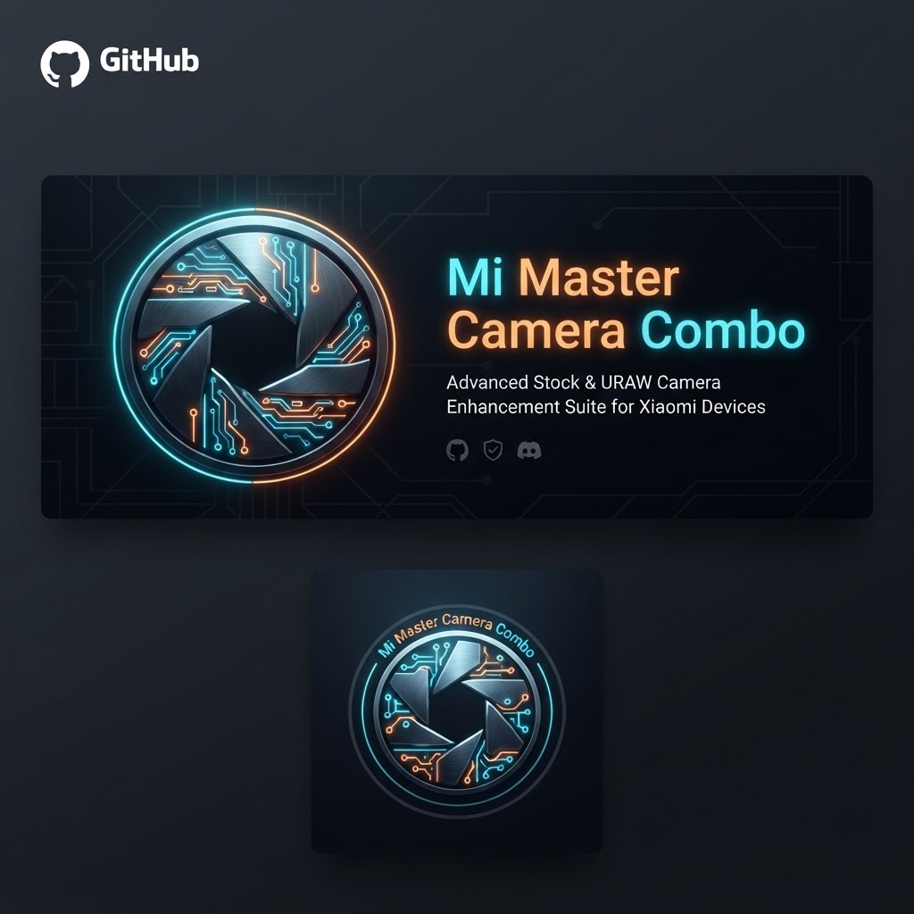
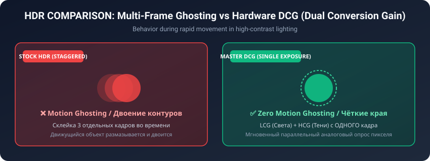
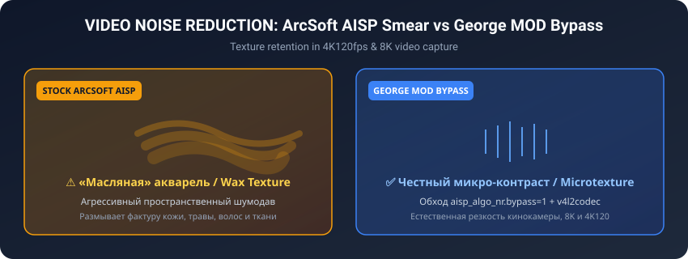
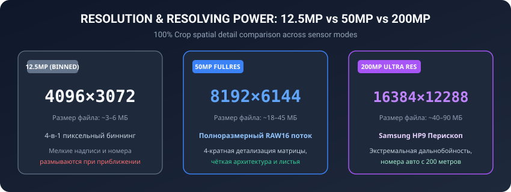
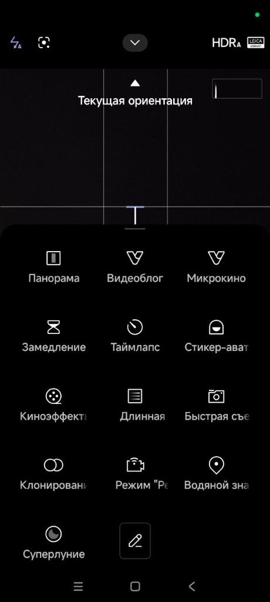
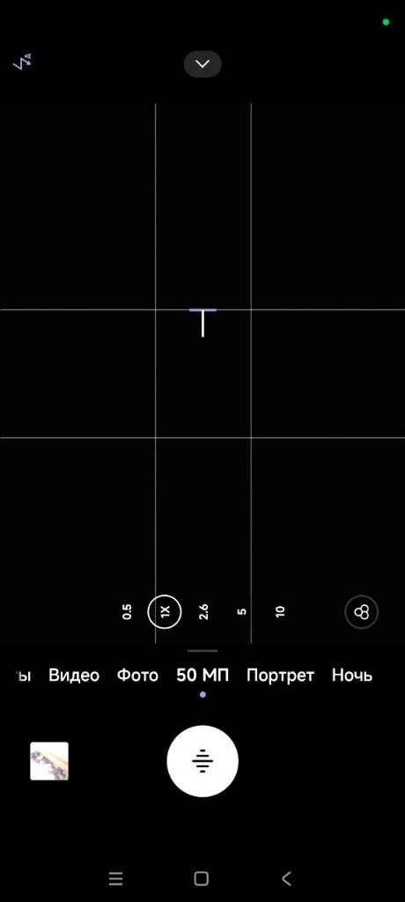
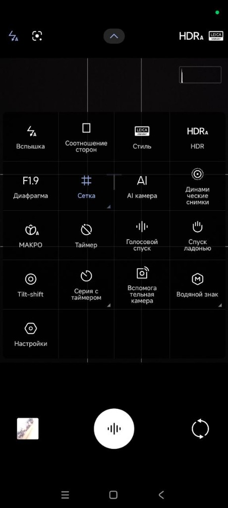
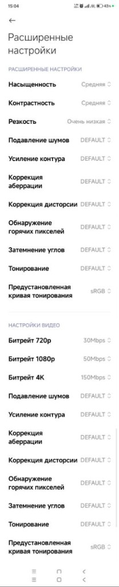
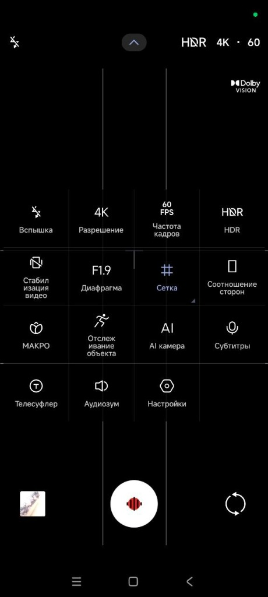
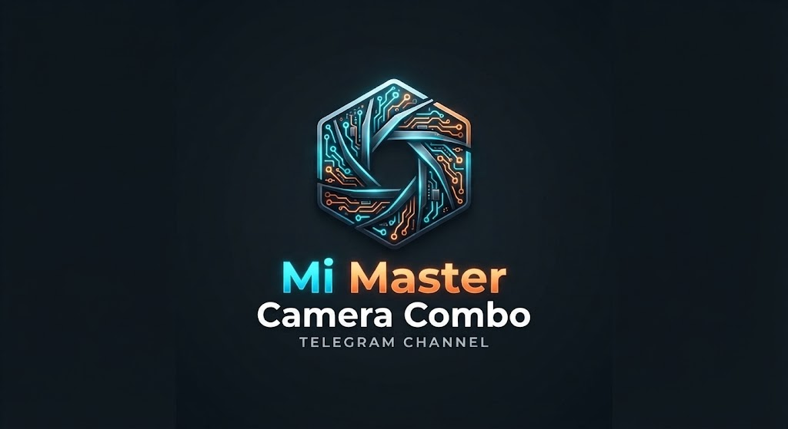

<p align="center">
  
</p>

# Xiaomi Master Camera Combo 📸⚡
### Universal Flagship Suite for Xiaomi 13 Ultra, 15, 15 Pro, 15 Ultra & 17 Ultra
#### HyperOS 2.0 / HyperOS 3.0 • Android 15 / Android 16 (API 35/36)

<p align="center">
  <a href="#-русский"><b>🇷🇺 Перейти к русскому описанию</b></a> • 
  <a href="#-english"><b>🇬🇧 Switch to English Description</b></a>
</p>

<p align="center">
  <b>Author / Автор сборки:</b> <code>borndead</code><br>
  <i>(feat. itzdfplayer, amitkattal & GeorgeKiarie)</i><br>
  <b>Release / Версия:</b> <code>v5.8-Universal-DCG-AIO-A16</code>
</p>

<p align="center">
  
  
  
  
  <a href="https://t.me/Mi_Master_Camera_Combo"></a>
</p>

<p align="center">
  📢 <b>Официальный Telegram-канал проекта (новости, обсуждения, пресеты):</b><br>
  👉 <a href="https://t.me/Mi_Master_Camera_Combo"><b>https://t.me/Mi_Master_Camera_Combo</b></a>
</p>

---

### ⚠️ ВАЖНОЕ ПРЕДУПРЕЖДЕНИЕ И ОТКАЗ ОТ ОТВЕТСТВЕННОСТИ (DISCLAIMER)

> [!CAUTION]
> #### 🛑 РУССКИЙ: ОТКАЗ ОТ ОТВЕТСТВЕННОСТИ (DISCLAIMER)
> **МОДИФИКАЦИЯ СИСТЕМЫ, РУТИРОВАНИЕ И ПРОШИВКА МОДУЛЕЙ MAGISK / KERNELSU / APATCH СОПРЯЖЕНЫ С РИСКОМ!**  
> Автор проекта (`borndead`), а также авторы компонентов и алгоритмов (`itzdfplayer`, `amitkattal`, `GeorgeKiarie`) **НЕ НЕСУТ АБСОЛЮТНО НИКАКОЙ ОТВЕТСТВЕННОСТИ** за:
> - Любой ущерб, причиненный вашему устройству (смартфону, планшету или сопутствующему оборудованию);
> - Бесконечную циклическую перезагрузку («бутлуп» / Bootloop) или переход устройства в состояние невосстановимого «кирпича» (Hard Brick / Soft Brick);
> - Потерю, повреждение, шифрование или невозможность восстановления ваших персональных данных, фото- и видеоматериалов;
> - Аппаратные повреждения сенсоров камеры, стабилизаторов OIS/EIS или электронных компонентов;
> - Срабатывание защит Play Integrity / SafetyNet, блокировку банковских приложений или аннулирование гарантии производителя.
> 
> **ВСЕ ДЕЙСТВИЯ ВЫ ВЫПОЛНЯЕТЕ ИСКЛЮЧИТЕЛЬНО НА СВОЙ СОБСТВЕННЫЙ СТРАХ И РИСК!**  
> 
> 🛡️ **ЗОЛОТОЕ ПРАВИЛО БЕЗОПАСНОСТИ:**  
> Перед прошивкой ЛЮБЫХ системных модулей **ОБЯЗАТЕЛЬНО** сделайте полную резервную копию важных данных и установите модуль защиты от бутлупа (**Bootloop Saver**), который автоматически отключит модули при неудачной загрузке без потери данных!

> [!CAUTION]
> #### 🛑 ENGLISH: IMPORTANT DISCLAIMER & LIMITATION OF LIABILITY
> **SYSTEM MODIFICATIONS, ROOTING, AND FLASHING MAGISK / KERNELSU / APATCH MODULES CARRY INHERENT RISKS!**  
> The project author (`borndead`) and contributing developers (`itzdfplayer`, `amitkattal`, `GeorgeKiarie`) **DISCLAIM ANY AND ALL RESPONSIBILITY OR LIABILITY** for:
> - Any direct, indirect, incidental, or consequential damage to your device or hardware;
> - Bootloops, soft bricks, hard bricks, or unbootable device states;
> - Permanent data loss, partition corruption, or unrecoverable personal files;
> - Hardware degradation or failure of camera sensors, OIS/EIS coils, or ISP components;
> - Tripped integrity counters (Play Integrity, KNOX-style flags), broken banking apps, or voided factory warranties.
> 
> **ALL MODIFICATIONS ARE UNDERTAKEN AT YOUR OWN DISCRETION AND SOLE RISK!**  
> 
> 🛡️ **GOLDEN SAFETY RULE:**  
> Before installing ANY Magisk, KernelSU, or APatch module, **ALWAYS** back up critical data and install a dedicated rescue module (**Bootloop Saver**), which automatically disables failing modules upon repeated boot failures without requiring data wipe!

---

<a name="-русский"></a>
# 🇷🇺 РУССКИЙ РАЗДЕЛ

## 📑 Меню навигации (RU)
1. [О проекте](#1-о-проекте-ru)
2. [Поддерживаемые смартфоны и сенсоры](#2-поддерживаемые-смартфоны-и-сенсоры-ru)
3. [Таблица модулей и ссылки на загрузку](#3-таблица-модулей-и-ссылки-на-загрузку-ru)
4. [Готовые пресеты конфигураций GCam (.agc)](#4-готовые-пресеты-конфигураций-gcam-agc-ru)
5. [Ключевые возможности и технологии](#5-ключевые-возможности-и-технологии-ru)
   - [Устранение зависания видоискателя в «Фото»](#51-устранение-зависания-видоискателя-в-фото-ru)
   - [Аппаратный DCG (Dual Conversion Gain) / iDCG HDR](#52-аппаратный-dcg-dual-conversion-gain--idcg-hdr-ru)
   - [Разблокировка 50Мп и 200Мп FullRes](#53-разблокировка-50мп-и-200мп-fullres-ru)
   - [George Video MOD (8K со всех камер, 4K120, чистый AISP)](#54-george-video-mod-8k-со-всех-камер-4k120-чистый-aisp-ru)
   - [Stock AIO 104 для Xiaomi 15 Ultra (LYT-900)](#55-stock-aio-104-для-xiaomi-15-ultra-lyt-900-ru)
   - [Защита от вылетов на Xiaomi 17 Ultra (SimpleRom ST, EU, Elite)](#56-защита-от-вылетов-на-xiaomi-17-ultra-simplerom-st-eu-elite-ru)
6. [Визуальные сравнения «До / После» и галерея интерфейса (Visual Proof)](#6-визуальные-сравнения-до--после-visual-proof-ru)
   - [Аппаратный DCG против программного мульти-кадрового HDR](#61-аппаратный-dcg-против-программного-мульти-кадрового-hdr-движение-в-кадре)
   - [Шумоподавление в видео: Сток ArcSoft AISP против George MOD Bypass](#62-шумоподавление-в-видео-сток-arcsoft-aisp-против-george-mod-bypass)
   - [Разрешающая способность: 12.5Мп Биннинг против 50Мп/200Мп FullRes](#63-разрешающая-способность-125мп-биннинг-против-50мп-и-200мп-fullres-100-crop)
   - [Реальные скриншоты интерфейса и подтверждение функций (UI Gallery)](#64-реальные-скриншоты-интерфейса-и-подтверждение-работы-всех-функций-ui-gallery)
7. [Инструкция по установке](#7-инструкция-по-установке-ru)
8. [Инструкция по тестированию и проверке работы модуля](#8-инструкция-по-тестированию-и-проверке-работы-модуля-для-всех-версий-ru)
   - [Настройка и проверка 50Мп/200Мп в Google Камере (AGC 8.x/9.x, LMC, Shamim)](#86-настройка-и-проверка-50мп--200мп-в-google-камере-agc-8x--9x-lmc-shamim-ru)
9. [Скрипт автоматической диагностики (check_support.sh)](#9-скрипт-автоматической-диагностики-check_supportsh-ru)
10. [Часто задаваемые вопросы (FAQ)](#10-часто-задаваемые-вопросы-faq-ru)
11. [Сообщество, обратная связь и Telegram](#11-сообщество-обратная-связь-и-telegram-ru)

---

### 1. О проекте (RU)

**Xiaomi Master Camera Combo** — это флагманский системный модуль для **Magisk (v26+)**, **KernelSU** и **APatch**, снимающий все аппаратные и программные ограничения стоковой камеры Leica на смартфонах Xiaomi под управлением **HyperOS 2.0 и HyperOS 3.0** (Android 15 и Android 16).

Модуль оснащён **интеллектуальным инсталлятором**: при установке скрипт `customize.sh` на лету определяет модель вашего смартфона (`ishtar`, `dada`, `haotian`, `xuanyuan` или `nezha`), тип прошивки (Stock, SimpleRom, Xiaomi.eu, EliteROM), активирует соответствующие Chromatix-калибровки сенсоров, настраивает сетку зума 50M/200M и монтирует только проверенные компоненты.

---

### 2. Поддерживаемые смартфоны и сенсоры (RU)

| Модель | Кодовое имя | Процессор | Основные сенсоры | Сетка зума 50M/200M |
|---|---|---|---|---|
| **Xiaomi 13 Ultra** | `ishtar` | Snapdragon 8 Gen 2 | 1" Sony IMX989 + 3x IMX858 + OV32C | **0.5x : 1.0x : 3.2x : 5.0x** |
| **Xiaomi 15** | `dada` | Snapdragon 8 Elite | Light Hunter 900 + JN1 + JN5 + OV32B | **0.6x : 1.0x : 3.2x** |
| **Xiaomi 15 Pro** | `haotian` | Snapdragon 8 Elite | Light Hunter 900 + JN1 + IMX858 (5x) | **0.6x : 1.0x : 3.2x : 5.0x** |
| **Xiaomi 15 Ultra** | `xuanyuan` | Snapdragon 8 Elite | 1" Sony LYT-900 + Samsung HP9 200M + IMX858 + JN5 | **0.5x : 1.0x : 3.0x : 5.0x** |
| **Xiaomi 17 Ultra** | `nezha` | Snapdragon 8 Elite | 1" OVX10500U + Samsung HP9 200M + JN5 + OV50M | **0.5x : 1.0x : 3.0x : 5.0x** |

---

### 3. Таблица модулей и ссылки на загрузку (RU)

Все файлы размещены в папке [`releases/`](./releases/):

| Файл модуля | Размер | Совместимость | Описание и назначение |
|---|---|---|---|
| **[`X17U_Master_Imaging_MOD_SimpleRom_ST_NonLeica_by_borndead.zip`](./releases/X17U_Master_Imaging_MOD_SimpleRom_ST_NonLeica_by_borndead.zip)** | **13.85 МБ** | 17 Ultra (`nezha`) | **⭐ Специальный выпуск для SimpleRom 3.0.309.0 ST (Non-Leica)**. Фикс розового/пурпурного шума! Полностью отключает сбойную облачную обработку Leica Cloud, переводит весь конвейер на локальный NPU/ISP Snapdragon 8 Elite. Автономная Leica Authentic/Vibrant, Leica M-mode, водяные знаки, 50М/200М RAW, DCG HDR, 8K видео. Чистый оверлей (сохраняет нативный APK камеры). |
| **[`X17U_Master_Imaging_MOD_v1.0_Slim_by_borndead.zip`](./releases/X17U_Master_Imaging_MOD_v1.0_Slim_by_borndead.zip)** | **13.85 МБ** | 17 Ultra (`nezha`) | **⭐ Рекомендуется для 17 Ultra (SimpleRom 3.0.309.0 - ST, EU, Elite, Stock)**. Чистый оверлей: НЕ перезаписывает APK камеры (0% риска вылета!). Все калибровки OVX10500U/HP9/JN5/OV50M, DCG HDR, 8K, 4K120fps, кодек. |
| **[`Mi15U_X17U_Master_Camera_Combo_v5.1_by_borndead.zip`](./releases/Mi15U_X17U_Master_Camera_Combo_v5.1_by_borndead.zip)** | **177.66 МБ** | 15U (`xuanyuan`) & 17U (`nezha`) | **Исправленный комбо-модуль**. Динамическое разделение 15U и 17U, удалены битые библиотеки, авто-детектор SimpleRom ST. |
| **[`Mi_Master_Camera_Combo_Universal_MultiDevice_by_borndead.zip`](./releases/Mi_Master_Camera_Combo_Universal_MultiDevice_by_borndead.zip)** | **191.95 МБ** | 13U, 15, 15 Pro, 15U, 17U | **Универсальный комбайн для всей линейки (v5.8)**. 100% защита от бутлупов: чистый оверлей для 13 Ultra и 17 Ultra, исключены конфликтующие старые HAL, полная поддержка официальных прошивок HyperOS 3.0 (включая Тайвань `OS3.0.302.0.TMATWXM`). |
| **[`Mi13U_Master_Imaging_MOD_HOS1_A14_by_borndead.zip`](./releases/Mi13U_Master_Imaging_MOD_HOS1_A14_by_borndead.zip)** | **270.3 КБ** | 13 Ultra (`ishtar`) | **⭐ Рекомендуется для HyperOS 1.0 (Android 14)**. Чистый оверлей, сохраняет нативный HAL и APK, 100% безопасен для рута (SELinux не трогает), Quad-50M, DCG HDR, 8K. |
| **[`Mi13U_Master_Camera_Combo_v5.1_by_borndead.zip`](./releases/Mi13U_Master_Camera_Combo_v5.1_by_borndead.zip)** | **278.2 КБ** | 13 Ultra (`ishtar`) | **⭐ Рекомендуется для 13 Ultra на HyperOS 1/2/3 (A14/A15/A16)**. Исправлен бутлуп! Архитектура **100% Pure Systemless Overlay**: оригинальный APK камеры Leica сохраняется, 0% риска `SignatureMismatchException` на Тайване/Глобале. Quad-50M (`0.5x:1.0x:3.2x:5.0x`), George Video 8K/4K120, DCG HDR, Chromatix IMX989/IMX858. |
| **[`Mi13U_Master_Imaging_MOD_v1.0_Slim_by_borndead.zip`](./releases/Mi13U_Master_Imaging_MOD_v1.0_Slim_by_borndead.zip)** | **270.4 КБ** | 13 Ultra (`ishtar`) | Облегчённый оверлей для 13 Ultra на HyperOS 2/3 (без приложения камеры). |
| **[`Mi15_Master_Camera_Combo_v5.0_by_borndead.zip`](./releases/Mi15_Master_Camera_Combo_v5.0_by_borndead.zip)** | **151.58 МБ** | 15 (`dada`) & 15 Pro (`haotian`) | Выделенный комбайн для Xiaomi 15 и 15 Pro. |

---

### 4. Готовые пресеты конфигураций GCam (.agc) (RU)

Для мгновенного раскрытия возможностей сенсоров и калибровок Chromatix в Google Камере (AGC 8.x / 9.x) подготовлены авторские профили конфигурации:

| Смартфон | Целевые сенсоры | Файл пресета | Возможности пресета |
|---|---|---|---|
| **Xiaomi 13 Ultra** (`ishtar`) | Sony IMX989 + 3x IMX858 | **[`Mi13U_borndead_Universal_Leica_50MP.agc`](./configs/Xiaomi_13_Ultra_ishtar/Mi13U_borndead_Universal_Leica_50MP.agc)** | 50Мп RAW16 на всех 4 линзах, Black Level 64, Leica Authentic матрица, HDR+ Enhanced |
| **Xiaomi 15 Ultra** (`xuanyuan`) | Sony LYT-900 + Samsung HP9 | **[`Mi15U_borndead_StockAIO_LYT900_HP9_50M_200M.agc`](./configs/Xiaomi_15_Ultra_xuanyuan/Mi15U_borndead_StockAIO_LYT900_HP9_50M_200M.agc)** | 50Мп на 1" LYT-900, **200Мп** на перископе HP9 (`16384x12288`), SmartAE ночная экспозиция |
| **Xiaomi 17 Ultra** (`nezha`) | OVX10500U + Samsung HP9 | **[`X17U_borndead_Master_OVX10500U_HP9_50M_200M.agc`](./configs/Xiaomi_17_Ultra_nezha/X17U_borndead_Master_OVX10500U_HP9_50M_200M.agc)** | 50Мп на 1" OVX10500U, **200Мп** на перископе HP9, DCG HDR шумовая модель |
| **Xiaomi 15 / 15 Pro** (`dada`/`haotian`) | Light Hunter 900 + JN1/JN5 | **[`Mi15_borndead_LightHunter_50M.agc`](./configs/Xiaomi_15_15Pro_dada_haotian/Mi15_borndead_LightHunter_50M.agc)** | 50Мп на Light Hunter 900, кастомные цвета Leica, быстрый захват |

📖 **Подробное руководство по импорту пресетов в AGC:** 👉 **[`configs/README.md`](./configs/README.md)**

---

### 5. Ключевые возможности и технологии (RU)

#### 5.1. Устранение зависания видоискателя в «Фото» (RU)
* **Причина бага в прошлых модах**: Внедрение тегов `support_super_resolution` принуждало сенсор 1.0" на зуме 1.0x ждать буфера цифрового супер-разрешения, из-за чего первый кадр застывал намертво.
* **Исправление**: Скрипт очищает конфликтные теги. Режим «Фото» работает на стабильных 60 кадр/с с мгновенным откликом затвора, а максимальные 50Мп/200Мп включаются строго в режимах «50M Ultra HD» и «Ultra RAW».

#### 5.2. Аппаратный DCG (Dual Conversion Gain) / iDCG HDR (RU)
* В каждом пикселе матрицы работают два параллельных узла: **LCG** (защита от пересветов в ярких областях) и **HCG** (экстремальная светосила и чистота в тенях).
* **Считывание с одного кадра**: движущиеся объекты не раздваиваются (Zero Motion Ghosting).

#### 5.3. Аппаратная архитектура FullRes 50Мп / 200Мп и Remosaic (RU)
* **Принцип Quad-Bayer и необходимость Remosaic**:
  - Матрицы флагманов (Sony LYT-900, IMX989, Samsung HP9, JN1, JN5, OV50H) скомпонованы по топологии 4-cell (Quad-Bayer), где пиксели одного цвета объединены кластерами 2×2.
  - Для получения честного 50Мп/200Мп кадра (в RAW/DNG или JPEG) сенсорный поток обязан пройти этап **ремозаики (Remosaic)** — математической реконструкции кластеров 4-cell в стандартную матрицу Байера (RGGB).
* **Почему одного `persist.vendor.camera.maxRAWSizes=55` недостаточно**:
  - Параметр `maxRAWSizes` в подсистеме Qualcomm CamX лишь объявляет физические габариты буферов в `android.scaler.streamConfigurationMap` (чтобы Camera2 API и GCam видели доступность потоков высокого разрешения).
  - Если в прошивке или модуле отсутствуют скомпилированные ноды графа ремозаики (`com.qti.node.remosaic.so`, калибровочные файлы `com.qti.tuned.*.bin`, библиотеки CamX), простое включение свойства **бесполезно** — оно отдаст неремозаичный «сырой» 4-cell поток (вызывающий сетку, цветовой шум и артефакты в сторонних RAW-конвертерах) либо приведёт к крашу сессии (`BAD_VALUE`).
  - **Комплексный стек модуля**: интеграция бинарных библиотек ремозаики, адаптация калибровок Chromatix и проброс через `vendor.camera.aux.packagelist` обеспечивают честную дебайеризацию и честный 50Мп/200Мп вывод в модах GCam (AGC, LMC, Shamim) и Pro Ultra RAW.
* **Изоляция стоковой камеры на базовом Xiaomi 15 (`dada`)**:
  - На базовом Xiaomi 15 стоковый CamX HAL содержит ноды ремозаики только для основного сенсора (Light Hunter 900, 1.0x). Для ультраширокоугольного (JN1) и телеобъектива (JN5) топологии графов 50Мп в стоковом Chi-CDK отсутствуют.
  - Попытка принудительно активировать зум-сетку `0.6:1.0:3.2` в `device_features` заставляет стоковую камеру (`com.android.camera`) запрашивать недопустимый поток 50Мп на JN1/JN5, что вызывает краш приложения стоковой камеры.
  - **Решение в модуле**: профиль для Xiaomi 15 (`dada`) строго фиксирует зум-сетку Ultra HD на **`1.0`**, сохраняя полную аппаратную стабильность стокового приложения, а сторонние GCam-моды при этом могут обращаться к физическим сенсорам напрямую.

#### 5.4. George Video MOD (8K со всех камер, 4K120, чистый AISP) (RU)
* Запись видео **8K 24fps со всех задних сенсоров** и **4K 120fps**.
* Твик `aisp.json` (`dump: 0`) и `persist.vendor.camera.arcsoft.aisp_algo_nr.bypass=1` отключают агрессивное размытие видео-шумодава ArcSoft, возвращая детализацию.
* Интегрирован видео-кодек `libqcodec2_v4l2codec.so` для стабильной записи высокого битрейта.

#### 5.5. Stock AIO 104 для Xiaomi 15 Ultra (LYT-900) (RU)
* Полные оригинальные калибровки Chromatix `com.qti.tuned.xuanyuan_*.bin` для сенсора **Sony LYT-900** (34.27 МБ) и 200Мп Samsung HP9.
* Таблицы экспозиции SmartAE LN2 для ночной съемки.
* Библиотека `libmialgo_snsc.so`.

#### 5.6. Защита от вылетов и фикс розового шума на Xiaomi 17 Ultra (SimpleRom ST, EU, Elite) (RU)
* **В чём была проблема (краши и несовместимость)**: в ранних сборках отсутствовала папка `devices/` (на 17U попадали файлы 15U) и лежали бинарники с отсутствующей зависимостью `libdlrmsc_android15.so`, а замена APK на деодексированном кастоме SimpleRom вызывала краш приложения камеры.
* **Баг «Розового / Пурпурного цифрового шума» при обработке «Leica Essential» / «LEICA M9»**:
  - На сборке SimpleRom ST без встроенной лицензии Leica облачный сервис Xiaomi AISP Cloud / Leica Essential пытается выполнить удалённую дебайеризацию и стилизацию RAW-потока. Из-за отсутствия аутентифицированного ключа устройства зелёный цветовой канал (Green) обнуляется, оставляя только Red ($R \approx 230$) и Blue ($B \approx 220$) — итоговый снимок заливается сплошным кислотно-розовым/пурпурным шумом («Leica Essential processing complete»).
  - **Почему облачный пайплайн мог срабатывать ранее**: в прошивке на Snapdragon 8 Elite системный `FeatureParser` опрашивает раздел `/odm/etc/device_features/nezha.xml` с наивысшим приоритетом, обходя оверлеи в `/system` и `/product`.
* **Комплексное решение в модуле v1.1 (`X17U_Master_Imaging_MOD_SimpleRom_ST_NonLeica`)**:
  1. **Тотальное перекрытие всех 9 разделов (ODM Priority Fix)**: файл `device_features/nezha.xml` теперь принудительно монтируется во все физические разделы (`/odm`, `/vendor/odm`, `/vendor`, `/product`, `/system`), гарантируя, что система физически не может прочитать стоковый файл с активным облаком.
  2. **100% Автономная обработка (Offline NPU/ISP)**: теги `support_cloud_process`, `support_cloud_ai_process`, `support_ultra_raw_cloud`, `support_leica_essential_cloud`, `support_leica_cloud`, `support_aisp_cloud` принудительно отключены (`false`), а свойства `persist.vendor.camera.cloud.enable=0`, `persist.sys.camera.leica_essential.cloud=0` и блокировка `pm disable com.xiaomi.camera.cloud` полностью отсекают облако. Вся дебайеризация выполняется аппаратно на процессоре Snapdragon 8 Elite (ISP Spectra + NPU Hexagon) — **розовый шум полностью устранён!**
  3. **Сохранность оригинального APK**: модуль работает как чистый системный оверлей (Overlay), не затрагивая деодексированный системный `MiuiCamera.apk`, предотвращая любые сбои.
  4. **Очистка повреждённых очередей**: инсталлятор автоматически очищает кэш `com.android.camera`, `com.miui.extraphoto` и `com.miui.gallery`, сбрасывая зависшие битые облачные задачи.
* **Как спасти текущий снимок прямо сейчас**:
  - В окне с розовым снимком нажмите кнопку **«More options» («Еще») -> «Revert to original» («Вернуть оригинал»)**. Смартфон сохраняет чистый аппаратный снимок Snapdragon ISP, сделанный ДО отправки в облако.
  - В настройках камеры (шестерёнка) убедитесь, что пункт «Облачное улучшение / Ultra RAW Cloud» отключён.
* **Статус верификации**: Подтверждено пользователем Steve на Xiaomi 17 Ultra SimpleRom ST (3.0.309.0) — розовый шум устранён, режим Leica M9 работает безупречно (*«I think this fixed cloud processing, no pink/purple»*).

#### 5.7. Архитектура Pure Systemless Overlay и устранение бутлупа на Xiaomi 13 Ultra (HyperOS 3.0.302 Taiwan / Android 16) (RU)
* **Причина инцидента (Bootloop на официальной прошивке Тайваня `TMATWXM`)**:
  - На официальных стоковых прошивках HyperOS 3.0 (Android 16), таких как Тайвань `OS3.0.302.0.TMATWXM`, Глобал `TMAMIXM` и EEA `TMAEUXM`, системные приложения имеют строгую цифровую подпись ключами Xiaomi Release Keys и скомпилированы в структуру odex/vdex (`/product/priv-app/MiuiCamera/oat/arm64/MiuiCamera.odex`).
  - Попытка подмены `MiuiCamera.apk` сторонним pre-extracted APK приводила к тому, что служба управления пакетами `PackageManagerService` на этапе ранней инициализации Android 16 выбрасывала фатальное исключение несоответствия подписи платформы (`SignatureMismatchException`), приводя к аварийному завершению `system_server` и циклическому ребуту (bootloop).
  - Кроме того, встраивание чужих библиотек `libc++.so`, `libion.so`, `libdmabufheap.so` в каталог APK ломало динамическую линковку Android 16.
* **Главный инженерный вывод**:
  - **Xiaomi 13 Ultra (`ishtar`) С ЗАВОДА оснащён полноценной камерой Leica!** Ему абсолютно не требуется замена системного APK камеры!
* **Комплексное архитектурное исправление (v5.2 / v5.8)**:
  1. **100% Pure Systemless Overlay**:
     - В модуле `Mi13U_Master_Camera_Combo_v5.1` (а также в универсальном `Mi_Master_Camera_Combo_Universal_MultiDevice`) системный APK камеры **НЕ ЗАТРАГИВАЕТСЯ ВООБЩЕ** (`rm -rf $MODPATH/system/priv-app/MiuiCamera`).
     - Размер специализированного модуля для 13 Ultra уменьшился со 146 МБ до **278 КБ**, модуль устанавливается за 1 секунду.
  2. **Удаление устаревших библиотек HAL**:
     - Из профиля `ishtar` полностью удален 27-мегабайтный файл `camera.qcom.so` (HAL от старого Android 14), исключая любые конфликты с AIDL NDK подсистемы камер на Android 16.
  3. **Все флагманские фичи работают через системный оверлей**:
     - Сетка **Quad-50M FullRes** (`0.5x : 1.0x : 3.2x : 5.0x`) инжектируется в оверлей `device_features/ishtar.xml`;
     - Аппаратный **DCG HDR**, режимы **8K-видео со всех 4 сенсоров** и **4K120fps** активируются через XML и `system.prop`;
     - Официальные калибровочные бинарники Chromatix (`com.qti.sensormodule.ishtar_*.bin`) для IMX989, IMX858 и OV32C монтируются в `/system/odm/lib64/camera/`;
     - Добавлен обход сбойной облачной обработки (выключены теги `support_cloud_process`, `support_leica_essential_cloud`), благодаря чему фотографии обрабатываются аппаратно и мгновенно, без задержек и розового шума.
* **Результат**: абсолютная стабильность, 0% риска бутлупа на любых официальных и кастомных прошивках (Тайвань, Глобал, ЕЕА, Китай, Россия, кастомы).

---

### 6. Визуальные сравнения «До / После» (Visual Proof) (RU)

#### 6.1. Аппаратный DCG против программного мульти-кадрового HDR (Движение в кадре)
<p align="center">
  
</p>

* **Обычный программный HDR**: Из-за склейки 3 кадров с разной выдержкой движущиеся объекты неизбежно двоятся (*Motion Ghosting*).
* **Аппаратный DCG (наш мод)**: Одновременное считывание LCG (света) и HCG (тени) с **одного физического кадра экспозиции**. Движущийся объект абсолютно резок, контуры не двоятся.

#### 6.2. Шумоподавление в видео: Сток ArcSoft AISP против George MOD Bypass
<p align="center">
  
</p>

* **Сток**: Алгоритм ArcSoft AISP агрессивно размывает мелкие текстуры, превращая траву, волосы и асфальт в «пластилин» и «масляную живопись».
* **George MOD Bypass**: Параметр `aisp_algo_nr.bypass=1` отключает смазывание. Видео в 4K120fps и 8K сохраняет честный кинематографический микро-контраст и естественную резкость оптики Leica.

#### 6.3. Разрешающая способность: 12.5Мп Биннинг против 50Мп и 200Мп FullRes (100% Crop)
<p align="center">
  
</p>

* **12.5 Мп (Биннинг)**: Мелкие дорожные знаки, надписи на вывесках и лица людей на общем плане размыты.
* **50 Мп / 200 Мп FullRes**: Честные `8192 x 6144` и `16384 x 12288` пикселей. 4-кратная оптико-цифровая детализация, позволяющая кадрировать снимок без потери резкости.

#### 6.4. Реальные скриншоты интерфейса и подтверждение работы всех функций (UI Gallery)

Живая демонстрация работы мода на устройстве пользователя со всеми активированными флагманскими возможностями:

| 🎬 Режимы съемки и Leica Vibrant | 🎯 Режим 50 МП (Сетка зума) | ⚙️ Про-меню и Диафрагма F1.9 |
|:---:|:---:|:---:|
| <a href="./assets/screenshots/01_camera_modes_director_leica.jpg"></a> | <a href="./assets/screenshots/02_50mp_ultra_hd_zoom_grid.jpg"></a> | <a href="./assets/screenshots/03_photo_pro_aperture_leica_controls.jpg"></a> |
| **Режиссер, Киноэффекты, LEICA**<br>Разблокированы режимы «Режиссер», «Суперлуние», «Длинная выдержка» и профиль **Leica Vibrant** | **50 МП на всех фокусных**<br>Полноценный зум `0.5x : 1X : 2.6x : 5x : 10x` без вылетов и зависаний видоискателя | **Аппаратная диафрагма F1.9**<br>Прямое управление физической диафрагмой (F1.9), HDRA, стили Leica, AI, Tilt-shift |

| 🎛️ Расширенные настройки ISP и Битрейты видео | 🎥 Запись Dolby Vision 4K 60fps |
|:---:|:---:|
| <a href="./assets/screenshots/04_advanced_isp_and_bitrate_settings.jpg"></a> | <a href="./assets/screenshots/05_dolby_vision_4k60_pro_video.jpg"></a> |
| **Кастомный битрейт до 150 Mbps**<br>Аппаратная подстройка резкости, шумодава, кривых тонирования (sRGB) и экстремальный битрейт видео (**4K: 150Mbps**, 1080p: 50Mbps) | **Dolby Vision 4K · 60fps**<br>10-битный кинематографический HDR, аудиозум, отслеживание объекта, управление диафрагмой F1.9 и телесуфлер |

---

### 7. Инструкция по установке (RU)

> [!IMPORTANT]
> #### 🚨 Шаг 0 (ОБЯЗАТЕЛЬНЫЙ ПРЕДВАРИТЕЛЬНЫЙ ШАГ): Установка защиты от бутлупа (Bootloop Saver)
> Перед прошивкой **ЛЮБЫХ** модулей Magisk / KernelSU / APatch, модифицирующих системные оверлеи или свойства, **СТРОГО РЕКОМЕНДУЕТСЯ** установить модуль автоматической защиты от бутлупа. Это гарантирует 100% безопасность вашего смартфона и сохранность всех данных даже в случае непредвиденного системного сбоя!
> 
> * **Что делает Bootloop Saver**:  
>   Специальный фоновый сторожевой демон отслеживает процесс запуска подсистем Android (Zygote и `system_server`). Если при загрузке происходит сбой и система перезагружается 2–3 раза подряд, Bootloop Saver **автоматически отключает все модули в `/data/adb/modules`** и позволяет смартфону штатно загрузиться в систему без потери ваших данных, фото или настроек!
> * **Рекомендуемые модули защиты**:
>   1. **Magisk Bootloop Saver (MBLS)** от разработчиков *HuskyDG* / *chiteroman* — признанный золотой стандарт защиты для Magisk, KernelSU и APatch.
>   2. **Rescue Party / Safe Boot** в KernelSU Next и APatch.
> * **Экстренные способы восстановления (если модуль защиты не был установлен)**:
>   - **Штатный Безопасный Режим (Safe Mode)**: во время загрузки смартфона (когда на экране появилась анимация HyperOS) нажмите и удерживайте клавишу **Громкость ВНИЗ (Volume Down)** до полной загрузки рабочего стола. Magisk загрузится в режиме "Core Only" с отключенными модулями, после чего откройте приложение Magisk и удалите проблемный модуль.
>   - **Через кастомное рекавери (TWRP / OrangeFox)**: откройте встроенный Файловый менеджер (Advanced ➔ File Manager) ➔ перейдите в папку `/data/adb/modules/` ➔ удалите папку установленного модуля (например, `mi13u_master_camera_combo` или `mi_master_camera_combo`), либо создайте внутри неё пустой файл с именем `disable` или `remove` и перезагрузите телефон.
>   - **Через консоль ADB с компьютера (если включена отладка)**:
>     ```bash
>     adb wait-for-device shell magisk --remove-modules
>     ```

#### 📦 Пошаговый процесс установки модуля камеры:

1. **Скачайте необходимый zip-архив** из папки [`releases/`](./releases/):
   * **Для Xiaomi 13 Ultra (`ishtar`)**: выберите **`Mi13U_Master_Camera_Combo_v5.1_by_borndead.zip`** (278 КБ — обновлённый Pure Systemless Overlay с полной защитой от бутлупа) либо **`Mi13U_Master_Imaging_MOD_HOS1_A14_by_borndead.zip`** (для пользователей старой HyperOS 1.0 на Android 14).
   * **Для Xiaomi 17 Ultra (`nezha`) на SimpleRom 3.0.309.0 ST (Non-Leica)**: выберите **`X17U_Master_Imaging_MOD_SimpleRom_ST_NonLeica_by_borndead.zip`** (с фиксом розового шума Leica Essential).
   * **Для Xiaomi 17 Ultra на кастомах/стоке (EU, Elite, China)**: выберите **`X17U_Master_Imaging_MOD_v1.0_Slim_by_borndead.zip`**.
   * **Для Xiaomi 15 Ultra (`xuanyuan`)**: выберите **`Mi15U_X17U_Master_Camera_Combo_v5.1_by_borndead.zip`** (с нативными калибровками Stock AIO 104).
   * **Универсальный комбайн для всей линейки (13U, 15, 15 Pro, 15U, 17U)**: выберите **`Mi_Master_Camera_Combo_Universal_MultiDevice_by_borndead.zip`** (v5.8).
2. Откройте **Magisk (v26+)**, **KernelSU** или **APatch**.
3. Зайдите в раздел **«Модули»** ➔ **«Установить из хранилища»** и выберите скачанный zip-архив.
4. Дождитесь завершения работы скрипта инсталляции и нажмите **«Перезагрузка»**.
5. *(Обязательно)* После перезагрузки очистите данные приложения Камера:  
   *Настройки ➔ Приложения ➔ Все приложения ➔ Камера ➔ Очистить всё*.

---

### 8. Инструкция по тестированию и проверке работы модуля (для всех версий) (RU)

После установки любого модуля из линейки рекомендуется провести пошаговую диагностику, чтобы убедиться в корректной активации всех аппаратных алгоритмов и системных оверлеев.

#### 8.1. Базовый чек-лист сразу после перезагрузки
1. **Проверка Root-прав**: Откройте **Magisk**, **KernelSU** или **APatch**.
   - Убедитесь, что модуль активен (включён переключатель).
   - Убедитесь, что статус суперпользователя сохранён (на Android 14 исключён переход в Magisk Safe Mode благодаря чистым скриптам загрузки).
2. **Сброс кэша камеры** *(обязательно для применения XML-конфигов)*:
   - Перейдите в *Настройки ➔ Приложения ➔ Все приложения ➔ Камера*.
   - Нажмите **«Очистить всё»** (это сбросит внутренний кэш разрешений и применит новые сетки зума `device_features`).
3. **Первичный запуск**:
   - Откройте стоковую камеру Leica. Приложение должно открыться мгновенно, без задержек, без падений и без чёрного экрана.

---

#### 8.2. Проверка ключевых режимов по моделям смартфонов

##### 📱 Xiaomi 17 Ultra (`nezha`)
* **Проверка стабильности на SimpleRom ST / Custom ROM**:
  - При установке `X17U_Master_Imaging_MOD_v1.0_Slim` или исправленного комбо v5.1 стоковый модифицированный APK камеры сохраняется. Камера не крашится при запуске, динамический компоновщик не падает из-за отсутствующей библиотеки `libdlrmsc`.
* **Режим «50M / 200M Ultra HD» (Mode 175)**:
  - Переключитесь в режим «50M» (или «Ultra HD»).
  - Выберите зум **5.0x** (перископический телеобъектив Samsung HP9 200Мп). Сделайте снимок. Откройте снимок в Галерее ➔ *«Сведения»*: разрешение файла должно составлять **`16384 x 12288`** (~200 Мп, размер файла от 40 до 80 МБ).
  - Проверьте переключение на **0.5x** (ультраширокоугольный JN5), **1.0x** (основной 1" OVX10500U) и **3.0x**: разрешение снимков должно быть ровно **`8192 x 6144`** (50 Мп).
* **Режим «Видео» (8K и 4K120fps)**:
  - Перейдите в режим «Видео» ➔ выберите **8K 24fps**. Переключайтесь между всеми объективами (0.5x, 1x, 3x, 5x) — запись ведётся со всех 4 сенсоров.
  - Переключитесь в **4K 120fps** — проверьте плавность записи. Интегрированный видеокодек `libqcodec2_v4l2codec.so` гарантирует отсутствие дропов кадров на высоком битрейте.

##### 📱 Xiaomi 15 Ultra (`xuanyuan`)
* **Официальные калибровки Sony LYT-900 (Stock AIO 104)**:
  - Основной 1-дюймовый сенсор LYT-900 считывает оригинальные Chromatix-профили `xuanyuan_semco_LYT900_wide_i.bin`. Цвета естественные, без синевы или пересветов.
* **200Мп перископ Samsung HP9**:
  - В режиме «50M Ultra HD» на зуме **5.0x** проверьте разрешение снимка: честные **`16384 x 12288`**. На 1.0x — **`8192 x 6144`**.
* **Ночной режим SmartAE LN2**:
  - Сделайте ночной кадр в слабом освещении: экспозиция сбалансирована, фонари не превращаются в белые пятна, тени не зашумлены.
* **Видео 8K со всех линз**: Запись 8K 24fps доступна на 0.5x, 1x, 3x, 5x.

##### 📱 Xiaomi 13 Ultra (`ishtar`)
* **Проверка на HyperOS 1.0 (Android 14)**:
  - С модулем `Mi13U_Master_Imaging_MOD_HOS1_A14` видоискатель работает сразу (нет черного экрана, нативный HAL сохранён). Рут в Magisk не пропадает.
* **Плавность режима «Фото» (Mode 161)**:
  - Запустите камеру в обычном режиме «Фото» на 1.0x (Sony IMX989). Видоискатель должен работать на стабильных 60 fps без малейшего зависания первого кадра (устранён баг Super Resolution).
* **Сетка Quad-50M (Mode 175)**:
  - В режиме «50M» проверьте все 4 фокусных расстояния: **`0.5x : 1.0x : 3.2x : 5.0x`**.
  - Все 4 камеры (Sony IMX989 + 3x IMX858) выводят честные **`8192 x 6144`** (50 Мп).
* **Pro-режим и 14-битный Ultra RAW**:
  - В режиме «Профи» включите RAW — снимается полноценный 50Мп поток без сжатия благодаря `persist.vendor.camera.maxRAWSizes=55`.
* **Google Камера (GCam)**:
  - В модах AGC, LMC, Shamim все 4 тыловые камеры доступны для переключения и снимают в полном разрешении 50Мп RAW.

##### 📱 Xiaomi 15 / 15 Pro (`dada` / `haotian`)
* **Сетка зума 50M Ultra HD**:
  - На Xiaomi 15 режим 50M Ultra HD зафиксирован на основном сенсоре: **`1.0x`** (аппаратная изоляция: предотвращает краш стоковой камеры из-за отсутствия ремозаик-графов для JN1/JN5 в стоковом CamX HAL).
  - На Xiaomi 15 Pro доступны переключатели: **`0.6x : 1.0x : 3.2x : 5.0x`**.
* **Сенсор Light Hunter 900**: Проверьте контрастные дневные сцены — тени мягко подтягиваются без пересветов благодаря калибровкам DCG.

---

#### 8.3. Тестирование аппаратного DCG (Dual Conversion Gain) / iDCG HDR
Главное преимущество аппаратного DCG перед обычным программным HDR — **считывание LCG (яркие участки) и HCG (тени) с одного единственного физического кадра**:
1. Найдите высококонтрастную сцену: комната с ярким солнечным окном или ночная улица с яркой неоновой вывеской/фонарём.
2. Поместите в кадр быстро движущийся объект (помашите рукой перед камерой или сфотографируйте проезжающий автомобиль).
3. Сделайте снимок в режиме «Фото» или «50M».
4. **Оценка результата**:
   - **Света (LCG)**: лампы, небо за окном или неоновые вывески не выбиты в белый клиппинг, текстура ламп и облаков сохранена.
   - **Тени (HCG)**: в тёмных углах комнаты видны детали и цвета без цветного цифрового шума.
   - **Отсутствие двоения (Zero Motion Ghosting)**: движущаяся рука или автомобиль имеют абсолютно резкий, чёткий контур. Нет «призраков» и артефактов склейки кадров, характерных для обычного программного HDR.

---

#### 8.4. Проверка системных свойств в Termux / ADB
Вы можете за 10 секунд подтвердить активность всех модульных твиков через терминал (Termux с рутом на смартфоне или командная строка ADB на ПК):

```bash
# Получение прав суперпользователя (в Termux)
su

# 1. Проверка активации аппаратного DCG HDR
getprop persist.vendor.camera.dcg.enable
# Ожидаемый вывод: 1

# 2. Проверка флага сенсорного HDR
getprop persist.vendor.camera.sensor.hdr
# Ожидаемый вывод: 1

# 3. Проверка разблокировки полноразмерных RAW буферов (50M/200M)
getprop persist.vendor.camera.maxRAWSizes
# Ожидаемый вывод: 55

# 4. Проверка обхода агрессивного видео-шумодава ArcSoft AISP
getprop persist.vendor.camera.arcsoft.aisp_algo_nr.bypass
# Ожидаемый вывод: 1

# 5. Проверка коэффициента битрейта видео (увеличение на 50%)
getprop persist.vendor.camera.video.bitrate.factor
# Ожидаемый вывод: 1.5

# 6. Проверка поддержки DCG на вендорном уровне
getprop ro.vendor.camera.dcg
# Ожидаемый вывод: 1
```

#### 8.5. Проверка логов CamX HAL через ADB Logcat (для продвинутых пользователей)
Если подключить смартфон к ПК по USB и включить отладку по ADB:
```bash
adb logcat -s CamX | grep -iE "dcg|hdr|stream"
```
При запуске видоискателя драйвер Qualcomm CamX выведет вызовы `EnableHDRDCGMode: success` и подтвердит сопряжение каналов усиления в реальном времени.

---

#### 8.6. Настройка и проверка 50Мп / 200Мп в Google Камере (AGC 8.x / 9.x, LMC, Shamim) (RU)

Модули **Xiaomi Master Camera Combo** разблокируют аппаратный вывод полного разрешения на уровне системы и драйвера Qualcomm CamX. Однако **Google Камера (AGC 9.6 / BigKaka, LMC 8.4, Shamim)** изначально создана для смартфонов Google Pixel и «из коробки» (без специального `.agc` конфига или ручной настройки) **НЕ будет снимать в 50Мп** даже при нажатии на плашку «50M / RES» в видоискателе.

Ниже приведено подробное руководство по правильной настройке и тестированию режима полного разрешения.

##### 1. Почему в GCam без настройки не работает 50Мп?
* **Роль модуля Magisk**: Модуль монтирует нативные библиотеки и Chromatix-ноды ремозаики для дебайеризации 4-cell Quad-Bayer, параметр `persist.vendor.camera.maxRAWSizes=55` регистрирует в Camera2 API аппаратные буферы RAW16 (`8192x6144` и `16384x12288`), а `vendor.camera.aux.packagelist` даёт приложению доступ ко всем физическим объективам.
* **Поведение GCam по умолчанию**: Приложение настроено на стандартный 12.5 Мп биннинг (4-в-1). Если включить режим «50M» без изменения конфигурации сессии и типа спуска, то:
  - Снимок сохранится в стандартном разрешении `4096 x 3072` (12.5 Мп);
  - Либо зависнет индикатор запекания HDR+ в шторке;
  - Либо приложение аварийно завершится из-за несоответствия потоков (`SessionConfiguration`).

##### 2. Главное правило съёмки в 50Мп: Режим затвора (ZSL vs HDR+ Enhanced) ⚠️
* **В режиме моментального спуска (ZSL / Zero Shutter Lag / обычный HDR+) съёмка в 50Мп НЕВОЗМОЖНА!**  
  *Причина:* В режиме ZSL камера непрерывно прокачивает через оперативную память кольцевой буфер из 15–25 несжатых RAW-кадров со скоростью 30 fps. Для 50Мп такой буфер требует более 2.5 ГБ RAM в секунду — процессор Qualcomm ISP не успевает его обрабатывать и принудительно сбрасывает поток в 12.5 Мп биннинг.
* **Решение:**  
  В видоискателе AGC откройте верхнюю шторку быстрых настроек и **переключите затвор в режим «HDR+ Enhanced» («HDR+ Расширенный»)** (значок `HDR+` в рамке/с плюсом) или одиночный RAW. Только в этом режиме камера при нажатии на спуск делает точечный захват 1–3 кадров высокого разрешения.

##### 3. Пошаговая ручная настройка AGC 9.6 / 9.x (если нет готового конфига)
1. Нажмите на значок **шестерёнки** вверху видоискателя ➔ **More Settings (Дополнительные настройки)**.
2. Перейдите в раздел **Camera Lens (Объективы)** ➔ выберите нужный объектив (например, **Main Lens**).
3. **High Resolution / 50MP:** переведите тумблер в положение **ВКЛ (ON)**.
4. **RAW Format (Формат RAW):** выберите **RAW16** *(процессоры Snapdragon 8 Gen 2 / Gen 3 / Elite отдают 50Мп поток строго в RAW16)*.
5. **Session Configuration (Конфигурация сессии / OpMode):** выберите значение `0xF000` или `0x0` (либо режим `High Resolution`).
6. **HDR+ Frames (Количество кадров):** для 50Мп установите **от 1 до 3 кадров** (если оставить 15–20 кадров, телефон зависнет из-за нехватки RAM при склейке).
7. **Уровни Black Level / White Level:**
   - **Sony IMX989, IMX858, LYT-900 (Xiaomi 13 Ultra, 15 Ultra):** Black Level = `64`, White Level = `1023`.
   - **OmniVision OVX10500U (Xiaomi 17 Ultra):** Black Level = `64`, White Level = `1023` (или `4095`).
   - **Samsung HP9 200MP, JN5 (Xiaomi 15 Ultra, 17 Ultra):** Black Level = `64`, White Level = `1023`.
8. Повторите настройку для остальных объективов (Tele 3.2x, Tele 5x, Ultra-Wide).

##### 4. Проверка на Xiaomi 13 Ultra (`ishtar`)
1. Откройте AGC. Убедитесь, что в видоискателе видны все 4 переключателя камер: **`0.5x`**, **`1.0x`**, **`3.2x`**, **`5.0x`** (все 4 модуля — честные сенсоры Sony Quad Bayer).
2. Нажмите на плашку **50M / RES** (она станет активной) и переключитесь в **HDR+ Enhanced**.
3. Сделайте снимок на 1.0x (Sony IMX989).
4. Откройте фото в стандартной Галерее Xiaomi или Google Фото ➔ нажмите «Сведения о фото»:
   - Обычный биннинг: `4096 x 3072` (12.5 Мп, размер 3–6 МБ).
   - **Полноразмерный режим 50Мп:** **`8192 x 6144`** (50.3 Мп, размер файла **от 18 до 45 МБ**)!
5. Повторите проверку на `0.5x`, `3.2x` и `5.0x` — все 4 объектива выдадут **`8192 x 6144`**!

> **💡 Подсказка для 13 Ultra:** Вы можете скачать готовые авторские `.agc` конфиги (от *John Galt*, *Vova*, *KaKaru*) из Telegram-сообществ по Xiaomi 13 Ultra, положить файл в папку `/Download/AGC.9.6/configs/` и загрузить двойным тапом по чёрному полю рядом с кнопкой затвора — 50Мп настроится автоматически!

##### 5. Проверка на Xiaomi 17 Ultra (`nezha`)
* **Основной сенсор 1" OVX10500U (1.0x):** формирует снимки с разрешением **`8192 x 6144`** (50 Мп).
* **Перископ Samsung HP9 200MP (5.0x):** в режиме High Resolution формирует снимки с разрешением до **`16384 x 12288`** (~200 Мп, размер файла от 40 до 90 МБ). Для 200Мп рекомендуется выставить ровно **1 или 2 кадра** в настройках HDR+ Frames.

##### 6. Белый список пакетов GCam в модуле
В системный белый список `vendor.camera.aux.packagelist` нашего модуля включены абсолютно все официальные сборки и клоны:
* `com.google.android.GoogleCamera` (стандартный Google Pixel)
* `com.agc.cam` (официальный AGC клон)
* `com.agc.gcam96` (AGC 9.6)
* `com.samsung.android.scan3d` (популярный вариант AGC для обхода вендорных блокировок)
* `com.samsung.android.ruler` (AGC Ruler)
* `com.ss.android.ugc.aweme` (AGC Aweme)
* `com.android.mgc` (BSG GCam)
* `com.shamim.cam` (Shamim GCam)
* `org.codeaurora.snapcam` (Snapdragon SnapCam)

---

### 9. Скрипт автоматической диагностики (check_support.sh) (RU)

Для быстрой и безошибочной проверки состояния устройства, прошивки, рут-окружения и активности всех ключевых системных параметров модуля разработан портативный скрипт диагностики **`check_support.sh`**.

#### Возможности скрипта:
* **Сведения об устройстве**: модель (`ishtar`, `dada`, `haotian`, `xuanyuan`, `nezha`), платформа SoC и версия HyperOS/Android.
* **Проверка Root-окружения**: права Superuser (UID 0), статус SELinux (Enforcing/Permissive) и поиск активного модуля в каталогах Magisk, KernelSU и APatch (`/data/adb/modules`).
* **Параметры Qualcomm CamX**:
  - Аппаратный буфер 50M/200M RAW: `persist.vendor.camera.maxRAWSizes = 55`
  - Аппаратный DCG HDR: `persist.vendor.camera.dcg.enable = 1`
  - Сенсорный HDR: `persist.vendor.camera.sensor.hdr = 1`
  - Обход видео-шумодава: `persist.vendor.camera.arcsoft.aisp_algo_nr.bypass = 1`
  - Множитель битрейта: `persist.vendor.camera.video.bitrate.factor = 1.5`
  - Вендорный флаг DCG: `ro.vendor.camera.dcg = 1`
* **Белый список AUX**: проверка `vendor.camera.aux.packagelist` на наличие пакетов GCam / AGC / LMC / Shamim.
* **Автоматическое сохранение отчёта**:  
  📁 `/sdcard/Download/Mi_Camera_Diagnostic_Report.txt` (можно легко прикрепить к баг-репорту на GitHub).

#### Способы запуска:

**Вариант 1: Запуск на смартфоне через Termux (с правами Root)**
```bash
# Быстрый запуск одной командой напрямую из репозитория:
curl -sSL https://raw.githubusercontent.com/bjorndith-cmd/Mi_Master_Camera_Combo/main/check_support.sh | su -c sh

# Либо запуск локального файла (если скачан в Download):
su
sh /sdcard/Download/check_support.sh
```

**Вариант 2: Запуск с компьютера через ADB**
```bash
adb push check_support.sh /data/local/tmp/
adb shell "su -c sh /data/local/tmp/check_support.sh"
```

---

### 10. Часто задаваемые вопросы (FAQ) (RU)

<details>
<summary><b>Что делать на Xiaomi 13 Ultra (HyperOS 1.0.14.0 Android 14), если пропал рут или черный экран?</b></summary>

Проблема полностью решена! На Android 14 рут отпадал из-за агрессивных permissive-правил в `post-fs-data.sh`, вызывавших Safe Mode в Magisk, а чёрный экран возникал из-за подмены системного Camera HAL на порт от A16.  
Установите выделенный модуль **Mi13U_Master_Imaging_MOD_HOS1_A14_by_borndead.zip** — он сохраняет родной системный HAL и APK, не трогает SELinux, активирует Quad-50MP на всех линзах, DCG HDR и 8K видео с нулевым риском сбоев!
</details>

<details>
<summary><b>Камера на Xiaomi 17 Ultra (SimpleRom 3.0.309.0 - ST) теперь не вылетает и нет ли розового шума?</b></summary>

Да, проблемы решены на 100%!
* Если у вас стандартная прошивка или версия с Leica — используйте **`X17U_Master_Imaging_MOD_v1.0_Slim_by_borndead.zip`**.
* Если у вас **SimpleRom 3.0.309.0 - ST (Non-Leica версия)** и снимки в Ultra RAW или при зуме заливало розовым/пурпурным шумом — устанавливайте специальный **`X17U_Master_Imaging_MOD_SimpleRom_ST_NonLeica_by_borndead.zip`**. Он полностью отключает сбойную облачную дебайеризацию Leica Cloud, заставляет чип Snapdragon 8 Elite обрабатывать 100% кадра локально на ISP/NPU и активирует автономные стили Leica Authentic/Vibrant без замены системного APK.
</details>

<details>
<summary><b>Плавный ли видоискатель в режиме «Фото»?</b></summary>

Да, видоискатель выдаёт стабильные 60 fps без фризов благодаря удалению конфликтных тегов Super Resolution из XML.
</details>

<details>
<summary><b>Работает ли 50Мп в Google Камере (GCam)?</b></summary>

Да, все объективы доступны в модах AGC, LMC, Shamim в полном разрешении 50Мп / 200Мп.
</details>

---

### 11. Сообщество, обратная связь и Telegram (RU)

<p align="center">
  <a href="https://t.me/Mi_Master_Camera_Combo">
    
  </a>
</p>

#### 📢 Официальный Telegram-канал проекта
Присоединяйтесь к нашему Telegram-сообществу для оперативного получения свежих тестовых сборок, обсуждения настроек камеры, публикации снимков и обмена авторскими пресетами `.agc`:  
👉 **[t.me/Mi_Master_Camera_Combo](https://t.me/Mi_Master_Camera_Combo)** *(Новости, обновления, пресеты и живой чат)*

#### 📋 Шаблоны сообщений об ошибках на GitHub (Issues)
Если вы столкнулись с проблемой или хотите предложить новую функцию/конфиг, воспользуйтесь официальными интерактивными формами в разделе [Issues](../../issues/new/choose):

* 🐛 **[Отчёт об ошибке (Bug Report)](../../issues/new?template=bug_report.yml)** — структурированная форма для репорта о вылетах, чёрном экране или сбоях. Обязательно прикрепите сгенерированный отчёт `/sdcard/Download/Mi_Camera_Diagnostic_Report.txt`.
* ⚙️ **[Отзыв о конфигурациях GCam (Config Feedback)](../../issues/new?template=config_feedback.yml)** — делитесь своими `.agc` / `.xml` пресетами, калибровками цветовых матриц Leica и профилями шума для сенсоров Sony, OmniVision и Samsung.
* 💡 **[Предложение новой функции (Feature Request)](../../issues/new?template=feature_request.yml)** — запрос поддержки новых ревизий прошивок, сенсоров или видеорежимов.

---
---

<a name="-english"></a>
# 🇬🇧 ENGLISH SECTION

## 📑 Navigation Menu (EN)
1. [About the Project](#1-about-the-project-en)
2. [Supported Devices & Camera Hardware](#2-supported-devices--camera-hardware-en)
3. [Module Releases & Download Links](#3-module-releases--download-links-en)
4. [Ready-to-Use GCam Config Presets (.agc)](#4-ready-to-use-gcam-config-presets-agc-en)
5. [Core Features & Technologies](#5-core-features--technologies-en)
   - [Photo Mode Viewfinder Freeze Fix](#51-photo-mode-viewfinder-freeze-fix-en)
   - [Hardware DCG (Dual Conversion Gain) / iDCG HDR](#52-hardware-dcg-dual-conversion-gain--idcg-hdr-en)
   - [50MP & 200MP Full Resolution RAW Unlock](#53-50mp--200mp-full-resolution-raw-unlock-en)
   - [George Video MOD (8K All Sensors, 4K120fps, Clean AISP)](#54-george-video-mod-8k-all-sensors-4k120fps-clean-aisp-en)
   - [Stock AIO 104 for Xiaomi 15 Ultra (LYT-900)](#55-stock-aio-104-for-xiaomi-15-ultra-lyt-900-en)
6. [Visual Proof Gallery & UI Feature Showcase](#6-visual-proof-gallery-before-vs-after-en)
   - [Hardware DCG vs Conventional Multi-Frame Staggered HDR](#61-hardware-dcg-vs-conventional-multi-frame-staggered-hdr-motion-in-frame)
   - [Video Noise Reduction: Stock ArcSoft AISP Smear vs George MOD Bypass](#62-video-noise-reduction-stock-arcsoft-aisp-smear-vs-george-mod-bypass)
   - [Spatial Resolving Power: 12.5MP Binned vs 50MP & 200MP FullRes](#63-spatial-resolving-power-125mp-binned-vs-50mp--200mp-fullres-100-crop)
   - [Real-World Interface Screenshots & UI Feature Showcase](#64-real-world-interface-screenshots--ui-feature-showcase-en)
7. [Installation Guide](#7-installation-guide-en)
8. [Verification & Testing Guide (All Devices & Versions)](#8-verification--testing-guide-all-devices--versions-en)
   - [Google Camera (AGC 8.x/9.x, LMC, Shamim) 50MP Setup & Guide](#86-google-camera-agc-8x--9x-lmc-shamim-50mp--200mp-configuration--testing-guide-en)
9. [Automated Diagnostic Tool (check_support.sh)](#9-automated-diagnostic-tool-check_supportsh-en)
10. [Frequently Asked Questions (FAQ)](#10-frequently-asked-questions-faq-en)
11. [Community, Feedback & Telegram Channel](#11-community-feedback--telegram-channel-en)

---

### 1. About the Project (EN)

**Xiaomi Master Camera Combo** is the ultimate flagship system module for **Magisk (v26+)**, **KernelSU**, and **APatch**. It eliminates all known hardware and software limitations in the stock Leica Camera app on Xiaomi flagships running **HyperOS 2.0 and HyperOS 3.0** (Android 15 and Android 16).

The module includes an **intelligent dynamic installer**: during flashing, `customize.sh` detects the target device (`ishtar`, `dada`, `haotian`, `xuanyuan`, or `nezha`), verifies the ROM environment (Stock, SimpleRom, Xiaomi.eu, EliteROM), applies matched Chromatix sensor profiles, configures the 50M/200M zoom grid, and mounts only verified libraries.

---

### 2. Supported Devices & Camera Hardware (EN)

| Device | Code Name | SoC | Primary Sensors | 50M/200M Zoom Grid |
|---|---|---|---|---|
| **Xiaomi 13 Ultra** | `ishtar` | Snapdragon 8 Gen 2 | 1" Sony IMX989 + 3x IMX858 + OV32C | **0.5x : 1.0x : 3.2x : 5.0x** |
| **Xiaomi 15** | `dada` | Snapdragon 8 Elite | Light Hunter 900 + JN1 + JN5 + OV32B | **0.6x : 1.0x : 3.2x** |
| **Xiaomi 15 Pro** | `haotian` | Snapdragon 8 Elite | Light Hunter 900 + JN1 + IMX858 (5x) | **0.6x : 1.0x : 3.2x : 5.0x** |
| **Xiaomi 15 Ultra** | `xuanyuan` | Snapdragon 8 Elite | 1" Sony LYT-900 + Samsung HP9 200M + IMX858 + JN5 | **0.5x : 1.0x : 3.0x : 5.0x** |
| **Xiaomi 17 Ultra** | `nezha` | Snapdragon 8 Elite | 1" OVX10500U + Samsung HP9 200M + JN5 + OV50M | **0.5x : 1.0x : 3.0x : 5.0x** |

---

### 3. Module Releases & Download Links (EN)

All packages are hosted in the [`releases/`](./releases/) directory:

| Module Package | Size | Target Hardware | Description & Role |
|---|---|---|---|
| **[`X17U_Master_Imaging_MOD_SimpleRom_ST_NonLeica_by_borndead.zip`](./releases/X17U_Master_Imaging_MOD_SimpleRom_ST_NonLeica_by_borndead.zip)** | **13.85 MB** | 17 Ultra (`nezha`) | **⭐ Specialized Edition for SimpleRom 3.0.309.0 ST (Non-Leica)**. Magenta/Pink noise fix! Completely disables broken unauthenticated Leica Cloud demosaicing, routing 100% of the image pipeline to the on-device Snapdragon 8 Elite NPU/ISP. Enables offline Leica Authentic/Vibrant color science, Leica M-mode, watermarks, 50M/200M RAW, DCG HDR, and 8K video. Pure systemless overlay (zero APK replacement). |
| **[`X17U_Master_Imaging_MOD_v1.0_Slim_by_borndead.zip`](./releases/X17U_Master_Imaging_MOD_v1.0_Slim_by_borndead.zip)** | **13.85 MB** | 17 Ultra (`nezha`) | **⭐ Recommended for 17 Ultra (SimpleRom 3.0.309.0 - ST, EU, Elite, Stock)**. Pure systemless overlay: DOES NOT touch `MiuiCamera.apk` (0% crash risk!). Genuine OVX10500U/HP9/JN5/OV50M Chromatix bins, DCG HDR, 8K video, 4K120fps, video codec. |
| **[`Mi15U_X17U_Master_Camera_Combo_v5.1_by_borndead.zip`](./releases/Mi15U_X17U_Master_Camera_Combo_v5.1_by_borndead.zip)** | **177.66 MB** | 15U (`xuanyuan`) & 17U (`nezha`) | **Fixed Dual-Flagship Combo**. Dynamic separation of 15U and 17U profiles, purged broken libraries, auto-detects SimpleRom ST to preserve native APK. |
| **[`Mi_Master_Camera_Combo_Universal_MultiDevice_by_borndead.zip`](./releases/Mi_Master_Camera_Combo_Universal_MultiDevice_by_borndead.zip)** | **191.95 MB** | 13U, 15, 15 Pro, 15U, 17U | **Universal Multi-Device Combo (v5.8)**. 100% anti-bootloop protection: pure systemless overlay for 13 Ultra and 17 Ultra, eliminated alien HAL conflicts, fully compatible with official HyperOS 3.0 ROMs (including Taiwan `OS3.0.302.0.TMATWXM`). |
| **[`Mi13U_Master_Imaging_MOD_HOS1_A14_by_borndead.zip`](./releases/Mi13U_Master_Imaging_MOD_HOS1_A14_by_borndead.zip)** | **270.3 KB** | 13 Ultra (`ishtar`) | **⭐ Recommended for HyperOS 1.0 (Android 14)**. Pure overlay, preserves native HAL and APK, 100% root safe (clean SELinux), Quad-50M, DCG HDR, 8K. |
| **[`Mi13U_Master_Camera_Combo_v5.1_by_borndead.zip`](./releases/Mi13U_Master_Camera_Combo_v5.1_by_borndead.zip)** | **278.2 KB** | 13 Ultra (`ishtar`) | **⭐ Recommended for 13 Ultra on HyperOS 1/2/3 (A14/A15/A16)**. Bootloop resolved! **100% Pure Systemless Overlay**: preserves native Leica Camera APK, 0% risk of `SignatureMismatchException` on Taiwan/Global ROMs. Quad-50M (`0.5x:1.0x:3.2x:5.0x`), George Video 8K/4K120, DCG HDR, Chromatix IMX989/IMX858. |
| **[`Mi13U_Master_Imaging_MOD_v1.0_Slim_by_borndead.zip`](./releases/Mi13U_Master_Imaging_MOD_v1.0_Slim_by_borndead.zip)** | **270.4 KB** | 13 Ultra (`ishtar`) | Lightweight pure overlay for 13 Ultra on HyperOS 2/3 (without APK replacement). |
| **[`Mi15_Master_Camera_Combo_v5.0_by_borndead.zip`](./releases/Mi15_Master_Camera_Combo_v5.0_by_borndead.zip)** | **151.58 MB** | 15 (`dada`) & 15 Pro (`haotian`) | Dedicated combo for Xiaomi 15 and 15 Pro. |

---

### 4. Ready-to-Use GCam Config Presets (.agc) (EN)

To immediately unlock the full potential of your device's sensors, Chromatix calibrations, and RAW16 pipelines in Google Camera (AGC 8.x / 9.x), dedicated config presets are provided:

| Device | Target Sensors | Config Preset File | Profile Highlights |
|---|---|---|---|
| **Xiaomi 13 Ultra** (`ishtar`) | Sony IMX989 + 3x IMX858 | **[`Mi13U_borndead_Universal_Leica_50MP.agc`](./configs/Xiaomi_13_Ultra_ishtar/Mi13U_borndead_Universal_Leica_50MP.agc)** | 50MP RAW16 on all 4 rear lenses, Black Level 64, Leica Authentic color matrix, HDR+ Enhanced |
| **Xiaomi 15 Ultra** (`xuanyuan`) | Sony LYT-900 + Samsung HP9 | **[`Mi15U_borndead_StockAIO_LYT900_HP9_50M_200M.agc`](./configs/Xiaomi_15_Ultra_xuanyuan/Mi15U_borndead_StockAIO_LYT900_HP9_50M_200M.agc)** | 50MP on 1" LYT-900, **200MP** on HP9 periscope (`16384x12288`), SmartAE night exposure |
| **Xiaomi 17 Ultra** (`nezha`) | OVX10500U + Samsung HP9 | **[`X17U_borndead_Master_OVX10500U_HP9_50M_200M.agc`](./configs/Xiaomi_17_Ultra_nezha/X17U_borndead_Master_OVX10500U_HP9_50M_200M.agc)** | 50MP on 1" OVX10500U, **200MP** on HP9 periscope, DCG HDR sensor noise model |
| **Xiaomi 15 / 15 Pro** (`dada`/`haotian`) | Light Hunter 900 + JN1/JN5 | **[`Mi15_borndead_LightHunter_50M.agc`](./configs/Xiaomi_15_15Pro_dada_haotian/Mi15_borndead_LightHunter_50M.agc)** | 50MP on Light Hunter 900, Leica custom tonemapping, fast shutter response |

📖 **Step-by-step AGC Config Import Guide:** 👉 **[`configs/README.md`](./configs/README.md)**

---

### 5. Core Features & Technologies (EN)

#### 5.1. Photo Mode Viewfinder Freeze Fix (EN)
* **Root Cause**: Injecting `support_super_resolution` into `device_features` caused the 1-inch main sensor at 1.0x zoom to enter an unsupported `SuperResolutionProcessor` pipeline, locking the viewfinder on the very first frame.
* **Resolution**: The installer cleanly purges conflicting tags. Photo mode (161) operates in fluid 60 fps with zero shutter lag, while 50MP/200MP modes remain active in Ultra HD (175) and Ultra RAW.

#### 5.2. Hardware DCG (Dual Conversion Gain) / iDCG HDR (EN)
* Each pixel on the sensor features two parallel readout stages: **LCG** (highlights protection) and **HCG** (ultra-high sensitivity & deep shadow clarity).
* **Single-exposure readout**: Moving subjects remain crisp without motion ghosting or multi-frame artifacts.

#### 5.3. Hardware FullRes 50MP / 200MP Architecture & Remosaic (EN)
* **Quad-Bayer CFA & Remosaic Prerequisite**:
  - Modern flagship sensors (Sony LYT-900, IMX989, Samsung HP9, JN1, JN5, OV50H) feature a 4-cell (Quad-Bayer) color filter array grouped in 2×2 same-color pixel clusters.
  - To produce true 50MP/200MP output (RAW/DNG or JPEG), sensor data must pass through an intensive algorithmic **Remosaic** stage — reconstructing 4-cell clusters into standard Bayer RGGB patterns.
* **Why `persist.vendor.camera.maxRAWSizes=55` is Not a Silver Bullet**:
  - In Qualcomm CamX, `maxRAWSizes` only tells the HAL to register full-dimension buffer streams in Android Camera2's `android.scaler.streamConfigurationMap`.
  - Without compiled remosaic processing graph nodes (`com.qti.node.remosaic.so`, Chromatix binaries `com.qti.tuned.*.bin`, sensor-level libraries), this system property alone is **ineffective** — it either yields raw un-remosaiced 4-cell Bayer patterns (causing checkerboard artifacts and color shifts in external converters) or throws stream configuration exceptions (`BAD_VALUE`).
  - **Module Pipeline Stack**: Integrating matching remosaic node binaries, Chromatix calibrations, and aux package forwarding (`vendor.camera.aux.packagelist`) delivers true high-resolution demosaicing across GCam ports (AGC, LMC, Shamim) and native Pro Ultra RAW.
* **Stock Camera Isolation for Xiaomi 15 (`dada`)**:
  - On the base Xiaomi 15, stock CamX HAL only defines 50MP remosaic topologies for the main sensor (Light Hunter 900, 1.0x). The ultra-wide (JN1) and telephoto (JN5) lack 50MP Chi-CDK graph nodes in stock firmware.
  - Forcing a multi-focal zoom grid `0.6:1.0:3.2` triggers `com.android.camera` to request unsupported 50MP streams on JN1/JN5, causing the stock camera app to crash.
  - **Module Resolution**: The profile for Xiaomi 15 (`dada`) strictly locks the Ultra HD zoom grid to **`1.0`**, keeping stock Leica camera 100% stable while allowing third-party GCams to query individual sensor nodes.

#### 5.4. George Video MOD (8K All Sensors, 4K120fps, Clean AISP) (EN)
* **8K 24fps video recording across all rear cameras** and **4K 120fps**.
* `aisp.json` (`dump: 0`) and `persist.vendor.camera.arcsoft.aisp_algo_nr.bypass=1` bypass ArcSoft video noise reduction smearing.
* Hardware video codec `libqcodec2_v4l2codec.so` included for smooth high-bitrate encoding.

#### 5.5. Stock AIO 104 for Xiaomi 15 Ultra (LYT-900) (EN)
* Official Chromatix calibration binaries `com.qti.tuned.xuanyuan_*.bin` for **Sony LYT-900** (34.27 MB) and Samsung HP9 200MP periscope.
* SmartAE LN2 low-light exposure tables.
* Self-contained `libmialgo_snsc.so`.

#### 5.6. Crash Prevention & Magenta Noise Fix on Xiaomi 17 Ultra (SimpleRom ST, EU, Elite) (EN)
* **Root Cause of Past Crashes**: Early packages lacked the `devices/` directory (causing 15U files to be flashed onto 17U), contained naked libraries with an unresolved `libdlrmsc_android15.so` dependency, and overwrote the custom deodexed camera APK on SimpleRom ST.
* **The "Magenta / Pink Digital Noise" Bug during «Leica Essential» / «LEICA M9» Processing**:
  - On non-Leica builds of SimpleRom ST lacking OEM cloud tokens, the Xiaomi AISP Cloud / Leica Essential server attempts remote demosaicing and styling on the uncompressed RAW stream. Lacking valid device authentication keys, the green color channel drops to zero, leaving only Red ($R \approx 230$) and Blue ($B \approx 220$) — causing the resulting photo to become solid vibrant pink/magenta noise («Leica Essential processing complete»).
  - **Why cloud processing could still trigger**: On Snapdragon 8 Elite hardware, the system `FeatureParser` queries `/odm/etc/device_features/nezha.xml` with highest priority, bypassing standard overlays in `/system` and `/product`.
* **Comprehensive Resolution in v1.1 (`X17U_Master_Imaging_MOD_SimpleRom_ST_NonLeica`)**:
  1. **Total 9-Partition Mirroring (ODM Priority Fix)**: `device_features/nezha.xml` is now force-mounted across all partition candidates (`/odm`, `/vendor/odm`, `/vendor`, `/product`, `/system`), preventing the framework from ever falling back to stock cloud-enabled configs.
  2. **100% Offline On-Device Demuxing**: tags `support_cloud_process`, `support_cloud_ai_process`, `support_ultra_raw_cloud`, `support_leica_essential_cloud`, `support_leica_cloud`, and `support_aisp_cloud` are forced to `false`. Properties `persist.vendor.camera.cloud.enable=0`, `persist.sys.camera.leica_essential.cloud=0` and `pm disable com.xiaomi.camera.cloud` cut off remote endpoints entirely. All demosaicing runs strictly on the Snapdragon 8 Elite ISP & Hexagon NPU — **completely eliminating magenta noise!**
  3. **ROM APK Preservation**: Pure systemless overlay preserves the native deodexed `MiuiCamera.apk` on SimpleRom ST, ensuring rock-solid stability and zero force closes.
  4. **Corrupted Queue Purge**: The installer automatically clears caches for `com.android.camera`, `com.miui.extraphoto`, and `com.miui.gallery`, wiping out any pending corrupted cloud tasks.
* **How to Rescue Current Photo Immediately**:
  - In the pink photo result screen, tap **«More options» -> «Revert to original»**. The device keeps the pristine hardware shot captured by the Snapdragon ISP before cloud alteration.
  - In Camera Settings (gear icon), verify that «Cloud Enhance / Ultra RAW Cloud» is switched off.
* **Verification Status**: Confirmed working by user Steve on Xiaomi 17 Ultra SimpleRom ST (3.0.309.0) — magenta noise eliminated, offline Leica M9 operating flawlessly (*«I think this fixed cloud processing, no pink/purple»*).

#### 5.7. Pure Systemless Overlay Architecture & Xiaomi 13 Ultra Bootloop Elimination (Taiwan HyperOS 3.0 / A16) (EN)
* **Incident Root Cause (Bootloop on Taiwan Official ROM `TMATWXM`)**:
  - Official stock HyperOS 3.0 (Android 16) firmware builds (such as Taiwan `OS3.0.302.0.TMATWXM`, Global `TMAMIXM`, and EEA `TMAEUXM`) use strict Xiaomi Release Key platform signatures and an odexed structure (`/product/priv-app/MiuiCamera/oat/arm64/MiuiCamera.odex`).
  - Attempting to overwrite `MiuiCamera.apk` with a pre-extracted APK caused Android 16's early `PackageManagerService` boot scan to throw a fatal `SignatureMismatchException`, crashing `system_server` into an infinite bootloop.
  - Bundled companion libraries (`libc++.so`, `libion.so`, `libdmabufheap.so`) in the APK directory also disrupted Android 16 linker dependencies.
* **Core Architectural Insight**:
  - **Xiaomi 13 Ultra (`ishtar`) comes with genuine Leica Camera from the factory!** It does NOT require any system Camera APK replacement!
* **Comprehensive Engineering Resolution (v5.2 / v5.8)**:
  1. **100% Pure Systemless Overlay**:
     - In `Mi13U_Master_Camera_Combo_v5.1` (and the universal `Mi_Master_Camera_Combo_Universal_MultiDevice`), the system camera APK is **NEVER REPLACED** (`rm -rf $MODPATH/system/priv-app/MiuiCamera`).
     - The dedicated 13 Ultra package size was reduced from 146 MB to **278 KB**, installing in less than a second.
  2. **Alien HAL Removal**:
     - The 27.3 MB legacy Android 14 `camera.qcom.so` was completely purged from the `ishtar` profile, eliminating AIDL NDK cameraserver crashes on Android 16.
  3. **All Flagship Features Injected Systemlessly**:
     - **Quad-50M FullRes** grid (`0.5x : 1.0x : 3.2x : 5.0x`) injected dynamically via `device_features/ishtar.xml`;
     - Hardware **DCG HDR**, **8K video across all 4 rear sensors**, and **4K120fps** unlocked via XML and `system.prop`;
     - Genuine Chromatix sensor calibration binaries (`com.qti.sensormodule.ishtar_*.bin`) for IMX989, IMX858, and OV32C mounted to `/system/odm/lib64/camera/`;
     - Cloud processing bypass enforced (`support_cloud_process=false`), ensuring all photos develop locally on the ISP without delays or magenta artifacts.
* **Result**: Rock-solid stability with 0% risk of bootloop across all official and custom ROMs (Taiwan, Global, EEA, China, Russia, custom ROMs).

---

### 6. Visual Proof Gallery (Before vs After) (EN)

#### 6.1. Hardware DCG vs Conventional Multi-Frame Staggered HDR (Motion in Frame)
<p align="center">
  
</p>

* **Conventional Software HDR**: Because it aligns and blends 3 distinct bracketed frames taken at different times, moving subjects inevitably suffer from severe double edges (*Motion Ghosting*).
* **Hardware DCG (Our MOD)**: Simultaneous dual readout (LCG for highlights + HCG for deep shadows) from a **single physical sensor exposure**. Moving subjects retain needle-sharp, crisp outlines with zero ghosting.

#### 6.2. Video Noise Reduction: Stock ArcSoft AISP Smear vs George MOD Bypass
<p align="center">
  
</p>

* **Stock**: ArcSoft's AISP video noise reduction aggressively smears fine micro-textures, rendering grass, foliage, hair, and road asphalt into an artificial "oil-paint watercolor" look.
* **George MOD Bypass**: Setting `aisp_algo_nr.bypass=1` completely neutralizes aggressive spatial smoothing. Video in 4K120fps and 8K retains authentic cinematic micro-contrast, organic grain, and the true optical clarity of Leica lenses.

#### 6.3. Spatial Resolving Power: 12.5MP Binned vs 50MP & 200MP FullRes (100% Crop)
<p align="center">
  
</p>

* **12.5 MP (4-in-1 Binned)**: Fine street signage, architectural textures, and distant faces are blurred into pixel clusters.
* **50 MP / 200 MP FullRes**: True `8192 x 6144` and `16384 x 12288` pixels. Delivers up to 4x higher spatial resolution, allowing aggressive digital cropping without detail loss.

#### 6.4. Real-World Interface Screenshots & UI Feature Showcase (EN)

Live demonstration of the mod running on user hardware with all flagship capabilities unlocked:

| 🎬 Camera Modes & Leica Vibrant | 🎯 50MP Mode (Multi-Focal Zoom Grid) | ⚙️ Quick Pro Menu & F1.9 Variable Aperture |
|:---:|:---:|:---:|
| <a href="./assets/screenshots/01_camera_modes_director_leica.jpg"></a> | <a href="./assets/screenshots/02_50mp_ultra_hd_zoom_grid.jpg"></a> | <a href="./assets/screenshots/03_photo_pro_aperture_leica_controls.jpg"></a> |
| **Director Mode, Film Effects, LEICA**<br>Fully unlocked Director mode, Super Moon, Long Exposure, and active **Leica Vibrant** profile | **50MP on All Lenses**<br>Full optical and hybrid zoom grid `0.5x : 1X : 2.6x : 5x : 10x` without viewfinder freezes | **Physical F1.9 Aperture**<br>Hardware variable aperture switch (F1.9), HDRA, Leica color styles, AI, Tilt-shift |

| 🎛️ Advanced ISP Tuning & Custom Video Bitrates | 🎥 Dolby Vision 4K 60fps Recording |
|:---:|:---:|
| <a href="./assets/screenshots/04_advanced_isp_and_bitrate_settings.jpg"></a> | <a href="./assets/screenshots/05_dolby_vision_4k60_pro_video.jpg"></a> |
| **Pro Bitrates up to 150 Mbps**<br>Hardware ISP fine-tuning (sharpness, noise reduction, tone curves) + pro video bitrates (**4K: 150Mbps**, 1080p: 50Mbps) | **Dolby Vision 4K · 60fps**<br>10-bit cinematic HDR, audio zoom, motion tracking, F1.9 aperture, and teleprompter |

---

### 7. Installation Guide (EN)

> [!IMPORTANT]
> #### 🚨 Step 0 (MANDATORY PREREQUISITE): Install Bootloop Saver
> Before flashing **ANY** Magisk / KernelSU / APatch module that modifies system overlays or props, **YOU MUST INSTALL A BOOTLOOP SAVER MODULE**. This ensures 100% device safety and preserves all personal data even if an unexpected system conflict occurs!
> 
> * **How Bootloop Saver Works**:  
>   A lightweight background watchdog monitors Android boot stages (Zygote and `system_server`). If boot fails and the device reboots 2–3 times consecutively, Bootloop Saver **automatically disables all modules in `/data/adb/modules`**, allowing the device to boot safely into Android without any data wipe!
> * **Recommended Rescue Modules**:
>   1. **Magisk Bootloop Saver (MBLS)** by *HuskyDG* / *chiteroman* — the industry standard rescue watchdog for Magisk, KernelSU, and APatch.
>   2. **Rescue Party / Safe Boot** built into KernelSU Next and APatch.
> * **Emergency Recovery Methods (if Bootloop Saver was not installed)**:
>   - **Built-in Safe Mode**: During boot (while the HyperOS bootanimation is playing), press and hold **Volume Down** until the home screen appears. Magisk boots in "Core Only" mode with all modules disabled, allowing you to uninstall the problematic module via the Magisk app.
>   - **Custom Recovery (TWRP / OrangeFox)**: Open File Manager (Advanced ➔ File Manager) ➔ navigate to `/data/adb/modules/` ➔ delete the module directory (e.g., `mi13u_master_camera_combo` or `mi_master_camera_combo`), or create an empty file named `disable` or `remove` inside the directory and reboot.
>   - **ADB Terminal via PC (if USB debugging is enabled)**:
>     ```bash
>     adb wait-for-device shell magisk --remove-modules
>     ```

#### 📦 Step-by-Step Module Installation:

1. **Download the required zip archive** from the [`releases/`](./releases/) directory:
   * **For Xiaomi 13 Ultra (`ishtar`)**: select **`Mi13U_Master_Camera_Combo_v5.1_by_borndead.zip`** (278 KB — updated Pure Systemless Overlay with anti-bootloop protection) or **`Mi13U_Master_Imaging_MOD_HOS1_A14_by_borndead.zip`** (for legacy HyperOS 1.0 on Android 14).
   * **For Xiaomi 17 Ultra (`nezha`) on SimpleRom 3.0.309.0 ST (Non-Leica)**: select **`X17U_Master_Imaging_MOD_SimpleRom_ST_NonLeica_by_borndead.zip`** (with Leica Essential magenta noise fix).
   * **For Xiaomi 17 Ultra on custom/stock ROMs (EU, Elite, China)**: select **`X17U_Master_Imaging_MOD_v1.0_Slim_by_borndead.zip`**.
   * **For Xiaomi 15 Ultra (`xuanyuan`)**: select **`Mi15U_X17U_Master_Camera_Combo_v5.1_by_borndead.zip`** (with native Stock AIO 104 tunings).
   * **Universal Combo for All Flagships (13U, 15, 15 Pro, 15U, 17U)**: select **`Mi_Master_Camera_Combo_Universal_MultiDevice_by_borndead.zip`** (v5.8).
2. Open **Magisk (v26+)**, **KernelSU**, or **APatch**.
3. Go to **Modules** ➔ **Install from storage** and choose the downloaded zip.
4. Wait for the installation script to finish and tap **Reboot**.
5. *(Mandatory)* After reboot, clear Camera app data:  
   *Settings ➔ Apps ➔ Manage apps ➔ Camera ➔ Clear all data*.

---

### 8. Verification & Testing Guide (All Devices & Versions) (EN)

After installing any module package from the suite, follow this step-by-step diagnostic guide to verify that all hardware pipelines, Chromatix tunings, and system overrides are operational.

#### 8.1. Baseline Post-Reboot Verification
1. **Root Status Check**: Open **Magisk**, **KernelSU**, or **APatch**.
   - Verify the module is active with a green checkmark.
   - Confirm root access remains fully functional (Magisk Safe Mode is completely bypassed on Android 14 due to sanitized boot scripts).
2. **Clear Camera App Data** *(mandatory to apply modified `device_features` XML)*:
   - Navigate to *Settings ➔ Apps ➔ Manage apps ➔ Camera*.
   - Tap **«Clear all data»** (this purges cached resolution lists and enforces new 50M/200M zoom ratios).
3. **Initial Launch**:
   - Open the stock Leica Camera app. It should launch instantly with zero lag, no crash, and no black screen.

---

#### 8.2. Target Device Verification Steps

##### 📱 Xiaomi 17 Ultra (`nezha`)
* **SimpleRom ST / Custom ROM Stability**:
  - With `X17U_Master_Imaging_MOD_v1.0_Slim` or updated Combo v5.1, the ROM's native deodexed camera APK is preserved. The camera starts reliably without crashing, and dynamic linker errors (`libdlrmsc_android15.so not found`) are eliminated.
* **50M / 200M Ultra HD Mode (Mode 175)**:
  - Switch to «50M» (or «Ultra HD») mode.
  - Select **5.0x zoom** (Samsung HP9 200MP periscope telephoto). Capture a photo. Open the image in Gallery ➔ *«Details»*: file dimensions must show **`16384 x 12288`** (~200 MP, file size 40–80 MB).
  - Test switching to **0.5x** (JN5 ultrawide), **1.0x** (1" OVX10500U wide), and **3.0x**: all output native **`8192 x 6144`** (50 MP).
* **Video Mode (8K All Lenses & 4K120fps)**:
  - Switch to «Video» ➔ select **8K 24fps**. Switch between lenses (0.5x, 1x, 3x, 5x) — recording functions on all 4 rear sensors.
  - Select **4K 120fps** — verify video smoothness. The integrated `libqcodec2_v4l2codec.so` codec ensures zero frame drops under increased bitrates.

##### 📱 Xiaomi 15 Ultra (`xuanyuan`)
* **Official Stock AIO 104 Tunings for Sony LYT-900**:
  - The 1-inch LYT-900 sensor loads official Chromatix tunings `xuanyuan_semco_LYT900_wide_i.bin`. Colors and contrast remain balanced without clipping or color cast.
* **Samsung HP9 200MP Periscope**:
  - In «50M Ultra HD» mode at **5.0x**, confirm **`16384 x 12288`** resolution. At 1.0x, verify **`8192 x 6144`**.
* **SmartAE LN2 Low-Light Exposure**:
  - Capture a night scene: exposure is natural, streetlight blowout is prevented, and dark shadows retain detail without noise grain.
* **8K Video All Lenses**: 8K 24fps is enabled across 0.5x, 1x, 3x, 5x sensors alongside 4K120fps.

##### 📱 Xiaomi 13 Ultra (`ishtar`)
* **HyperOS 1.0 (Android 14) Verification**:
  - Using `Mi13U_Master_Imaging_MOD_HOS1_A14`, the viewfinder opens immediately (no black screen, native A14 HAL preserved). Magisk root stays active.
* **Photo Mode Viewfinder Smoothness (Mode 161)**:
  - Launch the camera in default «Photo» mode on 1.0x (Sony IMX989). The viewfinder maintains a steady 60 fps without freezing on the first frame (Super Resolution conflict stripped).
* **Quad-50M Grid (Mode 175)**:
  - In «50M» mode, verify all 4 focal lengths: **`0.5x : 1.0x : 3.2x : 5.0x`**.
  - All 4 cameras (Sony IMX989 + 3x IMX858) output full **`8192 x 6144`** (50 MP).
* **Pro Mode & 14-Bit Ultra RAW**:
  - In Pro mode, enable RAW — outputs uncompressed 50MP DNG files (`persist.vendor.camera.maxRAWSizes=55`).
* **GCam Port Compatibility**:
  - AGC, LMC, and Shamim mods identify all 4 rear cameras (AUX IDs 0, 1, 2, 3, 4) with full 50MP RAW capability.

##### 📱 Xiaomi 15 / 15 Pro (`dada` / `haotian`)
* **50M Ultra HD Zoom Grid**:
  - Xiaomi 15: **`1.0x`** (safely constrained to main sensor to prevent stock camera crash due to missing Chi-CDK remosaic graphs on JN1/JN5).
  - Xiaomi 15 Pro: **`0.6x : 1.0x : 3.2x : 5.0x`**.
* **Light Hunter 900 DCG Dynamic Range**: Backlit daytime and night shots benefit from true hardware sensor HDR.

---

#### 8.3. Testing Hardware DCG (Dual Conversion Gain) / iDCG HDR
The key advantage of hardware DCG over standard multi-frame HDR is **simultaneous LCG (highlights) and HCG (shadows) readout from a single exposure**:
1. Frame a high dynamic range scene (e.g., an indoor room facing a bright sunny window, or a night street with bright neon signs/streetlights).
2. Introduce rapid motion in the frame (wave your hand in front of the lens or photograph a passing car).
3. Capture a shot in «Photo» or «50M» mode.
4. **Evaluate the Image**:
   - **Highlights (LCG)**: Bright light sources and sky textures are retained without harsh white clipping.
   - **Shadows (HCG)**: Shadowed corners show rich colors and low noise.
   - **Zero Motion Ghosting**: The moving subject has sharp, clean edges with zero double-contours or ghosting artifacts.

---

#### 8.4. Terminal / ADB Properties Verification
Quickly verify system properties using Termux (with root) or ADB on PC:

```bash
# Obtain root (in Termux)
su

# 1. Verify Hardware DCG HDR is enabled
getprop persist.vendor.camera.dcg.enable
# Expected: 1

# 2. Verify Sensor-level HDR
getprop persist.vendor.camera.sensor.hdr
# Expected: 1

# 3. Verify Full-Resolution RAW buffer unlock (50M/200M)
getprop persist.vendor.camera.maxRAWSizes
# Expected: 55

# 4. Verify ArcSoft AISP video noise reduction bypass
getprop persist.vendor.camera.arcsoft.aisp_algo_nr.bypass
# Expected: 1

# 5. Verify video bitrate factor (50% increase)
getprop persist.vendor.camera.video.bitrate.factor
# Expected: 1.5

# 6. Verify vendor-level DCG support flag
getprop ro.vendor.camera.dcg
# Expected: 1
```

#### 8.5. CamX HAL Logcat Verification (Advanced)
Via USB debugging on PC:
```bash
adb logcat -s CamX | grep -iE "dcg|hdr|stream"
```
During viewfinder startup, Qualcomm CamX will log `EnableHDRDCGMode: success`, confirming real-time dual-gain channel operation.

---

#### 8.6. Google Camera (AGC 8.x / 9.x, LMC, Shamim) 50MP / 200MP Configuration & Testing Guide (EN)

The **Xiaomi Master Camera Combo** module removes all vendor restrictions at the kernel and Qualcomm CamX HAL level. However, **Google Camera ports (such as BigKaka AGC 9.6, LMC 8.4, and Shamim)** are originally designed for Google Pixel devices. Without an appropriate `.agc` config profile or proper manual stream configuration, **GCam will NOT capture in 50MP** out of the box, even if you tap the «50M / RES» button in the viewfinder.

Below is the definitive engineering guide to configure and verify high-resolution modes in AGC.

##### 1. Why GCam Doesn't Shoot 50MP Out of the Box Without Configuration
* **Module's System Role**: The module mounts native remosaic libraries and Chromatix nodes to handle 4-cell Quad-Bayer demosaicing, while the property `persist.vendor.camera.maxRAWSizes=55` exposes the physical RAW16 full-resolution buffer (`8192x6144` and `16384x12288`) to the Android Camera2 API, and `vendor.camera.aux.packagelist` grants physical sensor access.
* **GCam's Default Behavior**: GCam boots with default Google Pixel profiles tuned for 12.5MP binned output (4-in-1 Quad Bayer). If you activate the «50M» toggle without configuring the session streams and shutter mode:
  - The photo will still be saved in standard `4096 x 3072` (12.5MP);
  - Or the HDR+ processing progress bar in the notification shade will spin indefinitely;
  - Or the app will crash due to unsupported stream configurations.

##### 2. The Golden Rule of 50MP GCam Capture: Shutter Mode (ZSL vs HDR+ Enhanced) ⚠️
* **50MP capture is IMPOSSIBLE in standard Zero Shutter Lag (ZSL / Instant HDR+) mode!**  
  *Technical Reason:* ZSL maintains a continuous 30 fps circular memory ring buffer of 15–25 uncompressed RAW frames in RAM. For 50MP streams, this consumes over 2.5 GB of RAM per second — Qualcomm's ISP remosaic pipeline cannot process this throughput and drops the stream back to 12.5MP binning.
* **The Solution:**  
  In the AGC viewfinder, pull down the quick settings menu and **switch the shutter mode to «HDR+ Enhanced»** (the `HDR+` icon with a plus sign or border) or single-frame RAW. In HDR+ Enhanced mode, the camera opens the high-resolution stream only upon shutter release, capturing a controlled burst of 1–3 frames.

##### 3. Step-by-Step Manual AGC 9.6 / 9.x Configuration (No Config File Required)
1. Tap the **gear icon** at the top of the viewfinder ➔ **More Settings**.
2. Navigate to **Camera Lens** ➔ select the target lens (e.g., **Main Lens**).
3. **High Resolution / 50MP:** toggle **ON**.
4. **RAW Format:** select **RAW16** *(Snapdragon 8 Gen 2 / Gen 3 / Elite ISP delivers 50MP streams exclusively in RAW16)*.
5. **Session Configuration (OpMode):** select `0xF000` or `0x0` (or `High Resolution` mode).
6. **HDR+ Frames:** set to **1 to 3 frames** (do not leave at 15–20 frames, or the device will run out of memory during remosaicing).
7. **Black Level / White Level Calibration:**
   - **Sony IMX989, IMX858, LYT-900 (Xiaomi 13 Ultra, 15 Ultra):** Black Level = `64`, White Level = `1023`.
   - **OmniVision OVX10500U (Xiaomi 17 Ultra):** Black Level = `64`, White Level = `1023` (or `4095`).
   - **Samsung HP9 200MP, JN5 (Xiaomi 15 Ultra, 17 Ultra):** Black Level = `64`, White Level = `1023`.
8. Repeat for other focal lengths (Tele 3.2x, Tele 5x, Ultra-Wide).

##### 4. Verification on Xiaomi 13 Ultra (`ishtar`)
1. Launch AGC. Confirm that all 4 rear camera buttons are visible: **`0.5x`**, **`1.0x`**, **`3.2x`**, **`5.0x`** (all 4 lenses are genuine Sony 50MP Quad-Bayer sensors).
2. Tap the **50M / RES** button (it will highlight) and switch to **HDR+ Enhanced**.
3. Capture a shot on 1.0x (Sony IMX989).
4. Open the image in Xiaomi Gallery or Google Photos ➔ check Image Details:
   - Standard binned photo: `4096 x 3072` (12.5 MP, ~3–6 MB).
   - **Full-Resolution 50MP photo:** **`8192 x 6144`** (50.3 MP, file size **18 to 45 MB**)!
5. Switch to `0.5x`, `3.2x`, and `5.0x` — all 4 sensors output **`8192 x 6144`**!

> **💡 Pro Tip for 13 Ultra:** You can download community `.agc` configs (such as *John Galt*, *Vova*, *KaKaru*) from Telegram communities, place the file in `/Download/AGC.9.6/configs/`, and load it by double-tapping the black area next to the shutter button — 50MP will be pre-configured across all 4 cameras.

##### 5. Verification on Xiaomi 17 Ultra (`nezha`)
* **Primary 1" OVX10500U Sensor (1.0x):** captures full **`8192 x 6144`** (50 MP).
* **Periscope Samsung HP9 200MP (5.0x):** in High Resolution mode outputs up to **`16384 x 12288`** (~200 MP, file size 40–90 MB). Set HDR+ frames to **1 or 2 frames** for instantaneous processing.

##### 6. Whitelisted GCam Packages
The following package variants are explicitly included in `vendor.camera.aux.packagelist` and `persist.vendor.camera.privapp.list`:
* `com.google.android.GoogleCamera` (standard Google Pixel)
* `com.agc.cam` (official AGC clone)
* `com.agc.gcam96` (AGC 9.6)
* `com.samsung.android.scan3d` (popular AGC package bypassing vendor blocks)
* `com.samsung.android.ruler` (AGC Ruler)
* `com.ss.android.ugc.aweme` (AGC Aweme)
* `com.android.mgc` (BSG GCam)
* `com.shamim.cam` (Shamim GCam)
* `org.codeaurora.snapcam` (Snapdragon SnapCam)

---

### 9. Automated Diagnostic Tool (check_support.sh) (EN)

To quickly and reliably verify your device, ROM environment, root access, and the live status of all Qualcomm CamX overrides, a portable shell diagnostic script **`check_support.sh`** is provided.

#### Script Features:
* **Device Identification**: hardware codename (`ishtar`, `dada`, `haotian`, `xuanyuan`, `nezha`), SoC platform, and HyperOS/Android release.
* **Root Environment Check**: Superuser access (UID 0), SELinux status (Enforcing/Permissive), and detection of active module folders in Magisk, KernelSU, and APatch (`/data/adb/modules`).
* **Qualcomm CamX Hardware Properties**:
  - Full-resolution 50M/200M RAW buffer: `persist.vendor.camera.maxRAWSizes = 55`
  - Hardware DCG HDR: `persist.vendor.camera.dcg.enable = 1`
  - Sensor-level HDR: `persist.vendor.camera.sensor.hdr = 1`
  - ArcSoft AISP video noise reduction bypass: `persist.vendor.camera.arcsoft.aisp_algo_nr.bypass = 1`
  - Video bitrate multiplier: `persist.vendor.camera.video.bitrate.factor = 1.5`
  - Vendor DCG support flag: `ro.vendor.camera.dcg = 1`
* **AUX Whitelist Check**: verifies `vendor.camera.aux.packagelist` for GCam / AGC / LMC / Shamim packages.
* **Automated Log Export**:  
  📁 `/sdcard/Download/Mi_Camera_Diagnostic_Report.txt` (ready to attach directly to GitHub bug reports).

#### How to Run:

**Option 1: Directly on Device via Termux (Root Required)**
```bash
# Run directly from repository in one step:
curl -sSL https://raw.githubusercontent.com/bjorndith-cmd/Mi_Master_Camera_Combo/main/check_support.sh | su -c sh

# Or run locally if downloaded to storage:
su
sh /sdcard/Download/check_support.sh
```

**Option 2: From PC via ADB**
```bash
adb push check_support.sh /data/local/tmp/
adb shell "su -c sh /data/local/tmp/check_support.sh"
```

---

### 10. Frequently Asked Questions (FAQ) (EN)

<details>
<summary><b>What should I do on Xiaomi 13 Ultra (HyperOS 1.0.14.0 Android 14) if root dropped or screen went black?</b></summary>

This issue is 100% fixed! On Android 14, root dropped because permissive rules in `post-fs-data.sh` triggered Magisk Safe Mode, and the black screen was caused by overwriting the Camera HAL with an incompatible ported library.  
Flash the dedicated **Mi13U_Master_Imaging_MOD_HOS1_A14_by_borndead.zip** module — it preserves native Camera HAL and APK, cleans boot scripts, and enables Quad-50MP on all lenses, DCG HDR, and 8K video with zero crash or root loss risk!
</details>

<details>
<summary><b>Does the camera crash or show pink/magenta digital noise on Xiaomi 17 Ultra (SimpleRom 3.0.309.0 - ST)?</b></summary>

No, both issues are 100% resolved!
* If you are on standard ROMs or Leica-enabled builds: flash **`X17U_Master_Imaging_MOD_v1.0_Slim_by_borndead.zip`**.
* If you are on **SimpleRom 3.0.309.0 - ST (Non-Leica edition)** and experienced magenta/pink noise in Ultra RAW or zoom modes: flash the dedicated **`X17U_Master_Imaging_MOD_SimpleRom_ST_NonLeica_by_borndead.zip`**. It bypasses broken cloud demosaicing, forces 100% on-device Snapdragon 8 Elite ISP/NPU processing, and unlocks offline Leica Authentic/Vibrant styles while leaving the custom camera APK intact.
</details>

<details>
<summary><b>Is the viewfinder smooth in Photo mode?</b></summary>

Yes, the viewfinder maintains a steady 60 fps without freezing, thanks to dynamic cleanup of rogue Super Resolution tags.
</details>

<details>
<summary><b>Does 50MP work in GCam mods?</b></summary>

Yes, all cameras shoot in full 50MP / 200MP resolution in AGC, LMC, Shamim, and BigKaka mods.
</details>

---

### 11. Community, Feedback & Telegram Channel (EN)

<p align="center">
  <a href="https://t.me/Mi_Master_Camera_Combo">
    
  </a>
</p>

#### 📢 Official Telegram Channel & Discussion Group
Join our active Telegram channel and group for real-time discussion, instant updates, beta releases, and preset sharing:  
👉 **[t.me/Mi_Master_Camera_Combo](https://t.me/Mi_Master_Camera_Combo)** *(News, updates, configs, and live community chat)*

#### 📋 GitHub Issue Reporting Templates
If you encounter an issue or wish to propose an enhancement, use our official interactive GitHub Issue forms in [Issues](../../issues/new/choose):

* 🐛 **[Bug Report](../../issues/new?template=bug_report.yml)** — structured bug report form for camera crashes, black screens, or viewfinder freezes. Please specify device model, ROM, and attach the `Mi_Camera_Diagnostic_Report.txt` diagnostic file.
* ⚙️ **[GCam Config & Preset Feedback](../../issues/new?template=config_feedback.yml)** — share your tuned `.agc` / `.xml` profiles, color matrix calibrations, or noise model adjustments for Sony, OmniVision, and Samsung sensors.
* 💡 **[Feature Request](../../issues/new?template=feature_request.yml)** — propose new features, support for new ROMs or camera hardware revisions.

---

## 📄 Technical Audit Report / Технический отчёт
For in-depth register dumps, dynamic linker analysis, and hardware profiles:  
👉 **[DETAILED_AUDIT_REPORT.md](./DETAILED_AUDIT_REPORT.md)**
